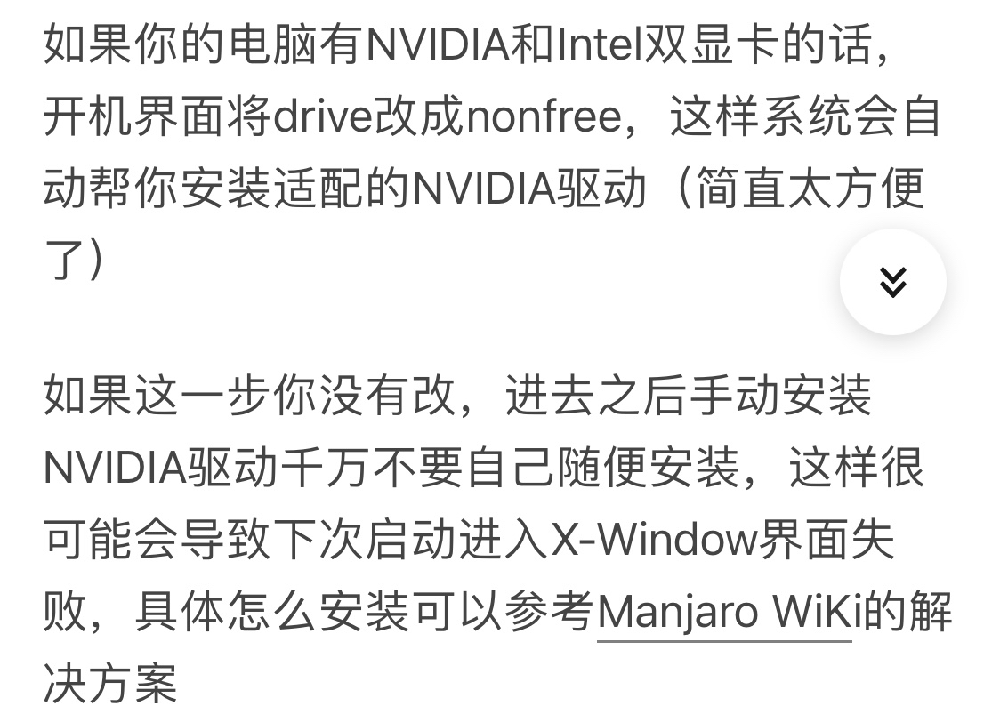

# 制作启动盘与硬盘分区

## 制作启动盘

1. Linux下制作启动盘

    - 通过`dd`写入

        ```bash
        # if后面是镜像名称，of后面是USB名称。注意，不是USB分区名称。
        # USB分区名称：/dev/sdb1
        # USB名称：/dev/sdb
        sudo dd bs=4M if=manjaro-gnome-17.1.12-stable-x86_64.iso of=/dev/sdb status=progress
        ```

    - 通过软件写入

        etcher

1. Windows 下制作启动盘

    - 注意：下载 rufus 3.5 及以下的版本（3.5 以上的版本没有 dd 模式）

    - 使用 rufus 烧录 iso 文件到 U 盘中。烧录时，gpt 分区，文件格式 fat32，簇大小 8192（默认）

    - diskgenious 保存分区表出错：先清除扇区数据（可以直接停止，然后就可以保存分区表）

1. 进入 BIOS

    - 联想 Y700-14isk 进入 BIOS：`F2`

    - 关闭 secure boot

    - 出现 grub >，是电脑的问题，是上次安装遗留的 grub 开机引导，但是找不到 Linux，因此导致此问题

1. 进入 LiveCD

    设置时区（也可以不设置，进入系统后自己手动设置）

    如果是英伟达独显，需要选闭源驱动。amd 独显或者英特尔单集显不用调

    > nonfree 一般都是闭源驱动，如果是双显卡就会装 bumblebee，如果只有 1050ti 那安的就是 nvidia 驱动。
    >
    > [nonfree 点不亮系统看这里](nonfree点不亮系统看这里：https://coreja.com/DailyHack/2019/08/nvidia-on-sddm-black-screen/)
    >
    > 

## 硬盘分区

1. 选择手动分区

    硬盘：东芝 RC500（512G）

    分区表类型：GPT（mbr 一块硬盘最多四个分区，但是 gpt 可以很多区，最多 64 个）

    |   名称   |   大小    |   挂载点    |  标记   | 分区格式 | 备注                                                                                                                                                      |
    | :------: | :-------: | :---------: | :-----: | :------: | --------------------------------------------------------------------------------------------------------------------------------------------------------- |
    | EFI 分区 |  `200M`   | `/boot/efi` | `boot`  | `fat32`  | 单系统覆盖安装 Manjaro 可以不分这个分区。另外，如果`fat32`不能引导，选`fat16`                                                                             |
    | 引导分区 |  `1024M`  |   `/boot`   | `boot`  |  `ext4`  | 此分区大小建议 2G 以内                                                                                                                                    |
    | 交换分区 |  `2048M`  |             | `swap`  |  `ext4`  | 交换分区无挂载点。分区格式选择交换分区（swap） 最大不建议超过真实内存大小，除非内存小于 2G，你的内存大于 4G，推荐 2G 即可，没必要有些人推荐的与内存相当。 |
    |  根目录  | `153600M` |     `/`     | `root`  |  `ext4`  |                                                                                                                                                           |
    |  家目录  | `153600M` |   `/home`   | `/home` |  `ext4`  |                                                                                                                                                           |

    - 如果系统启动时没有 grub 选择界面的话，在 KDE 分区管理器里面重新把`boot`标记到`/boot/efi`，然后执行`sudo update-grub`

## 安装

安装manjaro如果卡在下面的位置，说明驱动不行。解决方法：回到安装界面，按E，把driver=free 改成driver=intel，然后f10保存。


