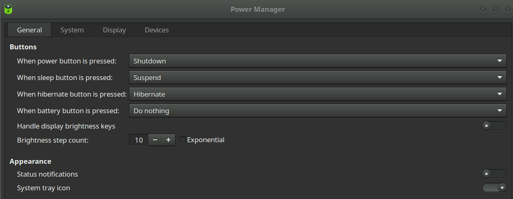

# i3

## 快捷键

查看当前键的名称：`xev`

| 快捷键             | 含义                       |
| ------------------ | -------------------------- |
| mod + f            | 聚焦的窗口全屏             |
| mod + enter        | 打开终端                   |
| mod + shift + q    | 关闭终端                   |
| mod + 数字         | 新建或切换桌面             |
| mod + shift + 数字 | 把当前窗口移动到指定桌面中 |
| ctrl + shift + c   | 终端内容复制到寄存器       |
| ctrl + shift + v   | 从寄存器中粘帖内容         |

## [更改默认 shell](http://c.biancheng.net/linux/chsh.html)

```bash
chsh -s /usr/bin/zsh
```

## ArchLinux 设置固定 ip

> 参考：https://blog.csdn.net/sgzqc/article/details/46627817

先查看自己的网卡名称和 ip 地址

```text
ip addr
```

另外还需要知道当前路由器的网关地址和 DNS

（假设上述获取到的 ip 为 `192.168.3.93`，网卡为 `enp0s3`）

在`/etc/netctl` 下新建文件 `enp0s3`，并对其进行编辑

```text
vim /etc/netctl/enp0s3
```

将文件内容修改如下：

```text
Description='enp0s3'
Interface=enp0s3
Connection=ethernet
IP=static
Address=('192.168.3.93/24')
#Routes=('192.168.3.0/24 via 192.168.0.1')
Gateway='192.168.3.1'
DNS=('192.168.3.1')
TimeoutUp=300
TimeoutCarrier=300
```

之后使用下面的命令使上述文件生效

```text
netctl enable enp0s25
reboot
```

## 在 KDE 的基础上使用 i3

参考： https://userbase.kde.org/Tutorials/Using_Other_Window_Managers_with_Plasma

## 多显示器

i3 默认是两个屏幕同时显示一样的内容。

arandr 和 arandr-indicator

## 窗口左上角出现字母，按字母就可以跳转到对应的窗口


## 更改默认应用（尝试了一下发现无效）

> 参考：https://www.reddit.com/r/i3wm/comments/gwymre/how_to_manage_default_applications/?utm_source=share&utm_medium=ios_app&utm_name=iossmf

```text
xdg-mime

# xdg-mime的CLI前端
mimeo（yay无法下载）
```

## 设置时间

通过`manjaro-settings-manager`设置。设置完成之后需要重启。

## 关于硬件设置

cli用`mhwd`

gui用`manjaro-settings-manager`

## 声音设置

<s>声音小是因为firefox或者chrome浏览器的限制。实际上153%对应的是windows的100%。</s>

<s>用`pavucontrol`先把最大音量限制开到153%，此时最大音量就与windows一致。</s>

<s>然后用`alsamixer`调整当前音量，调到合适位置即可。（用`pavucontrol`也行，在output那一栏）</s>

## 链接网络

自带 nmtui

设置网络后，需要通过右下角网络图标再设置当前网络为所有用户都能连接。否则有时会提示输入密码。

## 蓝牙设置

> 参考：
>
> - https://wiki.archlinux.org/title/Bluetooth_headset
> - https://wiki.archlinux.org/title/Bluetooth_keyboard


需要通过`blueman-manager`设置开机默认打开蓝牙

在第一次连接蓝牙耳机时会需要授权，此时直接在电脑里主动连接耳机就能连接上。连接上之后需要在蓝牙列表里设置为信任。否则下次连接还需要授权。

在连接键盘的时候最好通过命令行连接。参考上面的链接。

## 电池图标设置

通过rofi打开`xfce4-power-manager`，然后会出现一个gui界面。打开`Syatem tray icon`

同时也设置一下长时间关闭的电源策略



## gtk主题

通过`lxappearance`设置。注意主题设置为暗色，图标设置为亮色

## 外接U盘、默认文件管理器

通过`udisk2`与`udiskie`完成外接。相关设置已经在i3的开机启动脚本中设置好了。默认挂载位置是`/run/media/yusoli`，可以通过软链接的方式链接到`~/USB`方便管理。

manjaro的i3社区版本的默认文件管理器是`PCManFM`
