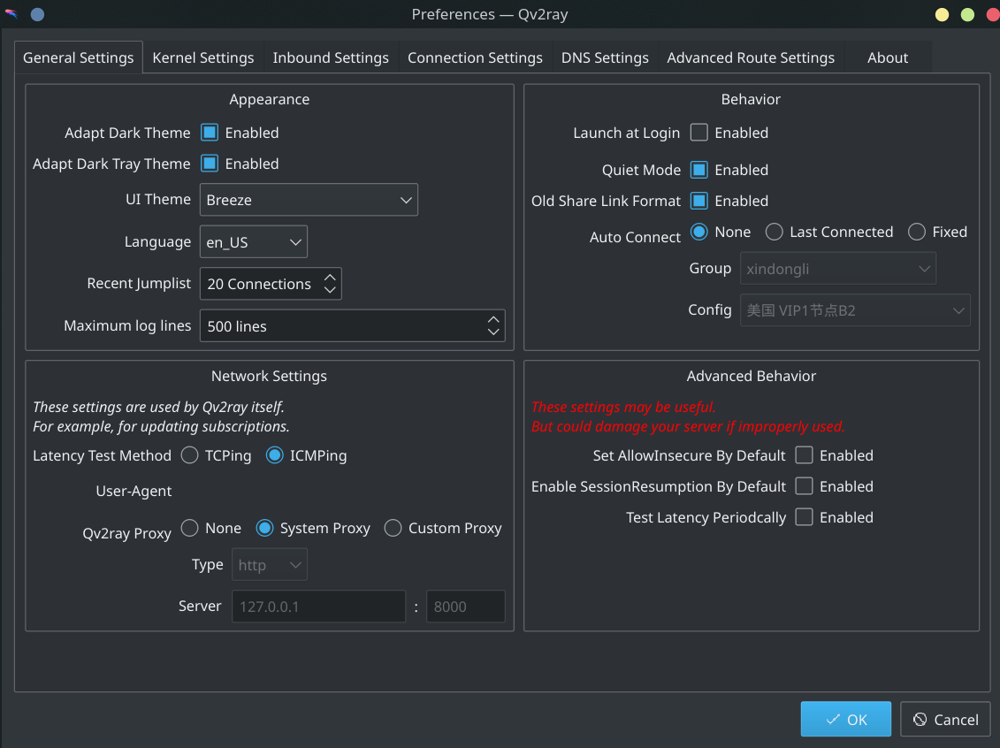
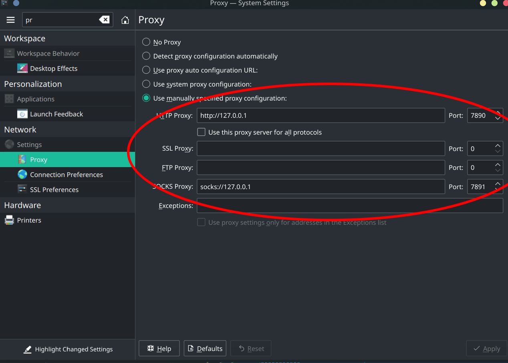

# 软件源与下载工具

## 设置 sudo 不需要密码

1. 执行 visudo 命令，清徐`%sudo ALL=(ALL) ALL`前的注释`#`

2. **不要在`sudoers（visudo）`文件中直接添加用户设置**，应该在`/etc/sudoers.d/10-installer`的`%wheel ALL=(ALL) ALL`行后添加如下配置：

    ```bash
    yusoli ALL=(ALL) NOPASSWD: ALL
    ```

## 设置 pacman

<s>1. `/etc/pacman.conf`文件</s>

<s>找到`Color`，取消这行前面的注释`#`</s>

<s>添加`archlinuxcn`源：编辑`/etc/pacman.conf`，在最后一行加入</s>

<s>`bash</s> <s>[archlinuxcn]</s> <s>SigLevel = Optional TrustedOnly</s> <s>Server = https://mirrors.tuna.tsinghua.edu.cn/archlinuxcn/$arch</s> <s># 注意，这个源可以按照自己的喜好选择。</s> <s>`</s>

1. 设置中国源

    执行下面这条命令， 选择延迟最小的一个，不要全部选

    ```bash
    sudo pacman-mirrors -i -c China -m rank
    ```

1. 完全更新系统

    <s>`bash</s> <s># 注意：如果有软件更新失败的情况，把下面这两个命令的顺序颠倒一下</s> <s>sudo pacman -Syyu && sudo pacman -S archlinux-keyring</s> <s>`</s>

    ```bash
    sudo pacman -Syu
    ```

1. 排错

    - 出现无法锁定 database 的错误时，在确认没有安装任务时运行以下命令删除锁定：

        ```bash
        sudo rm /var/lib/pacman/db.lck
        ```

    - aria2c 下载 xxx.db.sig 出现错误

        xx.db.sig 缺失是 database 的签名缺失，这是正常的，现在都只验证 package 的签名，database 都不签名了。

        在官方仓库和 archlinuxcn 中文社区库里已经没有 xxx.db.sig 文件了，所以当然下载不到。因此这个是正常现象，不用理会。

## 安装下载相关工具

> 下面有的可能已经包含了。如果已经有了，就不用再下载了

```bash
# 基本包编译命令
sudo pacman -S --needed base-devel

# AUR Helper
sudo pacman -S yay

# 下载工具
sudo pacman -S wget
sudo pacman -S curl
sudo pacman -S aria2

# 准备同步dotfiles
sudo pacman -S git
sudo pacman -S openjdk-src

# dotfiles管理工具
sudo pacman -S stow

# 梯子
sudo pacman -S v2ray

# 文件管理器
sudo pacman -S ranger
sudo pacman -S fzf
sudo pacman -S fd
```

## 设置 ssh

1. ssh 免密登录

    ```bash
    ssh-keygen -t rsa -C "任意字符串"
    ```

    把`~/.ssh/id_rsa.pub`中的内容上传到 github（通过 chromium）

1. （可选）系统默认没有开启 ssh 服务，需要手动开启并设置开机自启

    ```bash
    # 开启服务
    systemctl start sshd.service
    # 设置开机自启
    ​systemctl enable sshd.service
    ```

## 同步 dotfiles

```bash
# 通过ssh方式
git clone git@git.zhlh6.cn:ysl2/.dotfiles.git ~/.dotfiles
```

## 恢复部分用户设置：git、ssh、yay

用 stow 恢复

也可以选择用`.RESTORE-BY-JAVA`一键恢复所有用户设置：

```bash
cd .RESTORE-BY-JAVA/
sh start.sh
```

但是如果此时产生“找不到或无法加载主类”，查看`.RESTORE-BY-JAVA`文件的属组、属主、权限是否正常

```bash
chmod 777 -R .RESTORE-BY-JAVA/

chown yusoli:yusoli -R .RESTORE-BY-JAVA/
```

## 通过 yay 下载 pacman 的套壳--powerpill

```bash
# pacman的包装外壳
yay -S powerpill
```

## 恢复全局设置

dotfiles 文件中的`.MY-GLOBAL-SETTINGS`文件夹

恢复全局设置后，需要执行以下步骤：

```bash
# 注意：这次更新可能会出错，提示冲突。如果发生冲突，无视，然后继续下面的命令
sudo pacman -Syu

# 安装archlinuxcn-keyring包导入GPG key
sudo pacman -S archlinuxcn-keyring

# 再次更新源
sudo pacman -Syu
```

## 通过 yay 下载其他 AUR

```bash
# 浏览器
yay -S google-chrome-stable

yay -S switchhosts-bin

# 下面这个通过官方github的appimage下载。yay非常滞后，容易无法运行
# yay -S qv2ray
cd ~/Downloads
curl https://ghproxy.com/https://github.com/Qv2ray/Qv2ray/releases/download/v2.6.3/Qv2ray.v2.6.3.linux-x64.AppImage -o Qv2ray.v2.6.3.linux-x64.AppImage
# 参考笔记AppImage的安装方法
```

## 设置 hosts

1. 把switchhosts设置为开机自启，参考[这里](02-00-kde-settings.md#关于开机自启脚本与用户服务)

2. 同步 dotfiles 中关于 switchhosts 的内容

3. 自动改hosts

    > 参考：https://github.com/521xueweihan/GitHub520

    以 SwitchHosts 为例，看一下怎么使用的，配置参考下面：

    - Title: 随意

    - Type: `Remote`

    - URL: `https://cdn.jsdelivr.net/gh/521xueweihan/GitHub520@main/hosts`

    - Auto Refresh: 最好选 `1 hour`

    如图：

    

    这样每次 hosts 有更新都能及时进行更新，免去手动更新。

4. 如果需要手动更新 host，可参考[ipaddress.com](https://www.ipaddress.com/)查询相应 ip 地址

## 设置[qv2ray](https://qv2ray.net/)（过时，可使用clash）

> 使用的是xindongli

配置订阅链接（group）

主界面选择允许系统代理，默认连接方式为不连接，不要开机启动

在主界面里双击刚才设置的 group 打开选择节点

最终效果按照这张图设置



## 设置clash

> 使用的是github的GLaDOS

```text
yay -S clash
yay -S clashup
```

恢复关于clash的dotfiles，然后：

```text
systemctl --user start clash
```



此时clashup会通过json中的订阅链接下载对应的clash的`config.yaml`，然后clash启动在7890和7891端口，并通过KDE的设置进行代理上网

如果需要开机启动clash：

```text
systemctl --user enable clash
```

## 设置 chrome

暗色主题：设置 chrome 的 theme 为 GTK+，在浏览器设置里有

开梯子登录谷歌帐号，同步所有插件

登录Microsoft Authenticator插件，同步所有密码。参考[这里](../../passwords/README.md)

查看内存占用：`shift + <ESC>`

## 参考链接

https://www.codetd.com/article/4515916
