# 常用工具配置

## fcitx

参见[这里](fcitx.md)

## fcitx5

fcitx 第一项默认键盘不能是中文，否则会出现 idea 闪退的情况

直接恢复 dotfiles 的配置。但是目前单行模式与 rime 没有配置成功。凑合着用吧

取消下面这两个快捷键：

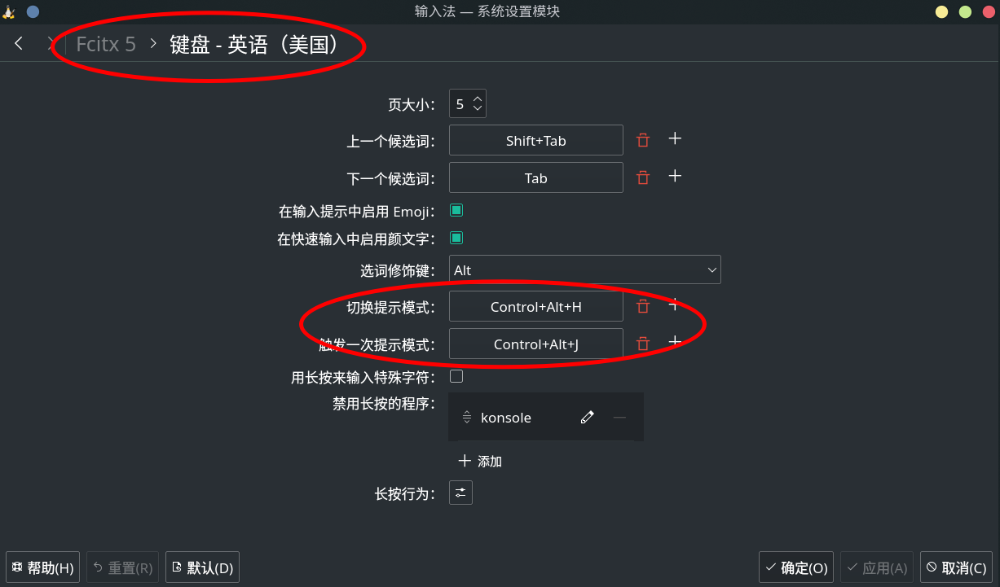

参考：

-   https://blog.csdn.net/m0_47627464/article/details/113790309
-   https://www.wannaexpresso.com/2020/03/26/fcitx5/
-   [Manjaro 下配置 KDE,内容很多，主要看其中 fcitx5 的部分](https://zhuanlan.zhihu.com/p/114296129)

## neovim

设置 vimdiff 默认使用 nvim，需要安装一个包

```text
yay -S neovim-symlinks
```

## chrome

设置 chrome 的 theme 为 GTK+，在浏览器设置里有

## vscode

解决二次登录问题，参考[这里](https://github.com/microsoft/vscode/issues/92972#issuecomment-608572519)，注意 keyring 一定要设置为空（就是什么都不输入）

如果一不小心输了密码，后面每次登录都要输入密码

解决这个问题的方法：直接删除 keyring 然后重新上面的操作

keyring 的位置：`~/.local/share/keyrings/`

隐藏菜单栏：命令面板搜索 toogle menu bar

## ranger

取消标签:

```text
:tag_remove
```

## mysql

参见[这里](./mysql/mysql-linux-configuration.md)

## intellij-idea

不要安装`oracle-jdk15`，这个会导致 idea 崩溃

应该安装`openjdk-src`

```bash
sudo powerpill -S openjdk-src
```

## gnome-boxes

Server 端（manjaro）需要安装`spice-vdagent`，这个包能够调节分辨率

Guest 端（linux）需要安装下图的两个包。注意，在安装完之后，重启 windows,然后设置 share-folder，然后再次重启 windows，这次就会出现一个网络驱动器

> 这两个包我已经下载好了：https://gitee.com/ysl2/gnome-boxes-windows-guest-pack
>
> 参考：
>
> -   https://askbot.fedoraproject.org/en/question/116855/boxes-windows-10-shared-files/#:~:text=The%20Sharing%20Folder%20preferences%20are%20in%20the%20Properties,default%29.%20This%20is%20available%20in%20gnome-boxes-3.26%20and%20newer.
>
> -   https://www.spice-space.org/download.html

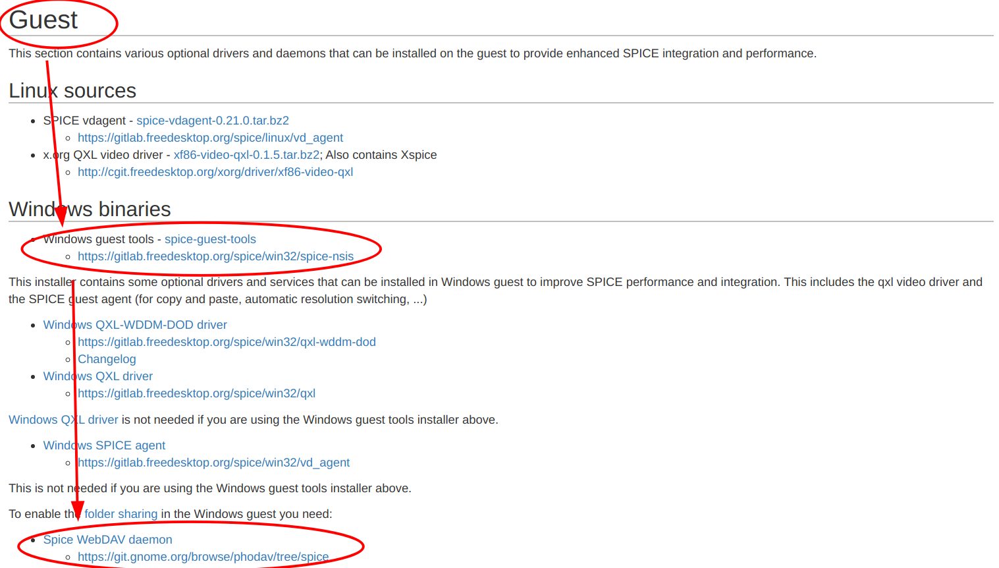

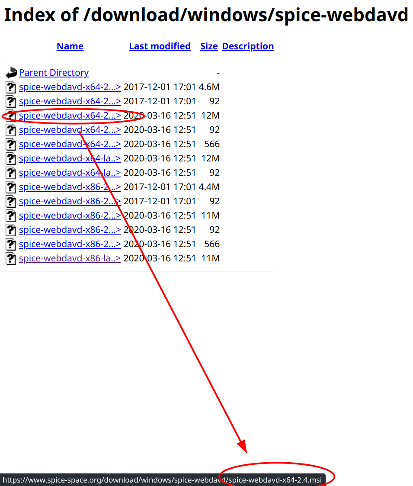

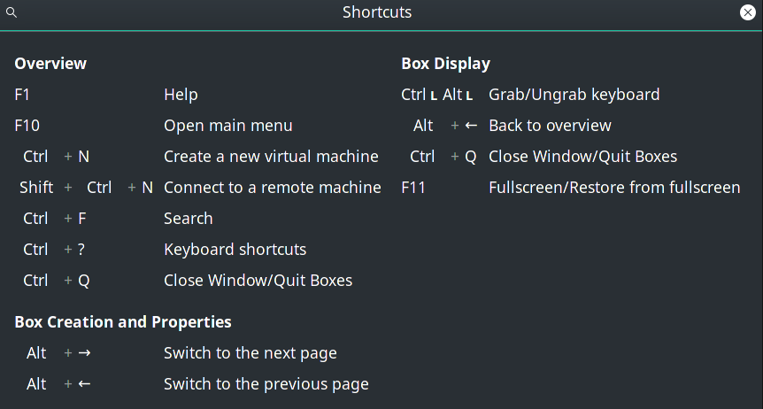

## virtualbox（不推荐，建议使用 gnome-boxes）

### virtualbox安装

Before installing virtualbox, you should run `cat /proc/version`to check your linux kernal version, then run `sudo pacman -S virtualbox` command and choose the virtualbox veision which fits your kernal version.

```bash
# Check your Linux kernel version
cat /proc/version
# Or you can use this command: `sudo uname -r`

# Choose the correct version to install
sudo pacman -S virtualbox

# Update your linux headers. Also, you need to choose the version that suits your kernel
# 注意每次更新完内核，都检查一下下面这个包是否和当前内核版本匹配
sudo pacman -S linux-headers

# Install this (I don't know why, but this is necessary)
sudo pacman -S virtualbox-host-dkms

# Add your username to "vboxusers" user group
sudo gpasswd -a yusoli vboxusers
# check current user's all group:
groups

# Add module probe
# 如果更新了内核，需要重新执行一下下面这条命令
# 如果因为更新了内核而导致执行的时候报错，就重新做一遍配置virtualbox的过程（因为我也忘了究竟是做了哪些步骤弄好的）
# 参考：https://blog.csdn.net/a805607966/article/details/112403665
sudo modprobe vboxdrv

# Finally, install the virtualbox enhance plugin
# It provides USB suggestion. If you don't install this, the virtual machine will not be lunched.
sudo pacman -S virtualbox-ext-oracle

# Note: After installing your virtual machine, don't forget install the enhancement CD in machine settings.
```

在安装完成之后，需要关闭“自动捕获键盘”

```text
File -> Preferences -> Input -> Auto Capture Keyboard
```

如果安装增强程序失败，就手动安装：

> 参考：https://superuser.com/a/1407054

```bash
sudo mkdir -p /media/cdrom
sudo mount /dev/cdrom /media/cdrom
```

然后执行：

```bash
sudo sh /media/cdrom/VBoxLinuxAdditions.run
```

可以把上述过程写成一个开机自启服务，或者直接修改 fstab 进行挂载。

需要注意的是，最后的`sh VBoxLinuxAdditions.run`不要写在服务里，只需要写挂载的那部分就行了

### virtualbox常用命令

> 注意：不用加后面的`--type headless`，否则会导致虚拟机只是在后台运行，而没有界面。

```bash
VBoxManage list vms

VBoxManage startvm "windows-7" --type headless

VBoxManage controlvm "windows-7" pause --type headless

VBoxManage controlvm "windows-7" resume --type headless

VBoxManage controlvm "windows-7" poweroff --type headless
```

## 学习 Java 过程中用到的相关工具

见[vscode-with-java](../../ide/vscode-settings/_default/vscode-with-java.md)

## unzip-iconv

pacman 默认的`unzip`中不包含`-O`选项，因此如果解压的文件中包含中文，那么可能会导致乱码。因此从需要卸载`unzip`重新安装`unzip-iconv`，这个是打了补丁之后的。

用法

```bash
# 先写-O选项的话，后面的压缩包文件名补全不了，所以，先-l补全写上文件，再移动到前面加上-O选项。 列出文件没问题的话，解压就行了

# 预览一下解压后将会出现的文件树
unzip -O gbk -l xxx.zip
unzip -O gb2312 -l xxx.zip

# 直接解压
unzip -O gbk xxx.zip
unzip -O gb2312 xxx.zip
```

## zsh

1. 刷新设置

    ```text
    source ~/.zshrc
    ```

2. 设置为 vi 快捷键：

    ```bash
    set -o vi
    ```

3. 一些关键词

    ```text
    grnl-zsh-config

    zoxide — cd
    tig — git
    firenvim — browser vim
    delta — diff
    ```

## tmux

1. 默认快捷键参考： https://gist.github.com/ysl2/684909e4a0f8a73db6a91a9b4f98e5b8

1. 关于 ssh 到远程服务器

    在 tmux 的官方文档中写了，如果想对当前的活动窗口执行 tmux 操作，只需要连按两次前导键就行了。

    比如，我当前的 zsh 里面有个 tmux，前导键是`ctrl + b`，但是我现在通过 ssh 连接到虚拟机上，虚拟机的前导键也是`ctrl + b`，那么如果我只是想对虚拟机执行分屏，就连按两次`ctrl + b`就能对虚拟机的窗格分屏

1. ssh 之后发现 neovim 报错：`clipboard error: no buffer`，

    说明当前 tmux 会话曾经被远程链接过，此时剪贴板无法工作。

    解决方案：重启 tmux 的 session

1. copy-mode

    `ctrl + b + [` 开启 cpoy-mode，此时可以用 vim 快捷键进行移动

    `space` 选中文本，可以换成`y`

    `enter` 退出 copy-mode

    `ctrl + b + ]` 粘贴，可以换成`p`

1. 退出 tmux 的命令模式

    快捷键：`C-c`

1. 给当前窗口重新命名编号

    快捷键`<prefix> + .`

1. pane 的分离与合并

    分离：原有快捷键`<prefix> + !`

    合并：自定义快捷键`<prefix> + u`

    自定义内容如下：

    ```bash
    bind-key u command-prompt -I "join-pane -h -t :"
    ```

1. 刷新设置

    > 我已经把前置键从`ctrl + b`改为了`ctrl + a`

    在命令模式（按 PREFIX : ，即按下 ctrl+a,再输入一个“：”)输入

    ```text
    source-file ~/.tmux.conf
    ```

## flameshot

1. 开启划取范围截图

    ```text
    flameshot gui
    ```

2. 设置 KDE 快捷键

新建一个全局命令

在 Trigger 那里绑定快捷键，在 Action 那里绑定上面的命令

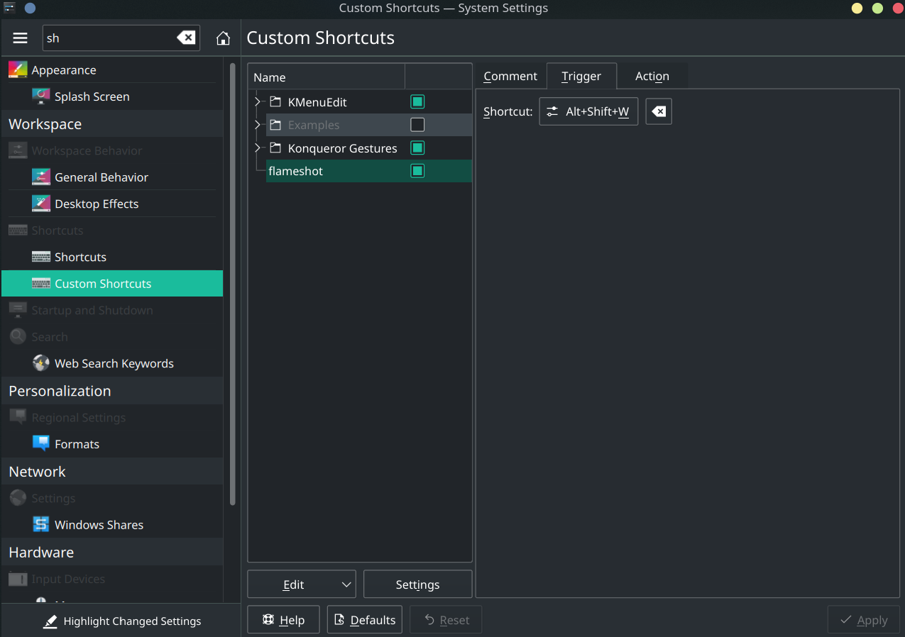

## deepin-screenshot 深度截图（我用的不是这个）

由于 KDE 与 Deepin 的剪切板实现机制的差异，深度截图无法复制图片到剪切板，必须安装 gpaste 来辅助：

```text
yay -S gpaste
```

## thunderbird

1. 解决 outlook 重复发邮件问题

    options -> account settings -> 取消勾选下面这个框

    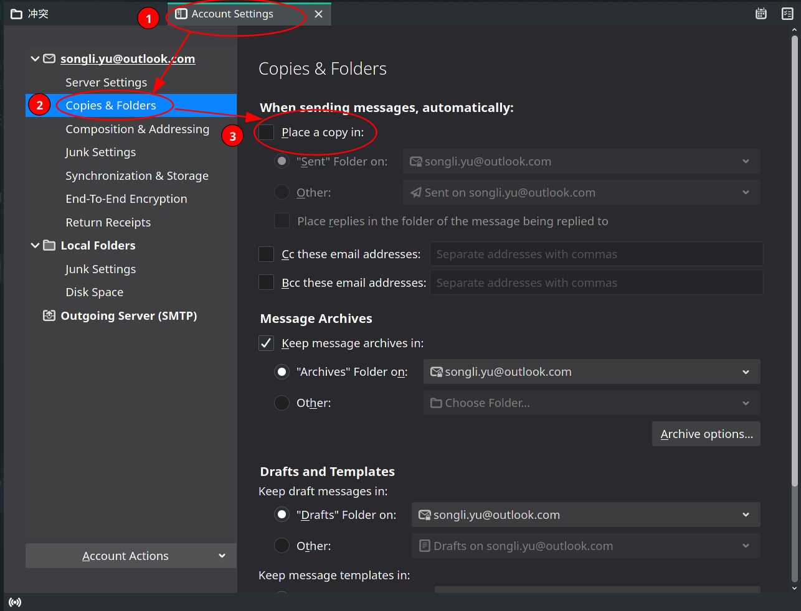

## Matlab

> 资源：https://www.luochenzhimu.com/archives/2540.html
>
> 下面两个方法任选：
>
> -   安装步骤 1：https://blog.csdn.net/m0_37775034/article/details/80876362
> -   安装步骤 2：https://lanseyujie.com/post/matlab-download-and-activate.html

直接用我的 github 仓库的安装脚本进行安装：https://github.com/ysl2/linux-matlab

高分辨率设置：

```text
# 在matlab的命令行中敲下面的命令：
>> s = settings;s.matlab.desktop.DisplayScaleFactor
>> s.matlab.desktop.DisplayScaleFactor.PersonalValue = 2
```

## haveged：扩大系统熵值

```text
sudo systemctl enable haveged.service
sudo systemctl start haveged.service
```

## (QQ 轻聊版 || tim) && 微信

> 这个比较稳定，但是版本很旧

```text
# qq轻聊版（无法后台挂起，一旦关闭就直接退出了）
deepin.com.qq.im.light
# tim（可以在后台挂起）
deepin.com.qq.office
# 微信
deepin.com.wechat
```

打开 deepin-wine 的配置界面，并改 dpi 为 144：

```bash
# 改QQ轻聊版的dpi
env WINEPREFIX=$HOME/.deepinwine/Deepin-QQLight deepin-wine5 winecfg
# 改tim的dpi
env WINEPREFIX=$HOME/.deepinwine/Deepin-TIM deepin-wine5 winecfg
# 改微信的dpi
env WINEPREFIX=$HOME/.deepinwine/Deepin-WeChat deepin-wine5 winecfg
```

参考：https://wiki.archlinux.org/index.php/Tencent_QQ_(%E7%AE%80%E4%BD%93%E4%B8%AD%E6%96%87)

## 星火商店 tim & 微信

> 星火商店是 deepin 社区维护的软件源。类似 arch 的 AUR。星火商店的 tim 与微信版本是最新的。
>
> 但是我配置的时候，tim 出现输入方块字问题。无法解决，于是暂时放弃。以后再说

```text
# 包很大，下载速度在600mb/s左右，需要十多分钟。耐心等待
yay -S com.qq.weixin.spark com.qq.tim.spark --noconfirm
```

1. 下载完之后可能会导致方块字的情况。这是因为下载包中没有包含必要的字体。解决方法如下

    以微信为例：去网上找一个微软雅黑字体`mysh.ttf`，放到`~/.deepinwine/Spark-Wechat/drive_c/windows/Fonts`目录下

2. 调节分辨率

    ```text
    # tim
    env WINEPREFIX="$HOME/.deepinwine/Spark-Tim" deepin-wine5 winecfg
    # 微信
    env WINEPREFIX="$HOME/.deepinwine/Spark-WeChat" deepin-wine5 winecfg
    ```

3. 系统语言非中文时，中文全显示成方块

    需要在：`/opt/deepinwine/tools/run.sh`中将 WINE_CMD 那一行修改为：

    ```text
    WINE_CMD="LC_ALL=zh_CN.UTF-8 deepin-wine"
    ```

## 网易云 & qq 音乐

yay 下载：

```text
# 网易云
netease-cloud-music
# qq音乐
qqmusic-bin
```

## wps

安装这两个包：

```text
ttf-wps-fonts
wps-office-cn
```

还有一个包`wps-office-fonts`我安装了，但是 b 站视频没说这个。并且我的界面还是英文，不知道咋回事

## onedrive

pacman 搜索`onedrive-git`

1. 配置 OneDrive（初次）/同步并退出。下次可以直接同步 dotfiles

    ```text
    onedrive
    ```

2. 自动同步

    ```text
    systemctl --user enable onedrive
    systemctl --user start onedrive
    ```

3. 查看日志

    ```text
    journalctl --user-unit onedrive -f
    ```

## VNC

1. 参考这篇文章： https://blog.csdn.net/zbgjhy88/article/details/85110220

2. tigervnc，`.vnc/xstartup`改一下。重启 vnc 服务。端口 5900+后面的数字。参考 b 站视频 BV1Qf4y1D7NP

## docker

> 参考 docker 的官方文档： https://docs.docker.com/engine/install/linux-postinstall/

一个可用的镜像：manjaro-with-zsh

1. 设置 docker 开机自启

    ```bash
    sudo systemctl enable docker.service
    sudo systemctl enable containerd.service
    ```

2. 需要配置 docker 在非 root 环境下运行。否则 vscode 插件没法识别。

    ```bash
    # 过时：sudo gpasswd -a ${USER} docker
    # 用下面这个
    sudo usermod -aG docker $USER
    # 重新启动终端
    ```

3. 关于 containerd.service 导致关机速度慢的问题

    有两种方法可以解决

    - 修改`/usr/lib/systemd/system/containerd.service`的`KillMode`，默认是`KillMode=process`，改成`KillMode=mixed`（我选用这种方法）

    - 修改`/usr/lib/systemd/system/docker.service`，让其依赖于`containerd.service`

        ```bash
        [Unit]
        ....
        After=network.target containerd.socket containerd.service
        Requires=containerd.socket containerd.service
        ```

## 终端下的计算器

1. bc

2. python

## brew

1. 安装

    按照 dotfiles 里的安装脚本可以一键执行

    参考：https://blog.csdn.net/baidu_40973299/article/details/108560242

2. 更换国内源

    ```bash
    git -C "$(brew --repo)" remote set-url origin https://mirrors.tuna.tsinghua.edu.cn/git/homebrew/brew.git
    git -C "$(brew --repo homebrew/core)" remote set-url origin https://mirrors.tuna.tsinghua.edu.cn/git/homebrew/linuxbrew-core.git
    brew update
    ```

## EasyConnect

```text
https://vpn.wh.sdu.edu.cn
```

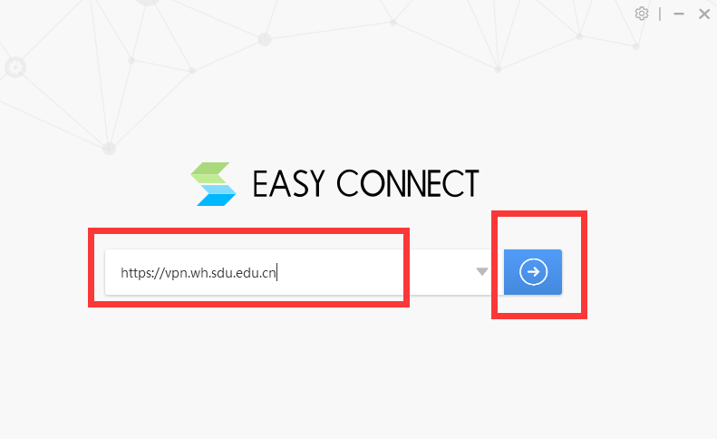

## zotero

> 参考： https://zhuanlan.zhihu.com/p/268375930

1. 设置数据文件夹位置

    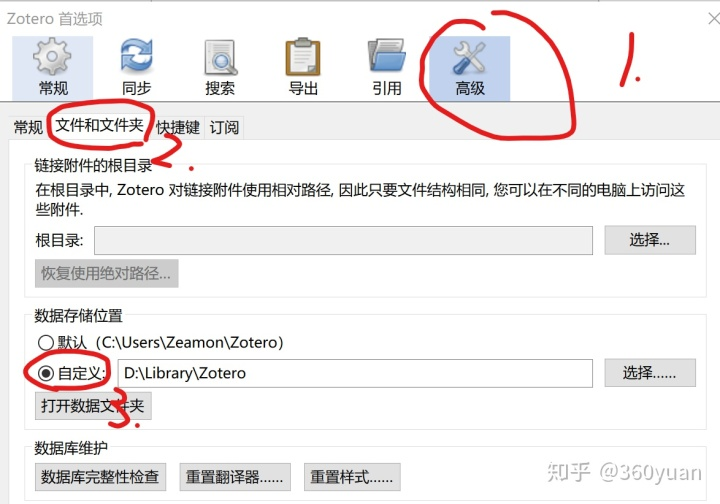

1. 设置坚果云

    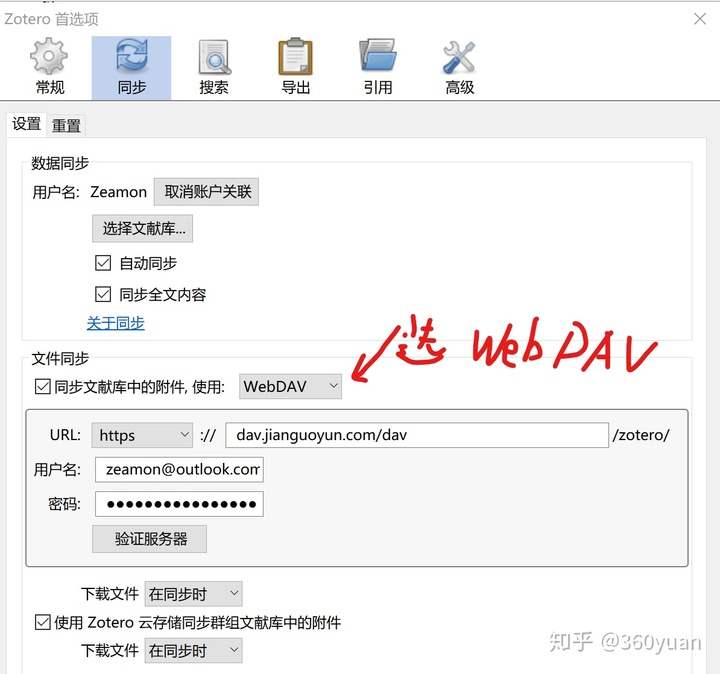

1. 设置直接获取英文文献

    > 特别注意可用的Sci-Hub域名有“http://sci-hub.st”，“http://sci-hub.do”（检测时间2020-11-04 20:33:23）。如果没有使用任何代理，由于网络环境问题，可能会有少部分从Sci-Hub下载的PDF出现损害的情况，这时你可以考虑将上述代码中的https改为http，或者更换其他可用的域名，情况可能会好转。

    ```text
    # 多行，不要用这个，用下面那个单行的
    {
        "name":"Sci-Hub",
        "method":"GET",
        "url":"http://sci-hub.tw/{doi}",
        "mode":"html",
        "selector":"#pdf",
        "attribute":"src",
        "automatic":true
    }
    ```

    ```text
    # 用这个单行的，可以直接复制进去
    {    "name":"Sci-Hub",    "method":"GET",    "url":"http://sci-hub.tw/{doi}",    "mode":"html",    "selector":"#pdf",    "attribute":"src",    "automatic":true}
    ```
    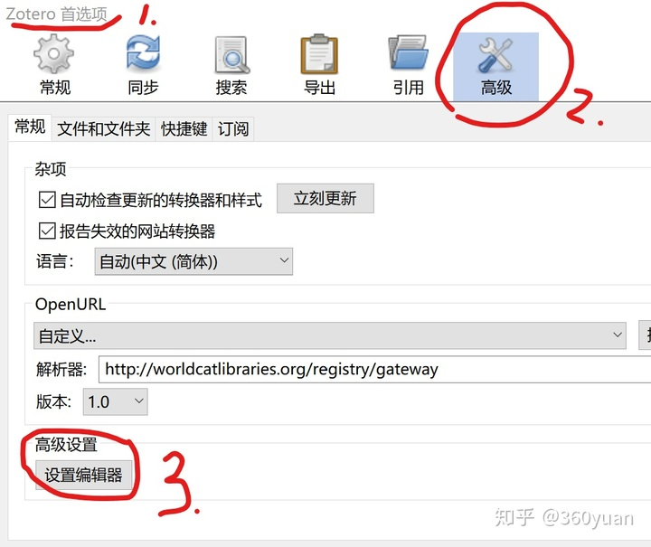

    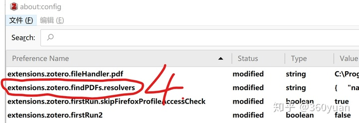

    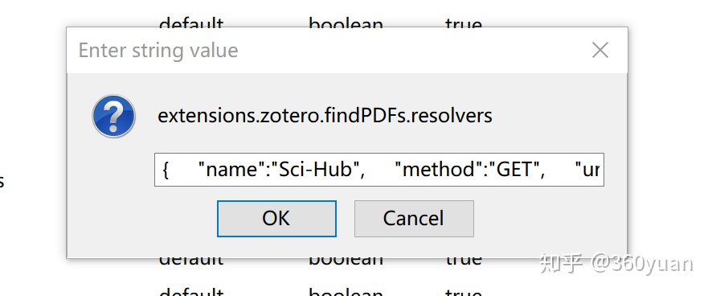

1. 安装ZotFile插件

    > 此插件的原地址（下载RELEASE）：https://github.com/jlegewie/zotfile
    >
    > 直接从官网下的话会出问题。因此从此文章的附件文件夹中下载（附件文件夹就是此文章的图片文件夹）

    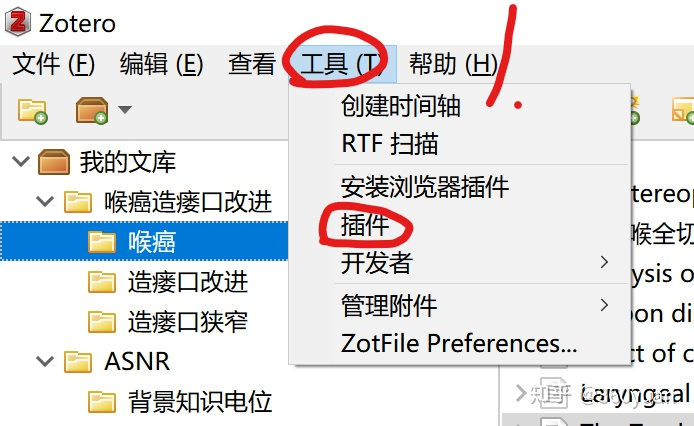

    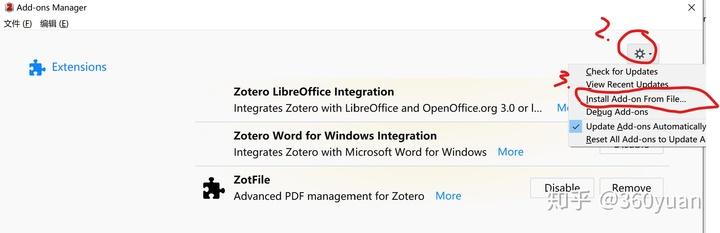

    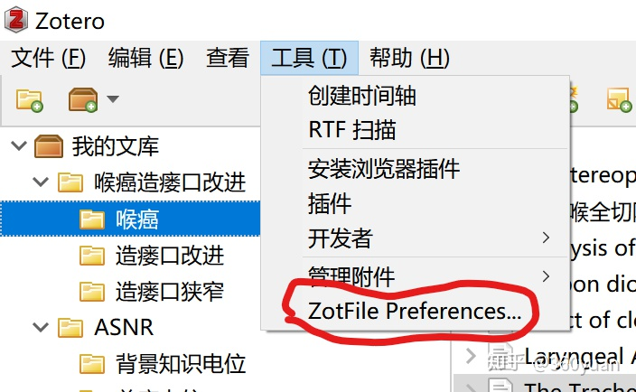

    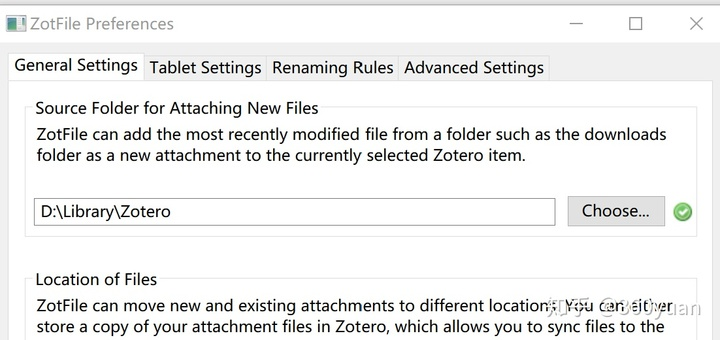

1. 设置移动端papership

    特别注意，在papership验证会出现验证不成功，解决方法：打开坚果云官网，登录坚果云账号，在zotero文件夹新建空白的lastsync.txt文件，务必注意的是，必须使用坚果云自带的新建文件工具来新建lastsync.txt文件，不能通过手动上传的方式。如下图所示

    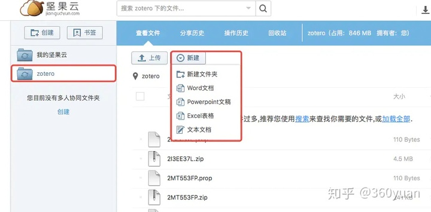

    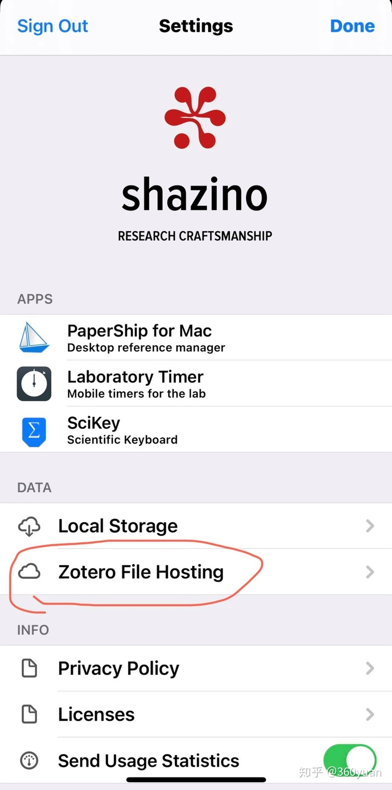

    密码可以直接使用zotero的，不要再新建了

    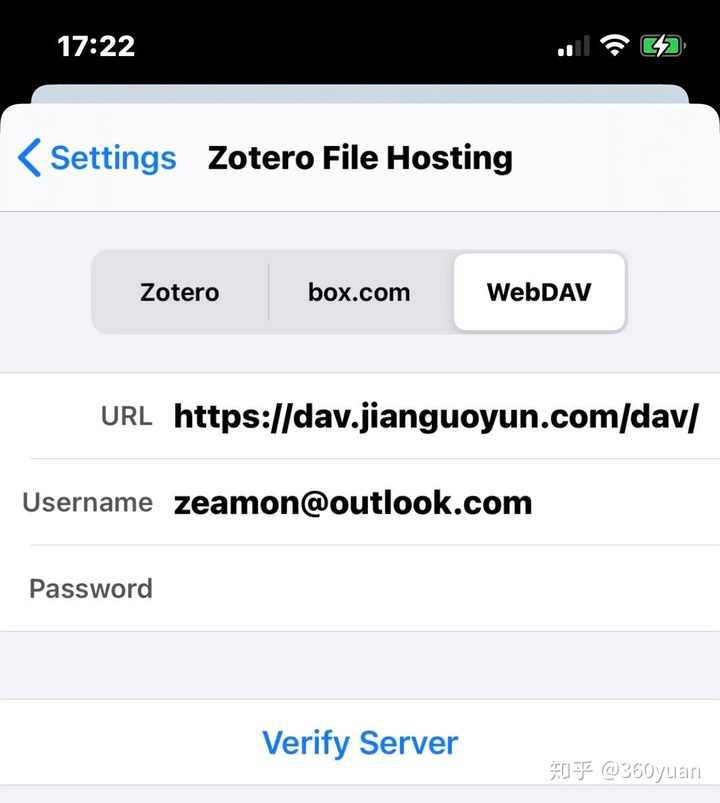

## firefox

关闭`从崩溃中恢复之前的会话`功能，这个功能如果开启会导致polybar的bug

在firefox地址栏中输入`about:config`，然后搜索：

```text
# 把下面这个选项改成false
browser.sessionstore.resume_from_crash = true
```

## 测试摄像头：cheese

```bash
# 调用cheese
cheese

# 调用指定的摄像头
cheese -d /dev/video1
```
