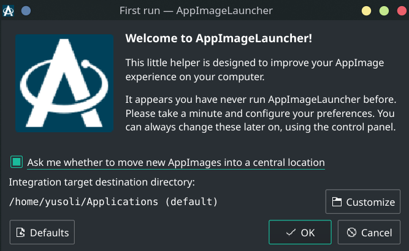
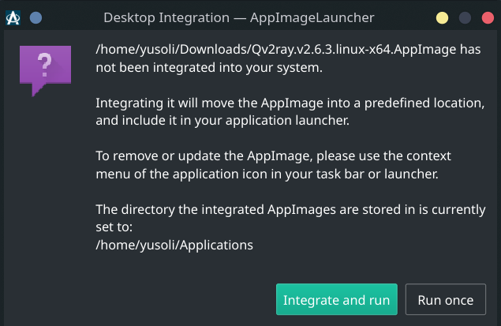

# linux-common-knowledge-for manjaro

## 字体

```text
# 查看当前系统安装的所有字体
fc-list
# 刷新字体缓存
fc-cache -fv
```

参考： https://wiki.archlinux.org/index.php/Fonts_(%E7%AE%80%E4%BD%93%E4%B8%AD%E6%96%87)

## AppImage

[How to use .AppImage on Manjaro (Arch based Linux)?](https://forum.manjaro.org/t/how-to-use-appimage-on-manjaro-arch-based-linux/34375)

```text
sudo pacman -S appimagelauncher
```





<details>
    <summary>以AppImage方式安装Qv2ray时的控制台信息</summary>

```text
~/Downloads                                                                                                                                                                  23:28:55
❯ ./Qv2ray.v2.6.3.linux-x64.AppImage
Created symlink /home/yusoli/.config/systemd/user/default.target.wants/appimagelauncherd.service → /usr/lib/systemd/user/appimagelauncherd.service.
[AppImageLauncher] Warning: can't find fallback icon for namedialog-ok
[AppImageLauncher] Warning: can't find fallback icon for namedialog-cancel
[AppImageLauncher] Warning: can't find fallback icon for namedocument-revert
Extracting usr/share/icons/hicolor/1024x1024/apps/qv2ray.png to "/home/yusoli/.local/share/icons/hicolor/1024x1024/apps/appimagekit_2b7470cc12bfd10c90c588027d7633ba_qv2ray.png"
Extracting usr/share/icons/hicolor/128x128/apps/qv2ray.png to "/home/yusoli/.local/share/icons/hicolor/128x128/apps/appimagekit_2b7470cc12bfd10c90c588027d7633ba_qv2ray.png"
Extracting usr/share/icons/hicolor/16x16/apps/qv2ray.png to "/home/yusoli/.local/share/icons/hicolor/16x16/apps/appimagekit_2b7470cc12bfd10c90c588027d7633ba_qv2ray.png"
Extracting usr/share/icons/hicolor/22x22/apps/qv2ray.png to "/home/yusoli/.local/share/icons/hicolor/22x22/apps/appimagekit_2b7470cc12bfd10c90c588027d7633ba_qv2ray.png"
Extracting usr/share/icons/hicolor/256x256/apps/qv2ray.png to "/home/yusoli/.local/share/icons/hicolor/256x256/apps/appimagekit_2b7470cc12bfd10c90c588027d7633ba_qv2ray.png"
Extracting usr/share/icons/hicolor/32x32/apps/qv2ray.png to "/home/yusoli/.local/share/icons/hicolor/32x32/apps/appimagekit_2b7470cc12bfd10c90c588027d7633ba_qv2ray.png"
Extracting usr/share/icons/hicolor/48x48/apps/qv2ray.png to "/home/yusoli/.local/share/icons/hicolor/48x48/apps/appimagekit_2b7470cc12bfd10c90c588027d7633ba_qv2ray.png"
Extracting usr/share/icons/hicolor/512x512/apps/qv2ray.png to "/home/yusoli/.local/share/icons/hicolor/512x512/apps/appimagekit_2b7470cc12bfd10c90c588027d7633ba_qv2ray.png"
Extracting usr/share/icons/hicolor/64x64/apps/qv2ray.png to "/home/yusoli/.local/share/icons/hicolor/64x64/apps/appimagekit_2b7470cc12bfd10c90c588027d7633ba_qv2ray.png"
Extracting usr/share/icons/hicolor/scalable/apps/qv2ray.svg to "/home/yusoli/.local/share/icons/hicolor/scalable/apps/appimagekit_2b7470cc12bfd10c90c588027d7633ba_qv2ray.svg"
WARNING: Unable to resize the application icon into a 128x128 image: "Unable to load image.". It will be written unchanged.
WARNING: Unable to resize the application icon into a 256x256 image: "Unable to load image.". It will be written unchanged.
gtk-update-icon-cache: Cache file created successfully.
which: no gtk-update-icon-cache-3.0 in (/home/yusoli/.local/bin:/home/yusoli/.zinit/polaris/bin:/home/yusoli/.local/bin:/usr/local/sbin:/usr/local/bin:/usr/bin:/usr/lib/jvm/default/bin:/usr/bin/site_perl:/usr/bin/vendor_perl:/usr/bin/core_perl:/var/lib/snapd/snap/bin:/usr/lib/jvm/default/bin)
which: no update-icon-caches in (/home/yusoli/.local/bin:/home/yusoli/.zinit/polaris/bin:/home/yusoli/.local/bin:/usr/local/sbin:/usr/local/bin:/usr/bin:/usr/lib/jvm/default/bin:/usr/bin/site_perl:/usr/bin/vendor_perl:/usr/bin/core_perl:/var/lib/snapd/snap/bin:/usr/lib/jvm/default/bin)
[INIT]: Qv2ray PreInitialization: OK
[INIT]: Qv2ray 2.6.3 on Manjaro Linux x86_64
[CORE-UI]: Successfully installed a translator for en_US
[LICENCE]:
This program comes with ABSOLUTELY NO WARRANTY.
This is free software, and you are welcome to redistribute it
under certain conditions.

Copyright (c) 2019-2020 Qv2ray Development Group.
Third-party libraries that have been used in Qv2ray can be found in the About page.

[INIT]: Application exec path: /tmp/.mount_Qv2rayMi3uSc/usr/bin
[INIT]: Path: /tmp/.mount_Qv2rayMi3uSc/usr/bin/config/ does not contain a valid config file.
[CORE-SETTINGS]: Found a config file, v= path=/home/yusoli/.config/qv2ray/
[INIT]: Using /home/yusoli/.config/qv2ray/ as the config path.
[CORE-UI]: Removed translations
[CORE-UI]: Successfully installed a translator for en_US
[COMMON-NETWORK]: Current OpenSSL version: OpenSSL 1.1.1g  21 Apr 2020
[CORE-UI]: Found factory style: Windows
[CORE-UI]: Found factory style: Fusion
[CORE-UI]: Found QSS style at: ":/uistyles/flatwhite.css"
[CORE-UI]: Found QSS style at: ":/uistyles/psblack.css"
[COMPONENT-PLUGINHOST]: Reloading plugin list
[CORE-UI]: Loading data...
[COMMON-NETWORK]: Start checking update for channel ID: 0
[COMPONENT-UPDATE]: Received update info:
 --> Latest: 2.6.3
 --> Current: 2.6.3
 --> Ignored: 0.0.0
[COMPONENT-UPDATE]: No suitable updates found on channel 0
[QV2RAY-CORE]: Cannot disconnect when there's nothing connected.
[INIT]: Terminating connections and saving data.
[QV2RAY-CORE]: Cannot disconnect when there's nothing connected.
[QV2RAY-CORE]: Triggering save settings from destructor
[QV2RAY-CORE]: Cannot disconnect when there's nothing connected.
[CORE-VCORE]: API thread stopped
```

</details>
