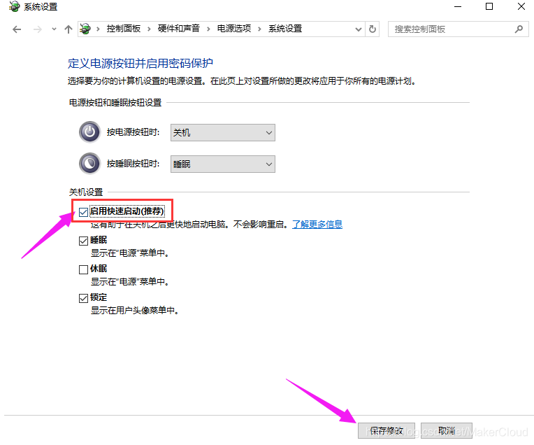

# 系统级别排错

## [Gtk-WARNING \*\*: cannot open display](https://bbs.archlinux.org/viewtopic.php?id=191251)

1. 在`~/.bashrc`中添加（或者是`~/.zshrc`，取决于你用的 shell）

    ```bash
    export DISPLAY=:0.0
    ```

1. 在切换到 root 用户之前，先执行`xhost +`，以关闭 Xserver 服务的限制。（具体什么限制，在[这里](https://m.linuxidc.com/Linux/2016-12/138495.htm)查看）

    ```bash
    # 当前用户是yusoli
    xhost +

    # 切换到root用户
    su - root
    ```

## Read only file system

> 参考：https://blog.csdn.net/makercloud/article/details/84300921

为什么会无法挂载磁盘，其根本原因是，Windows 10 关机或者睡眠后，其实并没有完全关机，而是将一些缓存保存在磁盘中，便于下一次开机快速启动，为了防止其他系统对缓存文件的更改，所以才会被拒绝挂载。

所以解决的办法是进 win10，关闭快速启动，关了它就可以正常挂载了



如果不能改的话，上面有个获取管理员权限，然后就能改了

## `/usr/lib/Xorg.wrap: Only console users are allowed to run the X server.`

You can add to

```text
/etc/X11/Xwapper.config
```

the line

```text
allowed_users = anybody
```

From `max Xorg.wrap`:

```text
allowed_users = rootonly|console|anybody
```

**:warning:NOTE:This might cause neovim plugin `instant-markdown-preview` not work. But I can't 100% reproduce it. Sometimes the preview can also be opened under the `anybody` item.**

[solved]: When you're connecting your computer via remote ssh tools, and using tmux at the same time, make sure your tmux session is created by ssh tools, instead of computer.

## 在切换shell时的注意事项

首先看一下想要切换的shell是否包含在`/etc/shells`文件中。只有在此文件中的shell才能使用`chsh`切换
