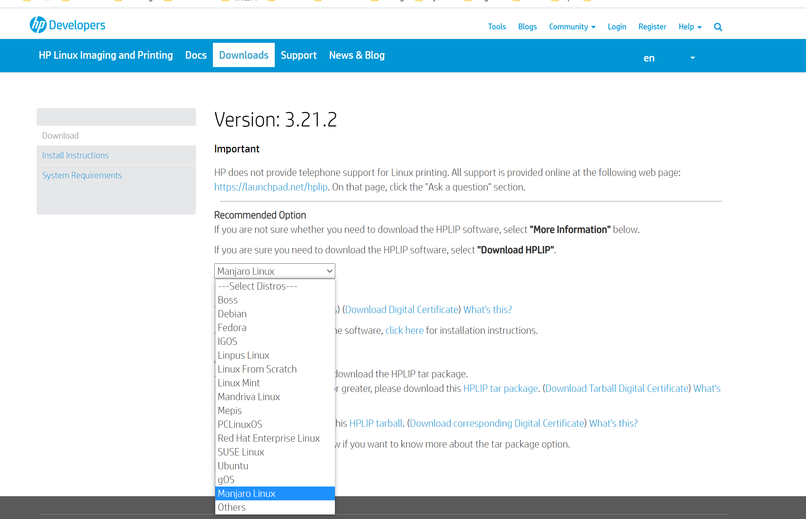

# Introduction

## 网站

- [鸟哥的Linux私房菜官网](http://linux.vbird.org/linux_basic/)
- [ArchWiki](https://wiki.archlinux.org/)
- [ManjaroWiki](https://wiki.manjaro.org/index.php/Main_Page​)
- [manjaro安装包的镜像站（包括社区版）](https://mirrors.tuna.tsinghua.edu.cn/osdn/storage/g/m/ma/manjaro-community/)
- [manjaro常用软件包](https://www.yuque.com/czyt/linuxdiynotes/idluxg)

---

## manjaro打印机

惠普的可以免驱动，见下面链接。群友买的是2132

https://developers.hp.com/hp-linux-imaging-and-printing/

## linux下人脸识别

https://www.bilibili.com/read/cv7824113/

## vim-like applications

https://vim.reversed.top/item/
