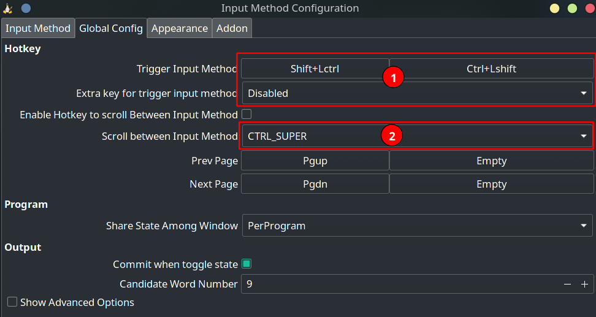

# fcitx（已过时。见下方fcitx5）

## 安装顺序

```bash
# 必须按照下面的顺序安装。因为第三个包需要依赖前两个包才能安装，否则会出现版本问题
sudo pacman -S fcitx-im
sudo pacman -S fcitx-configtool
sudo pacman -S  fcitx-googlepinyin

# 在安装完成后还需要改~/.xprofile文件的内容。但是如果有dotfiles就直接同步过去就行了
```

## 排错

### 快捷键问题解决

> 原链接：https://blog.csdn.net/win_turn/article/details/53637293

全局配置选项卡：



第一区域，用于切换“非激活输入法”和“激活输入法（的第一项）”。

第二区域，用于循环切换“激活输入法”列表中的每一项。

在这里，着重讲一下第一个红色区域“切换激活/非激活输入法”。

1. 先点击“空”按钮，然后按下你希望设置的快捷键组合。
2. 某些按键的顺序影响设置结果

    | 按键顺序                    | 结果                    | 使用方法                    | 备注                                     |
    | --------------------------- | ----------------------- | --------------------------- | ---------------------------------------- |
    | `Ctrl↓ Shift↓ Ctrl↑ Shift↑` | `Ctrl + Shift + Lctrl`  | `Ctrl↓ Shift↓ Ctrl↑ Shift↑` | 单独设置这一个不行，后面讲正确用法       |
    | `Ctrl↓ Shift↓ Shift↑ Ctrl↑` | `Ctrl + Shift + Lshift` | `Ctrl↓ Shift↓ Shift↑ Ctrl↑` | 单独设置这一个可以，要注意抬起按键的顺序 |

3. 我个人用惯了 `ctrl + shift`，而且经常是 `Ctrl↓ Shift↓ Ctrl↑ Shift↑`，但是单独设置 `Ctrl + Shift + Lctrl` 不行，该怎么解决？
   解决办法：把 `Ctrl + Shift + Lctrl` 和`Ctrl + Shift + Lshift`都设置上

### 不显示 configtool、不显示安装的中文输入法、同步 dotfiles 后的快捷键不生效

如果不显示 configtool，重启一下电脑

如果不显示安装的中文输入法，重启一下 configtool（右键有个 restart 选项）

如果同步 dotfiles 之后的快捷键不生效，重启一下 configtool
