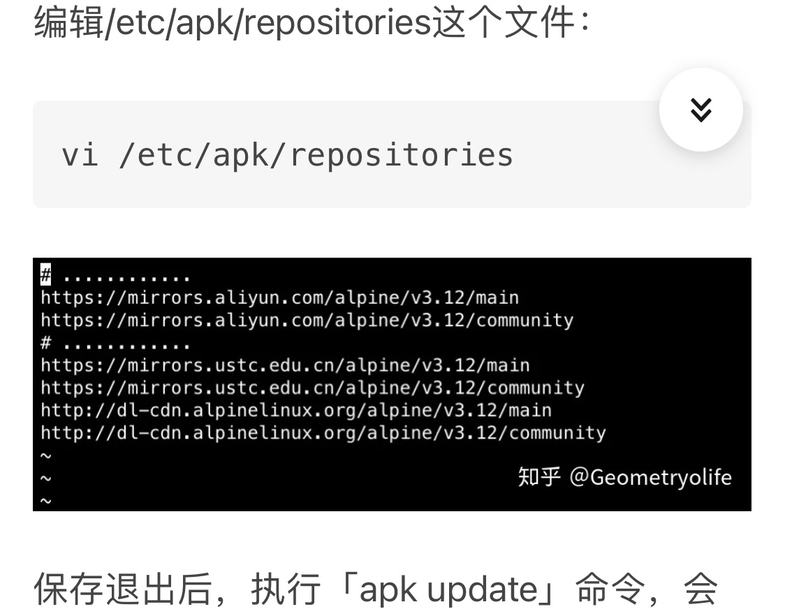

# 移动端linux

linux deploy: https://www.jianshu.com/p/fa32285672fc

## ish

1. ish更换国内源

    

1. 最小化zshrc

    ```bash
    [ -z "$TMUX" ] && { tmux attach || exec tmux new-session && exit;}
    ssht () {
        /usr/bin/ssh -t $@ "tmux new -A"
    }

    # 下面这里填写服务器的ip
    alias S="ssht ubuntu@192.168.1.2"
    ```
