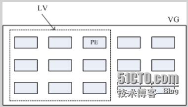
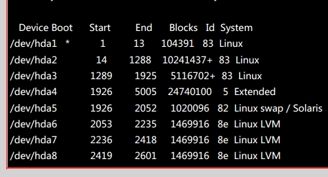
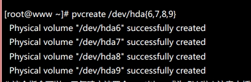
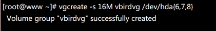
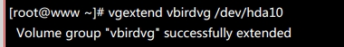

# 关于实现磁盘灵活性管理LVM中的PV，PE，VG，LV知识总结

> 原链接：https://blog.51cto.com/ny0716/1439757

## LVM发展的需要

当你在使用linux系统时，为了满足当时的工作需要你装了一个100G的磁盘，但是你发现随着公司的发展，和需要储存数据的空间的增大，你会不会重新买些磁盘给装到机器上去呢？每装一次重新分配一次磁盘，就复制一次数据，那这样对于工作的你，是不是非常的麻烦？如果我们用LVM就能解决这类的磁盘管理问题。

## LVM简介

LVM（logical volume manager）直白的翻译就是：逻辑滚动条管理员，也就是指逻辑卷管理。它是Linux环境下对磁盘分区进行管理的一种机制，LVM是建立在硬盘和分区之上的一个逻辑层，来提高磁盘分区管理的灵活性。LVM是在磁盘分区与文件系统之间增加的一层逻辑层，LVM能让下层的各个磁盘分区被文件系统看做为一个整体的大磁盘，供文件系统使用。

LVM的主要内容有以下几个方面的知识，

**PV（Physical Volume）实体滚动条**

PV 是LVM最基本的物理组成部分，利用fdisk命令把实际的partition转化成8e的系统格式，然后利用指令pvcreate把partition变成能够利用的physical volume。

**PE（Physical Extend）实体延伸区块**

PE是LVM最小的存储单位，一般为4MB大小，它是构成VG的基本单位，PE对于VG来说就如block对于分区来讲，它是存储数据的单元。而pe的大小并不是固定的，而是可以变化的，所以pe决定了LVM的灵活性，即能扩增，也能缩减。

**VG（Volume Group）滚动条群组**

VG，说的简单些就如我们使用的磁盘，是可以进行分区的，对于LVM上面的文件系统而言，VG就是一个大磁盘。文件系统时看不到LVM下面的组成部分的，它只管使用，而LVM则负责管理下面的组成储存块。

**LV（Logical Volume）逻辑滚动条**

LV就是VG切成的类似于分区的东西啦，我们可以用格式化，挂载使用啦，但是LV是VG切割成的，而VG又是有数量众多的PE组成，所以LV的大小取决于LV所包含的PE的数量的多少。（图片出自鸟哥私房菜（3版）



LVM具体的工作机制如下图（图用word画的有点粗糙）

![[picture 2]](../assets/image/2021-01-04-15-40-45.png)

如上图：从基层开始，把partition,转化为上层的PV，利用PV集合成VG，再把VG分隔成LV，最终挂载与使用。

  其中的过程：

- 第一步：利用fdisk创建分区的系统格式，如：



（我们可以看到后面的system是linux,这是不能用做LVM的，需要转化为8e Linux LVM格式，如hda6,7,8）

- 第二步，利用pvcreate /dev/hda{6,7,8,9},这就成功创建成PV啦



- 第三步，利用PV创建VG，且指定PE大小为16MB，并且用vgscan查看创建结果。



- 第四步，就剩下分隔VG成为LV啦，关于LV这块有以下命令需要用到， 如：lvcreate lvscan lvdisplay等。

LVM的突出特点就是可扩大容量和缩减容量，这就决定了LVM的灵活性管理。

扩大逻辑卷的容量命令为：lvextend , 我们创建一个 /dev/hda10,然后把hda10扩展到已经创建的逻辑卷上。



相反，减少容量就用到  lvresize -  。

整个LVM操作中用到的一些命令如下：

```bash
           创建分区时，fdisk， 设置8e 系统格式，

           然后让内核重读新创建的partitiong，kpartx -af device

                              partx -a

           创建PV时，pvcreate , pvscan ,pvdisplay

           创建VG时，vgcreate, vgscan, vgdisplay

           LV阶段时，lvcreate, lvscan lvdisplay lvextend lvreduce lvremove

           最后要给逻辑卷创建一个FileSystem，mkfs

           挂载时，要用到命令mount，unmount
```
