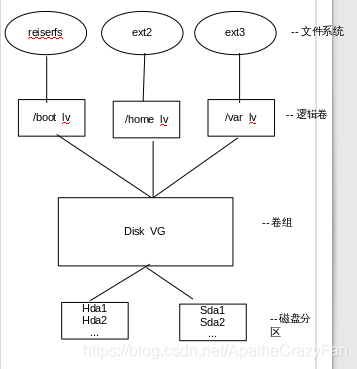
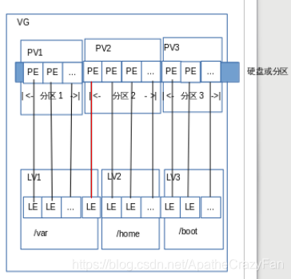
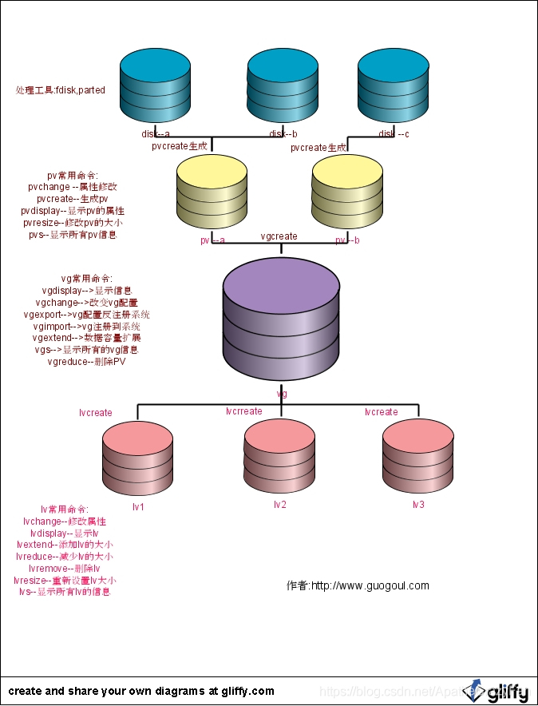

# Linux-LVM 原理及 PV、VG、LV、PE、LE 关系图

> 原链接：https://blog.csdn.net/ApatheCrazyFan/article/details/89454436

## Part 1

PV,VG,LV 构成了一种易于管理拥有一个或多个硬盘的主机的文件系统，这些硬盘可能只有一个分区也可能有多个。通过将这些物理存在的分区(或称为卷)PV(physical volume)进行整合，组成一个分区(卷)组 VG(volume group)，进而再次进行分配形成逻辑分区(卷)LV(logical volume)。创建成功的逻辑分区对于操作系统来说会想普通分区无异，其好处是可以动态调整分区大小。管理 PV,VG,LV 的工具称为逻辑卷管理器 LVM(logical volume manager)。

需要指出的是，在某个物理卷在加入卷组时，会将物理卷的最小存储单元设定为一个固定的值，这个值称为 PE(physical extent)。这个值的创建，是为了保证用统一的最小分配单元来创建逻辑卷，不至于因为分配单元大小不同而造成空间浪费。举个例子：用于远洋运输的集装箱的设计是是有着统一标准的，最重要一点是集装箱大小完全相同，这样做的好处是集装箱相互堆叠在一起不会留下多余的空隙，完全利用了空间，且便于管理。设定 PE 的原因也与此相同。LVM 以最小分配单元来创建逻辑卷，该最小分配单元的值称为 LE(logical extent)。一般来说 PE=LE，且大小为 2n。

## Part 2

LVM（逻辑分区管理）中的几个概念：

物理存储介质（The physical media）：这里指系统的存储设备：硬盘，如：/dev/hda、/dev/sda 等等，是存储系统最低层的存储单元。

PV(physical volume)：物理卷在逻辑卷管理系统最底层，可为整个物理硬盘或实际物理硬盘上的分区。
VG(volume group)：卷组建立在物理卷上，一卷组中至少要包括一物理卷，卷组建立后可动态的添加卷到卷组中，一个逻辑卷管理系统工程中可有多个卷组。LVM 卷组由一个或多个物理卷组成。
LV(logical volume)：逻辑卷建立在卷组基础上，卷组中未分配空间可用于建立新的逻辑卷，逻辑卷建立后可以动态扩展和缩小空间。在逻辑卷之上可以建立文件系统(比如/home 或者/usr 等)。
PE(physical extent)：物理区域是物理卷中可用于分配的最小存储单元，物理区域大小在建立卷组时指定，一旦确定不能更改，同一卷组所有物理卷的物理区域大小需一致，新的 pv 加入到 vg 后，pe 的大小自动更改为 vg 中定义的 pe 大小。
LE(logical extent)：逻辑区域是逻辑卷中可用于分配的最小存储单元，逻辑区域的大小取决于逻辑卷所在卷组中的物理区域的大小。
卷组描述区域：卷组描述区域存在于每个物理卷中，用于描述物理卷本身、物理卷所属卷组、卷组中逻辑卷、逻辑卷中物理区域的分配等所有信息，它是在使用 pvcreate 建立物理卷时建立的。

例外附加三张图帮助大家理解他们之间的关系：

图 1：磁盘分区/物理卷（PV）、卷组（VG）、逻辑卷（LV）、文件系统（FS）之间的关系图

图 2：LV、PV、VG 之间的单元关系图

由图 2 可以看出：

1. 物理卷（PV）被由大小等同的基本单元 PE 组成

2. 逻辑卷（LV）被由大小等同的基本单元 LE 组成

3. PE 与 LE 大小相同且一一对应

4. 一个卷组（VG）由一个或多个物理卷（PV）组成

5. 红线部分可以看出：逻辑卷可以比物理卷更大/更小，因为逻辑卷的单元（LE）个数可以比物理卷的单元（PE）个数更多/更小，又由于 PE 的大小等于 LE 的大小，这样就可以改变分区的大小

图 3：PV、LV、VG 之间的生成关系图

## 卷管理常用命令集合

|     | 查看显示  | 创建     | 删除     | 扩容     | 激活     | 扫描查找 |
| --- | --------- | -------- | -------- | -------- | -------- | -------- |
| LV  | lvdisplay | lvcreate | lvremove | lvextend | lvchange | lvscan   |
| PV  | pvdisplay | pvcreate | pvremove |          | pvchange | pvscan   |
| VG  | vgdisplay | vgcreate | vgremove | vgextend | vgchange | vgscan   |
