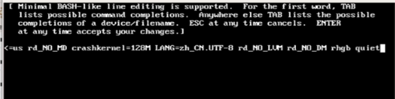

# 单用户模式(init 1)：How to Reset the root Password

> 原链接1：https://www.cnblogs.com/yxf-/p/11441518.html
>
> 原链接2：https://docs.fedoraproject.org/en-US/quick-docs/reset-root-password/
>
> Caution: This page has been converted from the Fedora Project Wiki and cleaned up for publishing here on the Fedora Docs Portal, but it has not yet been reviewed for technical accuracy. This means any information on this page may be outdated or inaccurate. Reviews for technical accuracy are greatly appreciated. If you want to help, see the [README](https://pagure.io/fedora-docs/quick-docs/blob/master/f/README.md) file in the source repository for instructions.

Centos6启动时读取的文件为：`/etc/grub.cfg`;

Centos7启动时读取的文件为：`/etc/grub2.cfg`

## CentOS6 How to reset the root password

1. 重启系统，进入系统欢迎界面按上下左右键进入GRUB界面；

    

    在此界面按下上下左右键进入GRUB界面；

    

2. 在GRUB界面选择内核版本，按下'e'键；

    

    选择kernel内核这行再按下'e'键进入

    

3. 在此界面可以进行编辑，在最后输入'single'再按回车键返回

    

    选择kernel这行，并按下'b'键进入单用户模式。

4. 修改密码

    ```bash
    #对root密码进行修改
    Passwd root
    ```

5. reboot进行系统重启

## CentOS7 How to reset the root password

Setting up a root password is one of the steps when installing Fedora. If you forget, or lose, the root password, there are two common methods to reset it:

- In Rescue Mode

- Using a Fedora Live Media (USB/DVD/CD)

### CentOS7 How to reset the root password in Rescue Mode

> Note: Changing passwords as root does not prompt for the old password.

While booting the system the [GRUB2](https://docs.fedoraproject.org/en-US/quick-docs/bootloading-with-grub2/) menu will be displayed. To boot the system into rescue mode using `bash` follow these steps:

1. Use the arrow keys to select the boot entry you want to edit

2. Press `e` to edit that entry

    备注：第一行是内核；第二行是援救模式。应该选的是内核那一项

3. Use the arrow keys to go to the line that starts with `linux`, `linux16`, or `linuxefi`

4. Go the the end of that line, add a space then type `rw`，然后在行尾添加`init=/bin/bash`. If your disk is encrypted, you may need to add `plymouth.enable=0`

5. Press `Ctrl-x` or `F10` to boot that entry

    （可选）如果在上一步忘记把`ro`改成`rw`，也可以在进入系统后重新挂载一下根目录，并设置为可读写：

    ```bash
    mount -o remount,rw /
    ```

    （可选）修改字符集：

    ```bash
    # 查看当前字符集
    Locale

    # 将终端的字符集改为英文
    export LANG=en_US
    ```

6. Run the command:

    ```bash
    passwd root
    ```

    It will prompt you to enter the new root password twice.

7. Restore the SELinux context and permissions with:

    当selinux防火墙启动时，修改密码后要创建文件。否则在系统重启时无法重启

    ```bash
    touch /.autorelabel
    ```

    > Warning: If you do not restore the SELinux permissions, the boot process may fail. You may have to do a hard-reboot and start back at step 1.

8. Reboot the machine with:

    ```bash
    /sbin/reboot -f
    ```

The system may take a while to boot as SELinux will be relabeling its permissions on the filesystem. If you see the Plymouth boot screen you can press the `ESC` key on your keyboard to view the SELinux progress. Once it is complete, your system is ready and your root password has been successfully changed.

### CentOS7 How to reset the root password with a Fedora Live Media

> Note: To download and create a live USB of Fedora Workstation, follow the instructions on the [Fedora USB Live Media Quick Doc](https://docs.fedoraproject.org/en-US/quick-docs/creating-and-using-a-live-installation-image/).

1. Boot the Live installation media and choose `Try Fedora`

2. From the desktop, open a terminal and switch to root using `su` (it won’t ask for a password)

3. To view your hard drive device nodes, in the terminal type: `df -H`. For this example we will use `/dev/sda1` for the `/boot` partition and `/dev/sda2` for the root `/` partition.

    If you are using LVM partitions, type: `sudo lvscan` and note the `/dev` path of your root partition. For this example we will use `/dev/fedora/root`.

4. Create a directory for the mount point (use the `-p` option to create subdirectories):

    ```bash
    mkdir -p /mnt/sysimage/boot
    ```

5. Mount the `/` (root) partition (be sure to use the actual device node or LVM path of your root `/` partition):

    To mount root on a **standard partition** scheme enter:

    ```bash
    mount /dev/sda2 /mnt/sysimage
    ```

    To mount root on an **LVM partition** scheme enter:

    ```bash
    mount /dev/fedora/root /mnt/sysimage
    ```

6. Continue the process by mounting `/boot`, `proc`, `/dev`, and `/run` with:

    ```bash
    mount /dev/sda1 /mnt/sysimage/boot

    mount -t proc none /mnt/sysimage/proc

    mount -o bind /dev /mnt/sysimage/dev

    mount -o bind /run /mnt/sysimage/run
    ```

7. `chroot` to the mounted root partition with:

    ```bash
    chroot /mnt/sysimage /bin/bash
    ```

8. Change the root password:

    ```bash
    passwd
    ```

9. Exit out of chroot with:

    ```bash
    exit
    ```

    and exit out of the terminal.

10. Reboot your system and boot from the hard drive.

Congratulations, your root password has been successfully changed.

### Additional Troubleshooting

1. If you cannot enter rescue mode because you forgot the Firmware/BIOS password here are some options:

    - Refer to your computer’s documentation for instructions on resetting the Firmware/BIOS password in CMOS memory.

    - Temporarily move the system hard disk to another machine, and follow the procedures above to reset the root password.

2. If you have set a password for your boot loader, refer to [Creating and Using a Live Installation Image](https://docs.fedoraproject.org/en-US/quick-docs/creating-and-using-a-live-installation-image/).

3. If you want to reset the boot loader password, refer to the instructions on how to [Reset the Bootloader Password](https://fedoraproject.org/wiki/Reset_Bootloader_Password).
