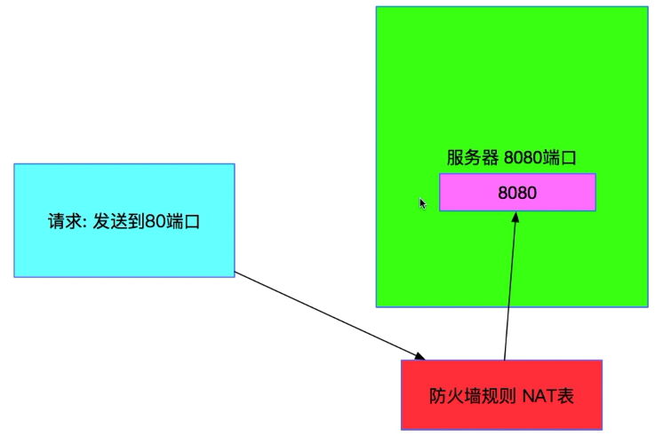
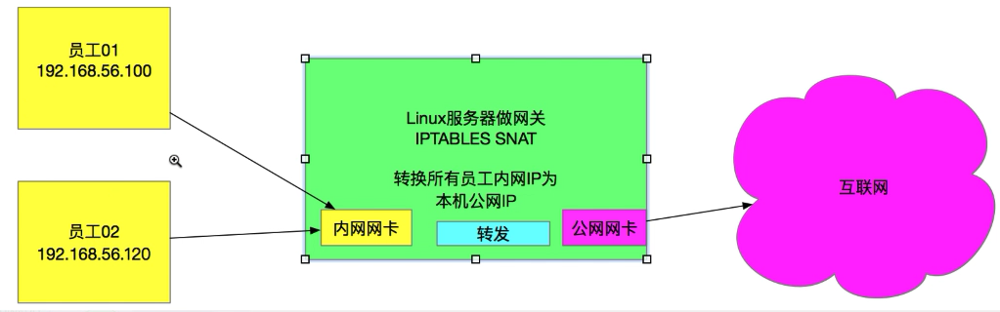

# Linux 下的 iptables 防火墙

## 防火墙

一种隔离技术

按照一种事先制定好的规则进行过滤，合格就通过，不合格就丢弃

## iptables

1. 概念：

    给 Linux 操作系统提供了内核层级的安全防护机制

    产生于 Linux 内核之中

    系统自带

    更难突破，安全性更高

1. 发展阶段：ipfirewall -> ipchains -> iptables

1. 特点：既是一个命令，也是一个服务

    ```bash
    # 命令
    iptables -h

    # 服务
    systemctl status iptables
    ```

1. CentOS 默认不带 iptables 软件，需要先用 yum 安装

    ```bash
    # CentOS-7
    yum -y install iptables

    # 如果是CentOS-8，应该安装iptables-service
    yum -y install iptables-service
    ```

1. 当使用 ps 命令或者 top 命令时，无法看到 iptables

    这是因为 iptables 是系统内核的一部分，真正工作的实际上是内核中一个叫做 Netfilter 的功能框架

    Linux 利用自身对于网络数据包的流向判断，来间接起到防火墙的功能，而 iptables 其实只是作为方便用户随时控制内核中 netfilter 功能的一个平台

    如何理解：

    ```bash
    # 尝试关闭iptables服务器
    systemctl stop iptables

    iptables -L -n
    # 就算把iptables服务关闭，也只是把全部的内核防火墙的表下的所有链都设置成允许。
    # 什么规则都没有，所有链都设置为通过，就跟没有防火墙一样
    # 但是内核的防火墙功能模块始终都存在，永远也不可能关闭
    ```

1. iptables 命令中，常用的参数

    | 常用参数 | 含义                                                                         |
    | :------: | ---------------------------------------------------------------------------- |
    |   `-t`   | 指定在哪个表下设置规则                                                       |
    |   `-A`   | 指定一个链，并指定本条规则是追加到链末尾（对应的还有一个`-I`将规则放在最前） |
    |   `-s`   | 限定来源地址的符合规则                                                       |
    |   `-d`   | 限定目标地址的符合规则                                                       |
    |   `-j`   | 执行动作和处理                                                               |
    |   `-p`   | 指定协议                                                                     |
    |   `-F`   | 清空表（危险操作）                                                           |
    |   `-P`   | 设置默认规则（ ACCEPT 或 DROP，见下面的标准追踪状态）                        |

**:warning:iptables 防火墙规则由以下内容（或顺序）构成：选择表 -> 选择链 -> 填写修饰。一定注意是先选表，再选链**

## iptables 4 个表

iptables 有 4 种标准化预定义的表（tables），每一种表代表了一种使用的类型

这 4 个表不管有没有设置，是一直都存在的，只是如果某个表没有设置规则的话，其默认规则就是全部 ACCEPT，因此会感受不到存在

```bash
# iptables的4种表：
.
├── filter 主讲内容，需要掌握
├── nat 主讲内容，需要掌握
├── mangle 使用频率不高
└── raw 使用频率不高
```

上面 4 种表的优先级：

```text
RAW（最优先） > MANGLE > NAT > FILTER（最不优先）
```

iptables 使用`-t`参数指定一个表，如`iptables -t filter -L`显示 filter 表中都有什么规则

filter 表是默认表，不加`-t filter`也一样，但如果要指定其他的表，就要用上`-t`

```bash
# 查看当前正在生效的防火墙规则
iptables -L

# 查看NAT表使用的规则
iptables -t nat -L
```

### 过滤型防火墙 filter 表

大多用来过滤外来的非法网络请求

根据一定的规则把即将发送到 OS 的请求或者即将发送出 OS 的请求（或者是转发的请求）预先做一个判断，根据判断的结果决定是否放行

```bash
# 有时发现某个IP不停地向服务器发包，采用以下命令将指定IP发来的包丢弃
# 这条命令的意思：
# 凡是来自172.16.0.0/16的网络请求全部丢弃， -s后面接上来源IP的范围，-j后面接上动作（DROP是丢弃，ACCEPT是通过）
iptables -A INPUT -s 172.16.0.0/16 -j DROP

# 给filter表添加一条过滤规则
iptables -A INPUT -t filter -s 172.16.0.0/16 -j DROP

# 给NAT表添加一条过滤规则
iptables -t nat -A PREROUTING -p tcp -d 192.168.102.37 --dport 422 -j DNAT --to 192.168.102.37:22
```

filter 表下面可以配置的链有三个：`INPUT`，`OUTPUT`，`FORWARD`。

> 虽然`FORWARD`是下路的，但是即使走上路的情况下（不涉及数据包的修改，只是数据包传输）也可能会跟`FORWARD`产生关系。比如 Linux 充当网关的时候，走的是上路，不是下路（因为不需要 NAT 转换地址），但是由于要用到路由转发功能，所以也会跟`FORWARD`有直接的关系

### 网络地址转换 NAT 表(Network Address Translation）

注意：NAT 技术是一种网络通用技术标准，并不是 Linux 特有的

目的：改变和转移请求

两种方式：

-   转移 IP 地址（不同主机）
-   同一台主机，但是转移端口

**要使用 nat，必须先开启 Linux 本身提供的数据包转发功能**

```bash
echo '1' > /proc/sys/net/ipv4/ip_forward
```

1. DNAT（Destination Network Address Translation）目的地址转换

    在 iptables 中通过`PREROUTING`链转换

    主要用途：

    1. 使用 DNAT 实现内网站点或其他服务的对外发布

        公司将内部服务器的某个站点使用 iptables DNAT 对外发布，可以实现员工远程连接企业内部资源。这样做会有安全隐患，因此要求在 iptables 的基础上做大量的额外工作。目前在企业中正在逐渐被其他技术取代，比如 VPN 技术（分为拨号 VPN、VPN 隧道、访问公有云）、带验证的反向代理技术等。如果对安全性没有要求，那么 DNAT 依然是速度最快的发布方法

    2. 堡垒机（跳板机）的实现 增强登录的安全系数

        

        绿色的是跳板机。结合 iptables 的 DNAT 技术，可以通过编写简单的登录脚本，实现快速后端间接登录，由于用户被限制在跳板机入口登录，所以这种方法既可以实现用户行为跟踪，又可以很好的起到保护后端登录安全的目的

    3. 服务器本机端口转换

        

        这种端口转发也会起到一定的安全防护作用，可以将服务器上软件的默认端口先用 iptables 都禁止访问。然后使用其他端口 DNAT 到这些默认端口来使用

    常用命令：

    ```bash
    # 把数据包目标地址是192.168.56.102的全部转发到192.168.56.104
    iptables -t nat -A PREROUTING -d 192.168.56.102 -j DNAT --to-destination 192.168.56.104
    # 这种属于全转发

    # 把来自于192.168.0.0/16网段且目标端口为3333的请求，转发到192.168.56.104:22（端口）。注意：-p和-deport要连用
    iptables -t nat -A PREROUTING -s 192.168.0.0/16 -p tcp --dport 3333 -j DNAT --to-destination 192.168.56.104:22
    # 之前讲的跳板机的用法和这个很类似
    ```

    实际案例演示：堡垒机--把 ssh 到不同端口的请求 转发到不同的后端机器上的 22 端口

    

    ```bash
    # 步骤1 在蓝色机器上设置路径B
    # 把发送到3333端口的ssh连接转发给192.168.56.104:22，
    # 把发送到3334端口的ssh连接转发给192.168.56.105:22，
    # ... 以此类推，把所有想设置的端口都设置好
    iptables -t nat -A PREROUTING -d 192.168.56.102 -p tcp --dport 3333 -j DNAT --to-destination 192.168.56.104:22

    # 步骤2 在蓝色机器上设置路径C
    # 由于数据包是有来有回的，假设数据包从106发出，想要发到102，但是现在被转发到了104，最终是104给回信，但是106不会搭理，因为106还在等102给他回信。所以在数据包从104发出想要发回106的时候，必须先把这个包的源地址从104改到102才行
    iptables -t nat -A POSTROUTING -d 192.168.56.104 -j SNAT --to-source 192.168.56.102

    # 总结：左右两边都是半边各自建立最短的直接链接，有去必有回
    ```

2. SNAT（Source Network Address Translation）来源地址转换

    在 iptables 中通过`POSTROUTING`链转换

    主要用途：

    1. 转换原地址为公网出口地址，实现企业上网

        

        虽然这样做是可行的，但是内网 ip 是无法在互联网上传送的，并且内网 ip 的数据包也没有办法被互联网返回回来。所以在经过`FORWARD`的路由转发之后，在最后一步的`POSTROUTING`链会把数据包的源地址改变为本机公网网卡的地址，并且在防火墙自身留下一条记录，数据包之后就可以发到互联网的对端了，之后再返回的时候，数据包回到 Linux 网关，再通过之前留下的记录，把数据包再转发给后端对应的那个内网 ip

        补充：我们绝大部分的所谓的“上网”都是通过类似这样的 SNAT 技术实现的（除非电脑是单独拨号，或者直连公网 ip 上网）。家里或者企业中的路由器做的就是这个事

        常用命令：

        ```bash
        # 把来源地址为172.16.0.0/16的数据包的源地址改成211.199.xxx.xxx（网关上的公网地址）
        iptables -t nat -A POSTROUTING -s 172.16.0.0/16 -p tcp -j SNAT --to-source 211.199.xxx.xxx
        # 这就是通过SNAT实现上网了
        ```

### raw 表和 mangle 表简介

这两张表更多的还处在一个探索和实验的阶段

1. raw

    - 第一优先级
    - 作用：针对一个数据包，让它可以跳过连接跟踪和 NAT。
        - Linux 操作系统中存在一个`ip_conntrack`的模块，专门用于对所有进入内核处理的数据包连接进行状态标记和跟踪，并且保存在一张表中，其目的是深入分析数据包的信息以供调研
        - 如果设置了 raw 表的规则，由于这张表在 iptables 中处于最高优先级，那么这个数据包不会再被 Linux 执行`ip_conntrack`追踪记录，并且也会跳过 nat 的规则
    - 包含的链：`PREROUTING`和`OUTPUT`
    - 使用的动作：`NOTRACK`

        ```bash
        iptables -t raw -A PREROUTING -d 192.168.56.102 -j NOTRACK
        ```

    - 注意事项：
        - 理论上说 raw 跳过连接追踪可以提高性能，在企业中对于高流量的且不需要执行 nat 的 Web 服务器可以尝试使用这种设置
        - 如果遇到日志发现错误为`ip_conntrack: table full, dropping packet`的状况，则可以通过检查防火墙中设置的 raw 规则，并且查看是否已经超过追踪表的最高存储量

1. mangle

    - 优先级处在 raw 表之后，nat 表之前，并且在企业中出场的概率高于 raw 表
    - 作用：在数据包经过路由表之前根据规则修改数据包的一些标志位，以便其他规则或程序可以利用这种标志对数据包进行二次处理。比较常用的是用这种方法来做策略路由（网络知识，非常常用）

        策略路由--比如下面这个例子：

        

        - 需求：当内网请求是访问寻常网站时走联通线路，当内网请求是访问其他外网服务（如 FTP 邮件等）走电信电路
        - 问题：传统的策略路由一般是按照修改静态路由表的方式来做，但是静态路由的设定属于三层模型，也就是说，是根据 IP 地址的走向来制定的。而我们这里的需求是属于 TCP 四层模型的策略路由，以一种偏向服务类的路由划分，所以按照传统方法是很难做到的
        - 解决方案：可以调用 PREROUTING 链在经过路由表之前按照需求给第一类的请求打上一个标签，然后在后面经过路由表时，就可以根据这个标签做路由划分的二次处理

            ```bash
            # 给不同目的的请求打上标签1和2
            iptables -t mangle -A PREROUTING -i eth0 -p tcp --deport 80:443 -j MARK --set-mark 1
            iptables -t mangle -A PREROUTING -i eth0 -p tcp --deport 20:21 -j MARK --set-mark 2

            # 之后制定两张路由表10和20，并且通过对两张标签分别做静态路由
            ip route add default via 202.106.x.x dev eth1 table 10
            ip route add default via 211.108.x.x dev eth2 table 20
            ip rule add from all fwmark 1 table 10
            ip rule add from all fwmark 2 table 20
            ```

## iptables 5 个链

iptables 一共有 5 个链，这 5 个链实际上对应着一个数据包流向的每个步骤

完整流程图：


| 链名          | 对应的步骤                 |        RAW         |       MANGLE       |        NAT         |       FILTER       |
| ------------- | -------------------------- | :----------------: | :----------------: | :----------------: | :----------------: |
| `PREROUTING`  | 数据包进入路由表之前       | :heavy_check_mark: | :heavy_check_mark: | :heavy_check_mark: |                    |
| `INPUT`       | 通过路由表后，目的是本地   |                    | :heavy_check_mark: |                    | :heavy_check_mark: |
| `FORWARD`     | 通过路由表后，目的不是本地 |                    | :heavy_check_mark: |                    | :heavy_check_mark: |
| `OUTPUT`      | 由本机产生，向外发送       | :heavy_check_mark: | :heavy_check_mark: | :heavy_check_mark: | :heavy_check_mark: |
| `POSTROUTING` | 发送到网卡接口之前         |                    | :heavy_check_mark: | :heavy_check_mark: |                    |

1. iptables 5 个链的含义（由浅到深）：

    1. iptables 命令中直接调用一个链。比如`iptables -t 表名 -A 链名`
    1. 这五个链实际上对应内核中 netfilter 框架的 5 个功能模块
    1. 五个功能模块再往下对应的是内核代码中的 5 个内核钩子函数，真正底层做事的是 5 个内核钩子函数对数据包进行处理、判断

1. 链与内核功能块的关系

    内核空间：

    - Linux 内核数据包刚到达时第一个进入的处理场所
    - 内核空间指的是系统的底层，也就是底层对网络数据包的判断、修改、转发、路由等功能

    用户空间：

    - 肉眼可见的，直接面对和操作的地方

    二者关系：

    - 数据包刚到达时，不会立刻进入用户空间，而是都必须先经过 Linux 内核的筛选后，才会进入（不管是否设定了 iptables 防火墙）

    路由功能：

    - 指的是 Linux 内核对数据包的转发功能
    - Linux 一项重要的功能：`FORWARD路由转发`，用于将数据包发送到其他网络或者非本机地址，直连路由
    - Linux 内核还有针对路由功能的防火墙链、FORWARD 链

## iptables 5 个链具体的功能

对于上面完整流程图的简化模型：


我们可以把数据包走势分成三个基本类型，以便理解，如下：

```text
1 从外面进入到本机的数据包：①->②
2 不进入本机，且需要过路由的数据包(或需要用到地址转换的数据包)：①-> ③ -> ④ -> ⑥
3 由本机由用户主动发起出去离开本机的数据包：⑤-⑥
```

1. `PREROUTING`

    字面意思就是`路由前`，在数据包经过 Linux 内核路由表之前对数据包进行第一次判断

    这时对数据包的判断只有两种结果，第一种是需要进入路由转发（发给本机），第二种是不需要进入路由转发（发给别的地方）。

    上路和下路的最终判定是过滤型防火墙还是 nat 型防火墙

    检查机制：

    - 根据事先定义好的表的 PREROUTING 链的规则，判断和修改数据包的**目的**地址、端口（补充：`POSTROUTING`是负责修改**来源**地址和端口）
    - 如果符合规则，就判定需要修改（走路径 3 提交给 FORWARD），否则不需要（走路径 2 进入本机转发）

    **目的**地址和端口只能在这个步骤修改。因为`PREROUTING`链是在数据包经过路由表之前发生（目标地址的修改）。而一旦经过了路由表，路由转发就已经确定，再想改目的地址就来不及了

    

1. 上路判定

    `INPUT` 顺序 1 -> 2

    - 作为内核和用户空间的一个输入关卡，是 iptables 最常配置的链。防火墙就是靠`INPUT`链的设置，防住任何对用户空间（操作系统）有害的请求

    - 补充：网络请求在内核空间中可以理解为无害的，因为内核空间中只是对数据包的网络包头做各种判断或修改，真正的破坏力都是在数据包进入应用层之后，所以内核进行过滤后才运行进入用户空间的应用层

    - 路径 2 属于过滤类型的防火墙，用的是 filter 表。

    `OUTPUT` 顺序 5 -> 6

    - 只能是从用户空间出去进入内核再出去的请求，简单说就是用户在本地发起的向外访问的请求

1. 下路判定

    `FORWARD` 顺序 1 -> 3 -> 4 -> 6

    `FORWARD`属于 filter 表，对于上路，是**可能**与`FORWARD`发生关系，而对于下路，是**一定**会与`FORWARD`发生关系（因为有 NAT 的参与）

    - 数据包提交给路由表并不代表一定执行所谓的路由功能，要取决于目标地址在路由表的判定，有可能是直连路由，也可能是路由（Linux 路由器），也可能是丢弃
    - 一旦源地址和目标地址都符合了`PREROUTING`的规则，就会走路径 3 提交给`FORWARD`，然后`FORWARD`判断是否符合任何自己的规则，如果判断后可以继续，就会再转发给`POSTROUTING`链

    `FORWARD`本身有两个意义

    - 内核层含义：Linux 内核本身具备`FORWARD`路由功能，也就是转发数据包（连接不同的网络）
    - 应用层含义：Linux 内核的防火墙 netfilter 本身还有一个`FORWARD`链，和其他 4 个链一样，也是用来做数据包判断，进而达到防火墙的目的

    `FORWARD`链只会跟需要用到 Linux 内核转发功能的数据包发生关系。只要是会用到 Linux 路由功能，或者 Linux 数据包转发的请求（过 Linux 网关，过 Linux 路由器，过 Linux NAT），就必然会经过`FORWARD`链的关卡

    1. 比如，**同网段**下从一台机器 ping 到另一台机器，与`FORWARD`链无关，因为同网段下用不到路由转发，走的是直连路由（路由表）。所以即使在防火墙下加上了如下语句，拒绝一个 ip 使用转发功能，但是依然可以 ping 通（但是此时 NAT 就不通了）

        ```bash
        iptables -A FORWARD -s 192.168.56.106 -j DROP
        ```

    1. 但是如果是不同的网段，就会用到`FORWARD`链：

        ```text
        机器A（网段A） -> 防火墙FORWARD DROP/网关（路由转发） -> 机器B（网段B）
        ```

        中间的这个防火墙机器充当了路由器使用，左右连接两个不同的网络下的机器，那么数据包经过的时候会依赖 Linux 内核的路由功能（路由功能即数据包转发功能），因此如果限制了`FORWARD DROP`，就 ping 不通了

    1. 如果一个数据包是要经过 DNAT 或者 SNAT 功能的时候， --> （数据包的转发功能） --> 会用到`FORWARD`链。因为只要是 NAT 功能（地址转换）就要用到 Linux 的数据包转发（但是这里就不属于使用路由功能了），Linux 开启数据包转发的时候，把自身做一个网关（路由器），NAT

    1. 如果在防火墙本机上往外 ping 一个公网地址，不会用到`FORWARD`链。因为防火墙本机向外发送数据包，这个等于是把一个数据包直接从本机发送出去，并未用到任何跟本机相关的路由功能（但是会用到路由表，这两个不是一个意思）

1. `POSTROUTING`

    通过规则来判断数据包的**来源**地址和端口是否需要修改

    **源地址**和端口的修改只能在此步骤进行，因为源地址的修改一般情况下只是作为将原本的源地址修改为本机的 ip 地址，以此来实现 SNAT。这种情况不可能在过路由之前就修改为本机一样的 ip 地址 A-A，否则数据包就没有办法被 Linux 判断

## 两种数据拒绝的方式（DROP 和 REJECT）比较、LINE-NUMBERS

### 拒绝方式

`DROP`：

-   表现：iptables 防火墙将符合规则的数据包直接丢弃，并且不给发起请求端任何的返回信息。这个时候发起请求的一段就会一直卡在那里，因为建立 TCP/IP 请求如果得不到任何返回的结果，默认会一直等待 TIMEOUT 才会结束
-   使用场景：适合生产环境上 iptables 对于防范真正的有害请求时应该使用的措施，也可以用于遮掩（让攻击者以为主机上并没有这个端口，但实际上我们是定义了 iptables 的防范规则）

`REJECT`：

-   表现：使用 REJECT 拒绝之后，请求端会立刻结束，并且会被提示一条语句，这个语句就是在防火墙端提前设置好的
-   使用场景：适合运维工程师在预先调试 iptables 的时候或者学习 iptables 的时候使用，因为会立刻返回并且告诉为什么被拒绝了，可以给我们调试规则提供很大的便利

举例

```bash
# DROP
iptables -A INPUT -s 172.16.0.0/16 -j DROP
# 后续使用命令的时候会卡住，并且没有任何返回提示

# REJECT
iptables -A FORWARD -s 192.168.0.0/16 -j REJECT --recect-with icmp-host-prohibited
# 会有动作，但是现象表现为输出ping不通的结果
```

### line-numbers

```bash
# 查看filter表使用的规则，并且带上行号
iptables -L -n --line-numbers

# 删除某个表的所有规则
iptables -t filter -F

# 指定行号删除nat表下，POSTROUTING链下的第3条规则
iptables -t nat -D POSTROUTING 3
# 删除之后，默认后面的一行会往前排序，把之前的行号补上

# 把当前所有表的所有规则规则保存在本地
service iptables save
# 会生成一份配置文件并保存在/etc/sysconfig/iptables路径下（注意省略了前面的iptables字样），然后可以在本地用vim去添加删除或修改某一行，这样就更规范了
```

## iptables 四种标准跟踪状态

状态跟踪信息：iptables 防火墙（内核模块）提供了一种数据包状态跟踪记录的功能。指的是，当数据包由防火墙本机主动发送出去的时候，iptables 会记录每个链接每个阶段的状态，并按照这个状态制定更细节的防火墙规则

## iptables 对数据包的追踪状态

-   NEW：新建连接的第一个数据包。不管是哪一种协议哪一种服务，只要发送出去的第一个数据包，就会被标记为这种类型
-   ESTABLISHED：已经成功链接的数据包。也就是当第一个数据包到达对端后，对端返回的应答数据包。也就是说，只要对端发送一个应答，就会被标记为这种状态
-   RALATED：发出的数据包相关的数据包。指的是由当前已处于 ESTABLISHED 状态的连接再发起这个连接之外的又一个连接，这时会被标记为 RELATED
-   INVALID：无效的数据包。只要不属于上面任意一种状态，iptables 就会标记为这种状态。该状态的数据包通常直接拒接掉，因为防火墙规则认为这种数据包有危险性

### 追踪状态实例

1. 一般在企业中，一台后端服务器上所设置的 iptables 规则，往往是通过先设置 INPUT 链为默认拒绝的状态

    ```bash
    # 设置INPUT链默认规则为拒绝
    iptables -P INPUT DROP
    ```

2. <s>然后把个别可以放进来的请求在 INPUT 链上单独设置 ACCEPT</s>

    ```bash
    # 例如这样，单独给一个网段开通ssh权限
    iptables -A INPUT -s 192.168.56.0/24 -p tcp0 --dport 22 -j ACCEPT
    # 给服务端口开放权限
    iptables -A INPUT -s 192.168.56.0/24 -p tcp0 --dport 80 -j ACCEPT
    iptables -A INPUT -p icmp -j ACCEPT

    # 然后再加上对OUTPUT链设置的开放，这样就有很好的防御作用
    ```

3. 但是此时当在这台带规则的机器上，向别的机器主动发起请求时，会发现 ping 不通，这是因为数据必须是有来有回的。目前是只能发出，但是当对方接收后再返回来的时候，会被默认 INPUT 规则给拒绝掉。**因此不采用步骤 2，直接采用追踪状态的方法设置规则**如下：

    ```bash
    # 对于ping命令，属于ICMP连接，这种连接是单通道连接，不存在RELATED的情况，因此只需要设置ESTABLISHED即可
    iptables -A INPUT -m state --state ESTABLISHED -j ACCEPT

    # 一般情况下，不会用上面这一条，而是用下面这个
    iptables -A INPUT -m state --state RELATED,ESTABLISHED -j ACCEPT
    # 这样就可以达到，只要是从本机发送出去的连接，无须个别设置INPUT，就可以通过状态的方法接收回来
    # NEW的状态是发起的第一个数据包，因为通常默认OUTPUT就是开启的，所以由本机发出去的第一个数据包自然可以通过，因此加不加NEW意义并不大
    # 一般本机 -> ping包 -> 路由表 -> OUTPUT -> POSTROUTING -> NEW
    # INVALID状态的话，直接DROP即可
    ```

## iptables 实践篇：结合企业集群架构合理设置

> 网络攻击关键词：DOS/DDOS 攻击、CC 攻击（DDOS攻击中的一种，占的比重最大）、SYN UDP 洪水攻击、 death-ping、tearDrop、ICMP分包攻击

iptables 现如今在生产集群中越来越趋向于扮演一个辅助角色，因为攻击种类多样化，单单使用一个 iptables 做所有的生产防护并不现实，且工作量太庞大，从人力成本来说一般企业也不会这么去做

但是 iptables 由于其快速部署等特性，作为生产环境的辅助安全策略，依然有效

下图中，左边是线上通用分层架构，右边是同一的线下集群。线上处理用户请求，线下是为线上做辅助和支撑的


1. 最外层/洪流层

    - 负载最高
    - 由于直接面对互联网用户，ip量非常大，所以必须保证最外层的 iptables 默认对`INPUT`和`FORWARD`关闭

        ```bash
        # 不要使用REJECT
        iptables -P INPUT DROP

        # 默认不允许任何形式的转发
        iptables -P FORWARD DROP

        # OUTPUT出去的包可以设置为允许
        iptables -P OUTPUT ACCEPT

        # 绝不允许任何公网用户访问与登录相关的敏感端口（比如22号ssh登录，还有ftp等），且最好连22号端口都不要让用户发觉出来
        # 可以通过改变默认端口的方法或者转发的方式，配置允许公司内部运维可以通过22登录端口进入
        iptables -t filter -A INPUT -p tcp --dport 22 -s "公司出口ISP地址" -j ACCEPT
        ```

    - 最外层一般采用四层均衡的方式来响应海量访问请求，HAProxy可作为最外层负载均衡，选择支持4&7模型。对于特定的负载均衡端口，要执行开放配置

        ```bash
        # 对外开放的端口
        iptables -A INPUT -p tcp --dport 80:8080 -j ACCEPT

        # 对负载代理的后端的目标IP执行开放转发
        iptables -A FORWARD -d 10.172.100.0/24 -j ACCEPT

        # 开放由本机主动发送请求的回应包
        iptables -A INPUT -m state --state ESTABLISHED,RELATED -j ACCEPT
        ```

    - 设置允许本机lo通信

        ```bash
        iptables -t filter -A INPUT -i lo -j ACCEPT
        iptables -t filter -A OUTPUT -o lo -j ACCEPT
        ```

    - 最外层对于任何形式的公网外来ping都要禁止掉，很多攻击都是由ping加上特殊参数实现的

        ```bash
        iptables -A INPUT -p icmp -i DROP
        ```

2. 后端防火墙规则

    ```bash
    # INPUT默认设置为REJECT，并且只允许上层的内网地址通过
    # 这里最好不要设置为DROP，因为一旦出现失误，上层内网的请求会被卡住
    iptables -P INPUT REJECT

    # INPUT开启状态追踪以接收更后端的返回数据包
    iptables -A INPUT -s 10.173.100.0/24 -j ACCEPT
    iptables -A INPUT -m state --state ESTABLISHED,RELATED -j ACCEPT

    # 允许线下集群的访问（same）
    iptables -A INPUT -s 10.171.100.0/24 -j ACCEPT
    ```

    后端后面的设置也都以此类推

## iptables注意事项


