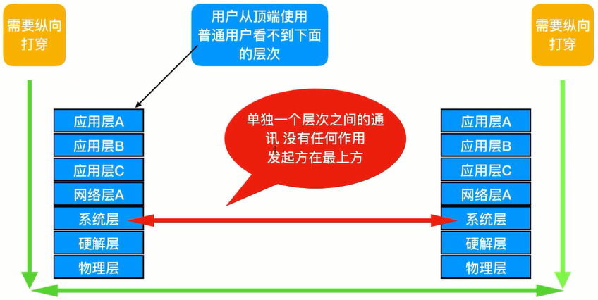

# Linux 和网络

## 引言

### 常用名词解释

1. 几个名词

    线上集群：指线上生产集群、线上用户流量

    网络攻击：比如 DDOS 攻击等

    非法侵入：非法登录、挖矿埋点式攻击

    云计算的安全产品：通过大量资源与各种网络攻击进行对抗，没有实际技术含量，可以作为我们对于安全问题解决的最后一步

    学习 TCP/IP 协议，需要从比较宏观的技术思路去入手，而不是一上来就深究各种协议和规范

1. 协议：计算机之间通过网络实现通信前所达成的一种约定，这种约定让不同厂商的设备、不同的硬件、不同的操作系统之间实现通信

1. 网络连接设备：比如集线器（HUB）、交换机、路由器

1. 网段：

    只有同网段的 ip 地址才能直接通信

    一个 ip 地址需要通过子网掩码来区分网络位和主机位。比如子网掩码`255.255.255.0`，三个 255 指定了 ip 地址的前三位是网络位，最后一位是主机位

    网络位相同的情况下，就是同一网段的 ip 地址

    一般情况下，`255.255.255.0`就是最常见、最简单的配置方法

    另外，子网掩码还有缩写形式，比如 ip 地址是`192.168.0.1`，子网掩码是`255.255.255.0`，那么这台机器的 ip 就可以缩写成`192.168.0.1/24`

1. 网关（Gateway）：

    指默认路由的位置。意思是如果我这台机器想访问其他任何外网，都先发送到最近的网关地址

    网关的设置其实就是设置本机的默认路由。

    所有的网关都是设置在路由器上，路由器上的网关越多，负载量相对也越大

    网关设备：用于连接两个不同网络的媒介。数据包在跨越网段时必须借助网关设备。可以是一个硬件的路由器，也可以是一台开启了路由功能的 Linux 主机

1. 转发

    数据包在传输过程中的一种中转

    Linux 本身提供了数据包转发功能：

    - Linux 本身就可以转发数据包，因此可以当作路由器使用
    - 只有开启了 Linux 的路由转发功能，nat 才能正常使用
    - Linux 数据包转发最少开启两种功能：路由器网关和数据包修改（nat）
    - 假如一个数据包需要被转发到一个地址去，一定先经过路由表的查询之后才能被转发。而一旦进入了路由表，就已经决定了这个包的下一步去向，此时目的地址就不能再修改

    ```bash
    # 开启路由转发
    echo 1 > /proc/sys/net/ipv4/ip_forward

    # 关闭路由转发
    echo 0 > /proc/sys/net/ipv4/ip_forward
    ```

1. 私网：

    又称内网

    只要有计算机和网线、有基本的网络设备，就可以自行架设

1. 公网：

    指互联网，全球范围的网络

    不能自己架设，必须依靠专门的接入商分配公网 IP、公网的网关，才能进入

    显示自己的公网 IP 的网站：myip.cn（网站已经打不开了）

1. 域名

    ip 地址由于不容易记忆，于是就要寻找一种方法来修饰一下 ip 地址，这就是域名

1. DNS 服务器

    也叫做域名服务器，用来翻译和转换域名与 ip 地址

    当我们访问一个网站的时候，会先拿着这个网站的域名去询问离我们最近的 DNS 服务器，它在自己的数据库中查询记录，然后把最终的 ip 地址告诉我们，最后再用 ip 地址去访问真正的网站

### TCP/IP 协议

TCP/IP 是具体的实现方式，但是没有主干

TCP/IP 实际上是一个协议族：


图中有很多高层协议已经具象为工具或命令行，比如 ftp

TCP/IP 和 OSI 的对比


TCP/IP 是 U 型结构，通信需要纵向打穿



## OSI 七层模型简介与纵向打穿

OSI 属于逻辑和主干，没有提供具体的实现方式（比如 java 里的抽象类）


### OSI 七层模型

-   第一层：物理层

    主要用来定义物理设备标准。它的主要作用是用来传输比特流（由 1、0 转化为电流强弱来进行传输，到达目的地后再转化为 1、0，也就是常说的数模转换与模数转换），这一层的数据就叫做比特。

-   第二层：数据链路层

    定义了如何让格式化数据进行传输，以及如何让控制对物理介质进行访问，这一层通常还会提供错误检测和纠正，以确保数据的可靠传输。

-   第三层：网络层

    对位于不同地理位置的网络中的两个主机系统之间提供连接和路径选择

-   第四层：传输层

    定义了一些传输数据的协议和端口号（www 端口 80 等），它的作用主要是将从下层接收到的数据进行分段和传输，到达目的地址后再将数据进行重组，常常把这一层数据叫做段。

-   第五层：会话层

    通过传输层（端口号：传输端口与接收端口）建立数据传输的通路，主要是在系统之间发起会话或者接受会话请求。

-   第六层：表示层

    可以确保一个系统的应用层所发送的信息可以被另一个系统的应用层读取。

-   第七层：应用层

    是最靠近用户的 OSI 层，这一层作为用户的应用程序（例如电子邮件、文件传输和终端仿真）来提供网络服务。

### 纵向打穿


上图表明了数据在 OS 七层模型中传输的一个基本方式。OSI-TCP/IP 网络通信中，由第一层（最高的应用层）提取出数据实体，并打上本层的标签传递给下一层。之后的每一层会把上一层传递过来的所有（包括上一层的实体数据及上一层的标签）都当作自己的数据实体，在这个基础上再打上本层标签继续传递。

OSI-TCP/IP 协议中，把每一层的这个实体数据统一叫作包，更专业点叫作报文。而每一层打的这个标签称作包首部，或者报文首部、报文头，都是一个意思。

纵向打穿，其实就是把本层的报文打上一个首部，在这个首部信息中加入详细的注解（每一层所涉及的具体的协议内容）

报文到了这一层，做了什么处理，使用了什么协议然后下一层接到上一层的全部信息后，就通过这个首部知道我手里的是什么东西，以及接下来该做什么。如下图


## OSI 的物理层

### 直连节点与网线知识

-   局域网：几台计算机通过网线连接，再加一个集线器，就构成了局域网

-   网线：学名是以太网双绞线，内含 8 根芯线，按照一定顺序摆列。水晶头中是 8 根线按照一定顺序整齐排列

    1. 网线分类：

        - 交叉线：连接两个相同层的设备，用于直接通信
        - 直连线：连接不同层的设备。比如请求发起端和请求接收端之间通过集线器或者交换机作媒介，它们连接到交换机时采用直连线

        现在所有网络设备的接口还有计算机的网卡都具有了自适应性，可以判断出接上的是交叉线还是直连线，然后自动转换

    1. 网线排序

        <details>
        <summary>网线中每一根线都用不同颜色来表示</summary>

        
        </details>

        以直连线为例，T568B 标准连线顺序从上到下依次为：

        | 颜色   | 作用           |
        | :----- | -------------- |
        | 1-橙白 | 输出数据（+）  |
        | 2-橙   | 输出数据（-）  |
        | 3-绿白 | 输入数据（+）  |
        | 4-蓝   | 保留为电话使用 |
        | 5-蓝白 | 保留为电话使用 |
        | 6-绿   | 输入数据（-）  |
        | 7-棕白 | 保留为电话使用 |
        | 8-棕   | 保留为电话使用 |

        交叉线的做法（现如今用的比较少）： 1 3 对调，2 6 对调即可

### 集线器

集线器（HUB）：最早一代用于实现局域网的网络级联设备

集线器只认识模拟信号

几台计算机配置到同网段，然后把它们级联在一起，彼此就可以互相访问

级联的方法：集线器上的一个单独一个 UPLINK

如果计算机数量更多了，就需要将多个集线器级联：每个集线器挑出一个口作为级联口，然后通过交叉线进行连接（早期必须是交叉线，因为集线器和集线器之间属于同层设备。现在无所谓）


但是如果计算机规模进一步扩大，虽然物理上可以实现，但是局域网的质量将会非常差。原因如下（集线器的本质和缺陷）：

-   带宽共享问题

    -   现象：

        集线器工作在物理层，没有智能化（只是电信号的传递），看上去是分享设备，其实构造原理非常单一（基于简单的信号放大器），相当于一根网线打了几个断点，然后把计算机连接上去。因此整个局域网网络的最大带宽就是由这一根网线来决定，导致局域网内所有计算机共享带宽，相互抢占带宽资源

    -   影响：

        导致实际使用中，不同集线器之间的主机传数据的速度要略慢于同一个集线器内的主机传输数据速度。因为级联的集线器通过一个级联端口用网线连接，其速度要慢于集线器内部广播的速度，而且级联端口上的数据冲突比率会较普通端口大，也会造成一些速度损失。单独的集线器内共享一个带宽，如果通信要跨越集线器，那么会因为级联的问题造成更多的带宽损失

-   广播风暴问题

    基于 ip 协议的网络通信，存在几种主要的通信方式：单播、多播、广播、组播（这个用的相对少）

      <details>
      <summary>单播与广播</summary>

    -   单播：一对一、点对点的通信。

        比如平时看网页、看电影、打游戏、两个机器执行 ping，日常使用几乎都是单播方式（互联网中绝大多数的应用，都属于 C/S 架构，也就是一个客户端去访问一个服务端，然后得到响应）

    -   广播：一对所有、单点对所有点的通信

        这里举一个离我们很近的使用广播的例子。当在一个局域网中去 ping 一台刚新装好的机器的 IP 地址时，其实就用到了广播。当我们尝试使用 IP 地址去访问一台机器时，其实真正做响应的是处于 IP 地址下一层的 MAC 地址。

        但在第一次尝试去 ping IP 时，由于计算机并不知道 IP 地址对应的是网络中哪一个 MAC 地址，所以会先以 ARP 包的方式发送一次广播到当前所在同一个网段内的全部机器，之后才会得到正确的该 IP 和某 MAC 的对应关系，然后下一次就不用再发广播。

        除此之外，广播还可以手动发送，之前学习过在 LNMP 环境中使用 keepalived 做 HA 高可用，所谓的高可用，说到底它的核心其实是健康检查+VIP 的游走，后面了解了 ARP（谁是 IP 对应的 MAC）和 GARP P（Gratitude--ARP，即现在的 MAC 对应的是 IPA）原理之后，甚至也可以通过 bash 脚本，用发送广播的形式来实现这种 keepalived 的功能

      </details>

    -   现象：

        集线器只能发广播，不能单播

    -   影响：

        只要是同一网段内的计算机发出任意通信，无论是否跨越集线器，其他计算机都会被波及。因此广播的范围越大，受到影响的范围也越大，出问题的概率也越大

-   地域和传输限制

    集线器不能智能地对 ip 协议做出判断，因此只有 ip 地址是同网段内的计算机才可以通过集线器直接通信

-   IP 地址的网络划分问题

    企业中正确的网络规划，应该是尽可能多的划分子网网段（也不是越多越好），且每个网段下的 ip 数量也不能过多。子网的划分有助于广播隔离、带宽使用、网络管理、权限管理、防火墙策略

    但是集线器根本不能对划分的子网进行管理

    补充：[网络和 ip 地址计算器](https://tool.520101.com/wangluo/ipjisuan/)

    **掩码越大，同一个网段的 ip 可用数就越少，而网段数量越多；掩码越小，同一个网段的 ip 可用数就越多，而网段数量越少。掩码最高是 32，对应的只是单个 ip**

    内网的 ip 确实可以随意定掩码，随意使用，但是如果是公网 ip，则要求分配时非常严格，通常一个企业都被 ISP 分配的固定的公网 ip，掩码都在 28 以上，不太可能低于 28.28 掩码给出 14 个可用 ip，29 则只有 6 个可用 ip，对于一般中小型企业已经是比较奢侈了，如果掩码达到 30，每 4 个 ip 地址就是一个网段，但是除了本机地址和广播地址，实际可用 ip 只有 2 个，小型创业公司一般会这么用

    由于如果使用 30 掩码来划分，理论上有 4 个可用，但实际上只有 2 个可用，这样会造成有一半的 ip 地址都浪费掉了。因此很多 ISP 运营商会采取类似下面的方法来划分：使用掩码 29，有 6 个可用 ip，然后把 6 个可用 ip 拆分给 3 家公司使用，所以说很多时候并不是一个网段分给一个公司，另外，公网所谓的固定 ip，也不等于永久 ip，公司总有搬走的一天，也总有倒闭的一天，自然固定 ip 也会经常被回收再利用

## OSI 的数据链路层与交换机

MAC 地址只能工作在同一链路上的计算机。比如集线器相连的就属于同一链路。但是集线器不能无限制的级联，因为信号在传输过程中会减弱，因此这种级联最终一定会中断。网络层的 ip 协议可以解决跨链路的问题

二层交换机只认识 MAC 地址，不认识 ip 地址。二层交换机虽然不认识 IP，但计算机在尝试去访问一个 IP 时，是先调用第三层的 ARP 协议，然后 ARP 协议以发广播帧的方式（广播帧是二层的概念，所以二层交换机可以识别）传到整个二层交换机再把对应的 MAC 地址返回来。因此当两台计算机通过交换机执行 ping 命令可以 ping 通

三层交换机其实是在二层交换机的基础上，加入了更高层对 IP 数据包头的识别能力，所以它可以进而根据 IP 数据包头做不同网段之间的通信转发，这就是路由功能。

“交换机替代了集线器”指的是企业级或 IDC 的大范围网络的使用，比如几百人的公司、核心网络设备、运营商的公司等。平时家用的用于连接多个电脑的设备，底层实际上就是个集线器。交换机很贵，两三万左右一台

-   解决带宽共享问题：

    交换机的每一个端口都被视为独享端口每一台连接交换机的设备，都会有自己独享的带宽（交换技术）

-   解决广播风暴问题：

    交换机端口与端口之间是分开的，发生广播风暴的概率大大降低（注意：只是降低。因为广播不一定都是有害的，所以交换机中一样有广播的产生。比如 ARP 的请求，如果没了广播，所有 ip 地址都作废了，无法进行翻译和通信）。另外，智能交换机的 VLAN（虚拟子网）也可以对广播风暴起到抑制作用

-   解决地域问题和子网划分问题--VLAN

    VLAN：逻辑的子网，不拘泥于任何端口和设备的限制，随时接入随时划分

    

    光纤：一种以光信号代替电信号，获得更稳定、更快速、更长距的新一代传输技术

    交换机中有专门的光纤转换插槽，接入光纤模块后，就可以完成光纤的接入。另外，光纤也可以在楼宇间长距离部署，通过竖井打通两边，并通过 OOF（光纤配线架）接入小机房，并最终连接上交换机。通过光纤级联交换机是目前多数企业倾向的部署方法

    

## OSI 的网络层

网络层能识别 ip 地址

### IP 网际协议

ip 协议可以解决 MAC 只能在同一链路上传输的问题

又称互联网真实载体，实现数据包在任意主机之间传送

协议首部中一个重要的字段：ip 地址，这是实现基于 ip 协议的网络传送的重要基础

网络中任意一个设备称作节点，ip 地址是这些节点在在网络中的唯一标识

正是因为 ip 网际协议和它相关的同一个层次中的其他协议的辅助的存在，当中的协议的各种规范把整个网络规划的整整有条，所以才不会出现网络中的 ip 地址混乱（比如 ip 冲突）

### ip 封包首部结构

分包与重组：网络中发送 ip 封包会先由主机分片，然后一个个分片独立发送到达目标后，再一个个分片由目标主机重组起来

ip 协议首部只有 32 个比特（bit）

```bash
1MB = 1024KB = 1024 * 1024byte = 1024 * 1024 * 8bit = 8388608 bit
```


1. 版本号（Version）

    一般就是 4，代表 ipv4，ipv6 以后会慢慢过渡过去，但是目前还太遥远，我们职业生涯都不见得能等到 ipv6 普及，其他的版本号几乎没有用，不用理会：

    | 版本 | 简称  | 协议                    |
    | :--: | :---: | ----------------------- |
    |  4   |  IP   | Internet Protocol       |
    |  5   |  ST   | ST Datagram Mode        |
    |  6   | IPv6  | Internet Protocol 6     |
    |  7   | TP/IX | TP/IX:The Next Internet |
    |  8   |  PIP  | The P Internet Protocol |
    |  9   | TUBA  | TUBA                    |

1. 首部长度（IHL）

    一般固定为 5（隐含单位是 byte），所以就是 5 \* 4byte = 20byte（20 字节）。其实就是一个 ip 首部的总大小是多少。

    横坐标一共 32bit（4 字节）就是刚才说的单位。纵坐标一共分为 6 层，但是一般第 6 层的内容不重要，所以只剩下前 5 层，也就是 5 \* 4 = 20 字节（160bit）

1. 区分服务（Type Of Service，TOS）

    这个字段整个互联网都没有在使用，所以可略过

1. 总长度（Total Length）

    Total Length 中存的数值代表着整个 ip 包，首部 + 传输实体的总大小上限，这个字段长 16bit，也就是最多 16 位的二进制数字，所以最大就是$2^{16}$，即 65536 字节（单位隐含为 1 字节）。也就是说，一个 ip 封包的最大大小在 ip 协议中限制在 65536

1. 标识位（Identification）

    用于给每一个 ip 分片都分配一个唯一的 ID 号，用作重组使用

1. 标志位（Flags）

    有 3 个 bit

    - 第 1 位，只能是 0，没有使用
    - 第 2 位，0 表示可以分片，1 表示不能分片
    - 第 3 位，0 表示是当前最后一个分片，1 表示不是当前最后一个分片

1. 偏移位（Fragment Offset，FO）

    代表当前一个分片相对于原始的相对位置，而这个相对位置按照字节来计算

    假设第 1 个 ip 数据包实体是 4000，MTU 是 1500，所以一个 4000 的包会被分成 3 份，即 1500 + 1500 + 1000.第二个分片相对于第一个就是 1500，第 1 个是 0，第 3 个是 2500

1. 生存时间（Time To Live，TTL）

    这个字段是 8 位，最多就是$2^{8}$，所以 TTL 不管在任何操作系统中，都不能超过 256

    ip 协议首部中，有一个字段`TTL`（Time to Live，生存时间），是为了追踪 ip 数据包在被每一个路由器转发时留下一个记录。每当 ip 数据包经过一个路由器转发，这个数值就会被 -1 ，如果到达目的地之前，这个数值被扣完，那么 ip 数据包会被丢弃

    之所以设置这个 TTL，初衷是为了预防 ip 封包在被路由转发的过程中出现死循环，另外也有恶意转发数据包循环的可能

    TTL 数值存在并设定在操作系统中，每一种不同的操作系统设置的基础 TTL 数值不一样

    | 操作系统 | TTL 数值 |
    | :------: | :------: |
    |  Linux   |    64    |
    |   Mac    |   255    |
    | Windows  |   128    |

    TTL 数值不是只由本地决定，还要由目标端的 TTL 决定

    确定准确 TTL 的方法：反复更改本地 TTL 数值，每次都 +1 直到能和目的地址恰好 ping 通

    ```bash
    # 更改本地TTL数值
    echo 11 > /proc/sys/net/ipv4/ip_default_ttl
    #
    ping www.baidu.com
    ```

1. 协议（Protocol）

    用来表示上一层下来协议首部是什么协议

1. 首部校验和（Header Checksum）

    用来检查一个数据包的首部在传输过程中有没有损坏

1. 源地址（Source Address）

    源 ip 地址

1. 目标地址（Destination Address）

    目的 ip 地址

### 路由器

路由器：转发不同网段之间的数据包，用于不同网段的 ip 进行通信

路由跳点：ip 封包在递送过程中，每经过一个路由器称为一跳

<details>
<summary>Linux 服务器充当路由器</summary>


1. 机器 A 连接到中间的`192.168.0.1`网卡上，并把网关设置为`0.0.0.0 -> 192.168.0。1`
1. 中间的机器开启路由转发功能`echo '1' > /proc/net/sys/ipv4/ip_forward`
1. 机器 B 连接到中间的`172.16.0.1`网卡上，并把网关设置为`0.0.0.0 -> 172.16.0.1`

</details>

采用“集线器 + 路由器”的组合，最多能承担 10 ~ 20 台左右且地域跨度不大的局域网规模

采用“交换机 + 路由器”


交换机支持远程 SSH、TELNET 等方式连接。运维人员远程连接上去之后，使用命令行配置各台交换机端口，之后各台交换机使用一个端口分别连接到一台 1U 物理服务器上，这台物理服务器的网卡需要对应不同网段分别设置网卡地址。之后开启 Linux 上的`ip_forward`，就可以在 4 块网卡直接执行 ip 数据包的转发，也就是充当路由器的功能，局域网配置就完成了

<details>
<summary>企业级局域网配置</summary>

100 ~ 200 台，使用 Cisco 二层交换机 + Cisco 三层交换机 + Juniper 路由器/防火墙 + 功能服务器


</details>

### 路由表、静态路由、默认路由、直连路由

路由表：一张可见、可更改的表。从发起端开始，到终点为止，中间每个节点上（不管是计算机还是路由器）都存在一个用于给 ip 数据包指向的表格

ip 数据包的发送必须结合路由表。如果没有路由表，即便同一网段的 ip 数据包也绝对发不出去


路由表中每一条都叫静态路由

以路由表中某两条数据为例

```text
0.0.0.0     192.168.0.1     # 第一条，又称默认路由
192.168.0.0     0.0.0.0     # 第二条，又称直连路由
```

第一条：`0.0.0.0`代表所有 ip 地址网段，意思是不管去什么网络（这里指外网）都经过`192.168.0.1`这个出口。所以这一条静态路由也称为默认路由，可以代替全部的外网网段，一条信息就搞定

第二条：意思是如果要去 192.168 的网段，不需要经过任何路由器，就可以来去自如，`0.0.0.0`代表忽略网关。这一条又称为直连路由

查看路由表

```bash
# 查看路由表
# 方式1
netstat -rn

# 方式2
route -n
```

默认路由可能会需要设置， 但是直连路由则不需要设置

```bash
# 设置默认路由（最后的文件名可能会不一样）
vim /etc/sysconfig/network/scripts/ifcfg-eth0
# 文件中字段，这个字段就是设置默认路由的
GATEWAY=???

# 直连路由不需要设置，只要接上局域网配置好本地ip，并执行以下命令后，就自动添加
service network start
```

路由信息其实也可以手动设置

```bash
# 删除路由信息
# 把默认路由删除
route del -net 0.0.0.0

# 添加路由信息
# 把删除的默认路由信息添加回来
route add -net 0.0.0.0 gw 192.168.100.1
```

### VPN：虚拟专用网络

功能：在公网上建立专用网络并且兼有加密功能

分类：拨号 VPNS、VPN 隧道

目的：打通内网

举例：

-   先拨号进入 VPN 设备（也可以是软件），获得临时进入公司内网的权限和一个临时的 ip 地址，之后与在公司上班一样，内部所有资源都可以使用

-   而 VPN 隧道不需要经过拨号就可以双向访问内网，这种技术一般在中大型企业中普遍使用，如公司内部有几百员工，需要时常访问 IDC 机房中的服务器和内网，或者公司在北京和南京分部两边需要访问内网

## OSI 传输层

传输层：通过端口号给应用层分类

端口号：为了让 ip 把数据传过来之后可以明确地细分给哪个应用或者哪个进程

TCP 协议：保证数据通信的完整性和可靠性，防止丢包

### TCP 协议首部结构


1. 序号：Seq 序号，占 32 位，用来标识从 TCP 源端向目标端发送的字节流，发起方发送数据时对此进行标记

1. 确认序号:Ack 序号，占 32 位，只有 ACK 标志位为 1 时，确认序号字段才有效，Ack=Seq+1

1. 标志位:共 6 个，即 URG、ACK、PSH、RST、SYN、FN 等，具体含义如下。

    | 标志位 | 含义                               |
    | :----: | ---------------------------------- |
    | `URG`  | 紧急指针（urgent pointer）有效     |
    | `ACK`  | 确认序号有效                       |
    | `PSH`  | 接收方应该尽快将这个报文交给应用层 |
    | `RST`  | 重置连接                           |
    | `SYN`  | 发起一个新连接                     |
    |  `FN`  | 释放一个连接                       |

:warning:注意：`Ack`和`ACK`是不一样的含义

### TCP 建立连接：三次握手

建立一个 TCP 连接时，需要客户端和服务器端总共发送 3 个包以确认连接的建立。如下图，左边是 Client（客户端），右边是 Server（服务器端），由客户端从左向右发起请求


1. 第一次握手: Client 将标志位 SYN 置为 1，并随机产生一个值 Seq=J，并将该数据包发送给 Server 等待 Server 确认

1. 第二次握手: Server 收到数据包后由标志位 SYN=1 知道 Client 请求建立连接， Server 将标志位 SYN 和 ACK 都置为 1，Ack=J+1，随机产生一个值 Seq=K，并将该数据包发送给 Client 以确认连接请求

1. 第三次握手: Client 收到确认后，检查 Ack 是否为 K+1，ACK 是否为 1，如果正确则将标志位 ACK 置为 1，Ack=k+1，并将该数据包发送给 Server， Server 检查 Ack 是否为 K+1，ACK 是否为 1，如果正确则连接建立成功， Client 和 Server 进入 ESTABLISHED 状态，完成三次握手，随后 Client 与 Server 之间可以开始传输数据了

:warning:`ACK`在握手过程中始终都是 1

### TCP 释放连接：四次挥手

当客户端和服务器端通过三次握手建立了 TCP 连接以后，若数据传送完毕，肯定要断开 TCP 连接。那对于 TCP 的断开连接，这里就有了四次挥手，如下图。


1. 第一次挥手:主机 1 设置 Sequence Number 和 Acknowledgment Number，向主机 2 发送一个 FIN 报文；此时表示主机 1 没有数据要发送给主机 2 了。

1. 第二次挥手:主机 2 收到了主机 1 发送的 FIN 报文，向主机 1 回一个 ACK 报文段， Acknowledgment Number 为 Sequence Number 加 1；主机 2 告诉主机 1“我‘同意’你的关闭请求”

1. 第三次挥手:主机 2 向主机 1 发送 FIN 报文，请求关闭连接。

1. 第四次挥手:主机 1 收到主机 2 发送的 FIN 报文向主机 2 发送 ACK 报文，然后主机 1 进入 TIME＿WAIT 状态；主机 2 收到主机 1 的 AK 报文段以后，就关闭连接；此时，主机 1 等待一会儿后依然没有收到回复，则证明 Server 端已正常关闭，主机 1 也可以关闭连接了。

## OSI 的会话层、表示层、应用层

1. 表示层的任务：

    1. 把数据转换成更适合传输的格式，二次加工再处理

        - ASCII 码：1 个字节表示 1 字符，只支持英文，节省空间，便于传输和存储
        - 中文 GB2312、日文 Shift_JIS、韩文 EUC-kr
        - 各国统一 Unicode：2 个字节表示 1 字符，浪费空间，不方便传输和存储。目前在计算机内存中使用
        - UTF-8：属于 Unicode 变种，是可变长编码，用 1\~6 个字节表示 1 字符，英文是 1 字节/字符，中文是 3 字节/字符，只有很生僻的才会被编码为 4\~6 字节，兼容 ASCII，便于传输和存储，但 UTF-8 普及度不够

    1. 加密、解密--HTTPS 对明文的加密传输
    1. 压缩、解压缩--Nginx 中启用 gzip

1. 应用层的任务：

    1. 网络传输有一个触发点--触发点的设定
    1. 网络传输必定存在一个传输实体--传输实体的提取和交付

## 企业网络安全技术

### 目标资源

服务器资源分类：

1. 服务器物理层面的资源。比如 CPU、内存、硬盘等
1. 操作系统层面的资源。以运维的核心 OS Linux 为基准，操作系统的资源有端口数量、连接数、TCP 列队数、文件句柄数、进程调度、优先级等。
1. 网络资源。这里主要指的是网络带宽

上面提到的三种类型的资源都是作为一个集群架构的有限资源，攻击的本质其实就是对资源的消耗资源的消耗殆尽最终会致使服务器无法再响应用户的请求，这也就是常说的 DoS 拒绝服务攻击。

另外，以上提到的三大类的资源彼此并不是独立的，之间实际上都有连带关系。现如今都是互联应用时代，一切都走网络，所以网络资源的消耗自然不言而喻。就算暂时忽略掉 IP 包在路由途中的过程，就算是直接到达了服务集群，在集群中也会产生一系列的连带其他资源的消耗。

例如，一个 HTTP 的请求到达之后，按照标准七层协议的框架由下到上从物理层一直到应用层都会串联起来。网卡会进行 IP 数据包重组，TCP/UDP 会进行传输层的连接建立，连接的建立必定又会继续向上消耗系统的 CPU、RAM、IO、端口、连接数、TCP 列队数、文件句柄数等。任何一种资源如果出现瓶颈都会牵制其他的资源。

### 攻击方和防守方的变化


如上图所示，从攻击方来说，由高难度的 4 层攻击逐渐转变为 7 层攻击。

后面要讲到的基于 4 层的系统漏洞攻击（主要指的是 TCP/IP 三层和四层协议）要求攻击者不但要精通 TCP/IP 协议，还要掌握系统底层知识，并具备代码的功底。

从流量要求很小的 DoS 攻击，逐渐变成并发量大的 DDoS 攻击（Distributed Dental of Service）原 本在操作系统（主要指的是 Linux）内核较低、服务器性能较低时，少量的攻击即可造成系统瘫痪。随着 OS 和服务器的提升，攻击流量的要求也越来越高，从早期的攻击物理层、系统层造成第一类、第二类资源的消耗，逐渐过渡到网络带宽的消耗另外就是费用问题，攻击方和防守方的费用其实都是一直在增长。

### 老式的四层攻击和模拟实验

后面要介绍的几种攻击主要是集中在第三层第四层（统一称为四层攻击）、第七层（5、6、7 可以合并为一层，统一称为应用层攻击）

#### Death Ping 攻击


ping 命令使用的是 ICMP 协议，用于检查网络连通性。ICMP 协议和 IP 协议都处于 OSI 的第三层，但 ICMP 是作为一个给 IP 协议支撑辅助的角色，而网络数据包的传递，必须依赖 IP 协议打成 IP 包才能传送给对端。

所以 ping 命令并不只有 ICMP 协议，它必须兼有 IP 协议（其他的还包括 UDP 协议，因为要处理 DNS 域名解析），不然单依靠一个 ICMP 协议，不可能在网络中传送。

根据 IP 协议的规定，IP 数据包在送出时会被分包，中间经过的路由器也会被分包，但是包的重组需要由接收端完成。ping 命令把数据实体先加 ICMP 首部，再加 IP 首部，然后通过网络送到对端。IP 首部中有首部长度，限制三个部分加一起不能超过 65536，但是 ping 命令可以人为创造超过这个上限的包。之后 IP 数据包会被分片（因为 MTU 的存在），然后单独传送到对端。接收端收到分片后，开始分配内存区域并进行重组工作（Linux 内核完成）。

早期的内核是假设 IP 数据包的大小不会超过最大限制，内核中的重组部分要优先于内核防火墙 INPUT 链。当攻击者发送一个超过 TL 最大限制的 IP 数据包后，在分片重组时，系统给包重组所分配的内存区域是固定的。且只有在所有包重组之后，才能识别其整个大小，所以说中途在重组过程中每一个包看上去都很正常。

一旦超过最大分配，系统只能将多出来的分片临时写入内存中的其他正常区域，这就是所谓的内存溢出方式的攻击，这种溢出并不是借用而是一种病态的占用，会把正常区域内的数据磨掉，如果是关键的数据，就有很大可能性会造成系统的崩溃。

到这里会有个疑问， iptables 不是能禁止 ping 吗？顺带复习一下 iptables 怎么禁止 ping。代码如下
所示:

```bash
 iptables -A INPUT -p icmp --icmp-type echo-request -j ACCEPT
```

中间的 echo-request 其实就是对应 ICMP 协议首部中一个字段消息类型的两个字段: `echo request` 和 `echo reply`


如上图所示，其中最后的序列号如果是 0 就代表应答（reply），是 8 就代表请求（request）
ping 就是这样，先把 0 或 8 加入 ICMP 首部，然后再用 IP 打包。

回到正题， iptables 组织 ICMP 协议（ping）能起到防御这种攻击吗？无法防御，因为防火墙是在数据包重组之后，有了完整的 IP 数据包（这时已经溢出），再去拨开 IP 的封包，找到 ICMP 头丢包已经来不及了。那么怎么解决这种攻击？企业中有以下两种方法。

1. 花钱买高级硬件防火墙（针对使用 IC 物理机），买云计算安全产品。这是最简单的，用钱就
   能最快地搞定，不懂技术都行。不过这种方式同时需要保证局域网严格物理隔离，保证流量不会从后方
   进入

1. 全面升级 Linux 内核，提高服务器的吞吐性能。让内核升级功能模块对于数据包重组部分，不再限定 IP 封包的最大大小，可以动态地扩容，不让多出来的数据写入其他内存区域。这是最有效的防御这种攻击的根本解决方法，现在所用的 Centos6/7 其实早就打上这种补丁，所以死亡之 ping 起不了什么作用，所以服务器性能也要提高，因为补丁中重分配的功能本身也会消耗 CPU 和内存资源。

可以试一下:

```bash
ping -i 0.001 -s 65550 ip
```

不过可惜，用 Centos6/7 已经发不出去，只能是简单的了解。

#### SYN 半连接攻击

接下来看四层攻击中的 SYN 半连接攻击。所谓的 SYN 半连接攻击，就是当接收方单方向确认了 ACK 后（接收方准备好数据传输），发起方不再发送最后一次的确认致使接收方无法继续推进握手的流程。接收方在收不到最后一次确认的情况下，会进行重试、等待，另外如果攻击方加上了 IP 欺骗，那么接收方连接会阻塞。

不管接收方的重试、等待还是阻塞，其实都不是真正造成 DoS 拒绝服务的本质。真正造成拒绝服务的，是接收方所能发起的 SYN 连接数量的列队限制。在尚未进行内核调优的 Linux 操作系统中，默认能开启的 SYN 连接数最大是 256 个。一旦超过了这个限制，就很难再开启 SYN，而正常的用户 HTTP 请求（或者其他的四层请求）又必须建立在以 SYN 开头的连接中。那么这时攻击者的目的就达到了，正常用户的大量请求接收端都不能再分配 SYN 最终造成拒绝服务。

#### CC 攻击

之前说过，高难度的抓系统漏洞的四层攻击效果越来越不明显，因为对攻击者本身有着很高的要求。于是一种傻瓜式的 DDoS 攻击方式应运而生，这就是基于七层（应用层）的 DDoS 攻击，也就是现在的 CC 攻击。

CC 攻击其实也是 DDoS 攻击的一个分支，其原理并不复杂，通过大量发送模拟正常用户的请求（一般 HTTP 请求居多）攻击接收端的资源。带宽资源严重被消耗，网站瘫痪，CPU、内存利用率飙升，主机瘫痪瞬间被快速打击，无法快速响应。

除此之外，我们也知道，对于攻击的发起方，也有很高的资源要求，包括主机配置、网络带宽、系统优化等，这些都是要钱的，所以攻击方如果自己建立集群发起攻击成本是非常高的。

所以，现如今的 CC DDoS 攻击，更多的是寻找各种宿主机，侵入之后，以它们作为自己的攻击跳板对目标发起攻击，这也就是俗称的“肉鸡”。

### 埋点式七层握手与免费防御 DDoS 攻击

先从线上架构说起，如图 17.67 所示，就是比较经典的线上五层架构。虽说不是所有互联网企业都是按照这样的方式搭建，但基本的线上架构现阶段始终逃不出这种布局。不管正常请求，还是攻击请求，都是从左到右进入。


图 17.67 中越向右各种资源的开销越大，连带性也越多；反之则否。所以需要尽可能地不让攻击流量向右打过来，控制在第一层、第二层的范围。这就是左推式优化方案，一样适用于安全防护。

很多人都知道反向代理的概念，但并不是十分清楚其实作用。这里就基于 LNMP 的环境进行讲解，HTTP 的请求到来后，需要先经过 Nginx，处理 HTTP 协议和静态内容。

如果请求中有动态内容，则反向代理到 PHP（代码层）进行处理，关键也就在于此处。 Nginx 可以做七层负载均衡，其实负载均衡的基本功能也是归属在反向代理中。反向代理的资源消耗要远小于 PHP（代码层）的资源消耗（Nginx 高并发处理，资源开销很小）

所以，希望当攻击请求到来时，最多控制在反向代理为止，不让其连带到 PHP（代码层），尽可能
切断这种关联。但这种切断需要判断请求的真伪这是一个疑难问题，如图 17.68 所示。


如何甄别 CC DDoS 攻击，值得考虑。首先，之前也说过 CC DDoS 攻击是模拟真实用户请求，想通过很简单的方法，如用防火墙加 IP 黑名单的做法行不通。IP 数量庞大，且动态改变或者 IP 伪装。既然 CC 攻击处在七层，那么应对的方案也需要在七层中去想办法。这里分享的一种甄别的方法叫作埋点七层握手。

如图 17.69 所示，在客户端的 HTTP 请求中刻意加入几个参数，并计算这几个参数的 MD5 值。然后在服务器端的反向代理中加入判断的代码。这段代码会验证客户端是否正确提交了这几项参数，并且在服务器端重新把这几项参数做一次 MD5 值的验证。如果通过，才会继续提交给后端的 AP 服务器；如果不通过，则直接返回 403 错误码。


在这几项参数中，需要加入一个动态参数和一个暗扣参数，这是什么意思？

1. 动态参数。每一次客户端提交上来的这个参数都会不一样，例如，可以按时间的推移，把秒或者毫秒计算成一个参数，让它时刻都在改变。

1. 暗扣参数。有一个参数是客户端和服务器端藏起来，也就是不直接体现在 URL 中，而是由程序员私下定制放在代码中。

以上这么做都是为了防止黑客破解计算方法，让每一次的请求都存在不定因子，这样会安全得多。
