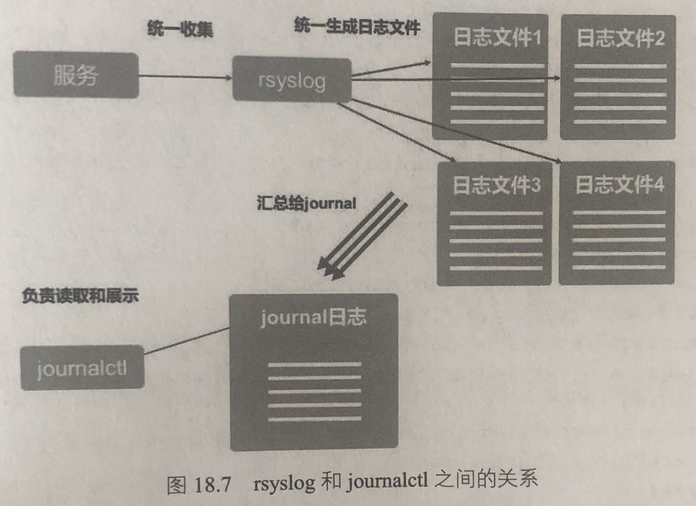

# Linux 日志

## 日志

默认日志路径：`/var/log`，但并不是所有的日志都储存在这里


`/var/log/messages`是一个系统综合日志文件，系统中凡是出现错误信息或者重要的信息，都有可能会记录在这个文件中。如果遇到某种软件/服务，不知道去哪里找它们的日志，都可以尝试去这个文件找

## journalctl

### journalctl 简介

```bash
# -x：在日志中加入一些注解帮助信息，以变得更容易理解
# -e：end of page，跳到日志的末尾
# -xe：一般是某个服务或软件刚出现错误提示时，立刻就用它来查看错误日志，比较有效
journalctl -xe
```

journalctl 属于 systemd，凡是在 systemd 中注册的服务，它们的日志都会统一交由 journalctl 来管理

### journalctl 的扩展用法

1. 单独显示某个服务（service）的日志

    ```bash
    journalctl -u sshd.service

    # 查看最新的几条
    journalctl -u -e sshd.service
    ```

1. 模拟`tail -f`的用法

    ```bash
    # 实时追踪某个服务的末尾
    journalctl -f -u sshd.service
    ```

1. 设置硬盘容量

    ```bash
    # journalctl的日志文件位置（不能直接用cat或者vim打开，必须用以下方式打开）
    ls -ltrh /run/log/journal/ec72068225e84169ae4dfb20a819790e/system.journal

    # 查看日志文件的大小
    journalctl --disk-usage

    # 硬性指定日志的总体体积，意味着其会不断删除旧有记录直到所占容量符合要求
    journalctl --vacuum-size=1G
    ```

1. 限定时间和周期

    ```bash
    # 查看2019年5月10日下午5:15之后的条目
    journalctl --since "2019-05-10 17:15:00"

    # 获得早9:00到1h前这段时间内的报告
    journalctl --since 09:00 --until "1 hour ago"

    # 获取昨天数据
    journalctl --since yesterday
    ```

## rsylog



在 Centos 中，各种服务（自带的服务）先把自己的日志信息统一汇总给 rsyslog 然后 rsyslog 为每一个服务生成单独的日志文件。最后， journalctl 把通过 journal 进程收集的所有 unit 的日志展示出来。所以说， journalctl 并不是日志的原产地，它只是做了一个二次加工而已。 rsyslog 最先收集日志，其本身也是一个运行在后台的服务，有自己独立的配置文件。

```bash
cat /etc/rsyslog. conf
```

上面这个文件中，最需要关注的是`#### RULES ####`字段。此字段定义了 rsylog 具体把哪些服务收集成日志

以下面这条配置为例

```bash
*.info;mail.none;authpriv.none;cron.none    /var/log/messages
```

`*.info`：是把 info 或更高级别的信息送往`/var/log/messages`中
`mail.none`：是 mail 的日志不发送到`/var/log/messages`，后面两个同理。
`mail.*`：是把所有 mail 的日志都送到`/var/log/maillog`中去。例如:

```bash
# Log all the mail messages in one place.
mail.*      ~/var/log/maillog
```

`cron.*`把所有 cron 计划任务的日志都送到`/var/log/maillog`中去。例如：

```bash
# log cron stuff
cron.*      /var/log/cron
```

另外，刚涉及的日志级别可以参考下面的关键字信息日志级别字段说明：

|   字段    | 说明                                                 |
| :-------: | ---------------------------------------------------- |
|  `Ebug`   | 有调试信息的，日志信息最多                           |
|  `Info`   | 一般信息的日志，最常用                               |
| `Notice`  | 最具有重要性的普通条件的信息                         |
| `Warning` | 警告级别                                             |
|   `Err`   | 错误级别，阻止某个功能或者模块不能正常工作的信息     |
|  `Crit`   | 严重级别，阻止整个系统或者整个软件不能正常工作的信息 |
|  `Alert`  | 需要立刻修改的信息                                   |
|  `Emerg`  | 内核崩溃等严重信息                                   |
|  `None`   | 什么都不记录                                         |


rsyslog 除了可以在本机收集日志以外，还可以在两台服务器之间相互传递收集日志，如上图所示。

本章所学习的是 Linux 自身的日志系统收集的日志信息，都是系统自身或者 Linux 自带的服务日志。其实在企业的生产环境中，还会出现很多自定义安装的服务，如各种 HTTP 服务（Apached. nginx）等，这些服务的日志通常都是相对独立存在，没办法依靠像 journalctl 这样的平台。

那么就需要另寻其他途径来收集和分析这些日志，如第 19 章中即将学习到的 Shell 脚本编程就是理想的途径。
