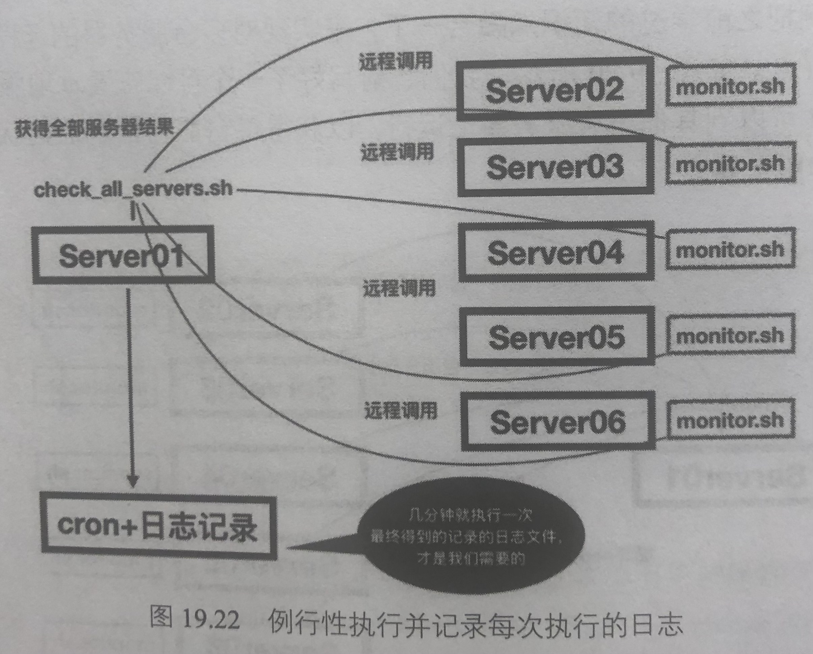
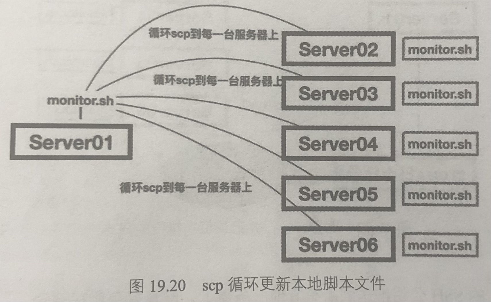
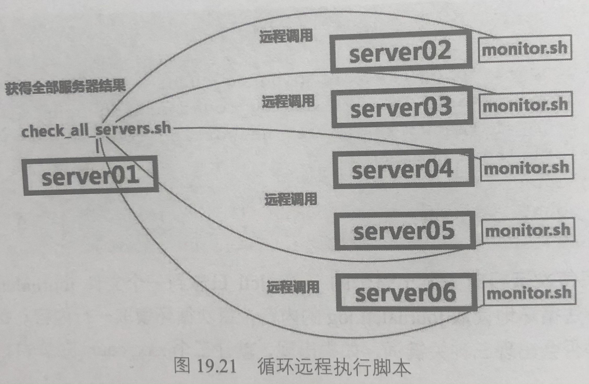

# Shell 脚本编程入门

## 脚本文件的创建

```bash
mkdir shell

cd shell/

touch myfirst_shell.sh

vim myfirst_shell.sh

# 输入以下这几行示例内容
echo "this is my first shell script"
hostname
whoami
id
echo "very easy"
# 输入结束

chmod +x mtfirst_shell.sh   # 一定要给一个可执行权限

bash myfirst_shell.sh
# 然后脚本就会依次顺序从上往下执行
```

## 变量

:warning:变量的声明中，等号两侧不能有空格

### 设置变量

1. 编辑脚本：

    ```bash
    vim shell2.sh

    # 输入以下这几行示例内容
    a="nihao"
    b=200
    c=250
    echo $a
    echo $b
    echo $c
    # 输入结束
    ```

    其实也可以不用通过脚本，上面的这个可以直接在命令行里面敲，直接就能输出值

### 算术引出字符

1. 编辑脚本：

    ```bash
    a=5
    b=10

    # let用于做数学运算
    # 如果没有let，c的值就会变成字符型`a+b`
    let c=a+b

    echo $c
    ```

### 变量规范化定义和用户输入

1. 编辑脚本：

    ```bash
    # `$1` 表示脚本运行时的第一个参数
    # `$2` 表示脚本运行时的第二个参数
    # `$3` 往后的同理
    num1=$1
    num2=$2
    # -n 表示不换行
    echo -n "您输入的两个数字分别为"
    echo -n "$num1 和"
    echo "$num2"
    let result_plus=num1+num2
    let result_minus=num1-num2
    let result_multiple=num1*num2
    let result_divide=num1/num2
    echo "加法结果：$result_plus"
    echo "减法结果：$result_minus"
    echo "乘法结果：$result_multiple"
    echo "除法结果：$result_divide"
    ```

    运行：

    ```bash
    bash test.sh 10 5
    ```

## 循环语句

1. 编辑脚本：从 1 加到 100

    ```bash
    i=0;sum=0

    # 注意中括号内侧的空格
    # while内的条件：i的值要小于等于100
    while [ $i -le 100 ]; do
        let sum+=$i
        let i++
    done
    echo $sum
    ```

    运行结果：5050

1. 编辑脚本：通过循环的方式检查三个路径

    ```bash
    PATHLIST='/var/log/ /tmp/ /run/'
    for i in $PATHLIST; do
        echo "检查目录"$i"中"
        # 在上面三个路径中找到大小超过10M的文件，并以gzip格式压缩
        find $i -size +10M -exec gzip {} \;
    done
    ```

1. 编辑脚本：通过循环的方式检查三个路径，但是用户可以通过键盘输入来指定文件的大小

    ```bash
    PATHLIST='/var/log/ /tmp/ /run/'
    fileSize=$1
    for i in $PATHLIST; do
        echo "检查目录"$i"中"
        # 在上面三个路径中找到大小超过10M的文件，并以gzip格式压缩
        find $i -size +"$fileSize"M -exec gzip {} \;
    done
    ```

## 条件语句

| 判断条件；算术比较运算符 | 含义                          | 对应的英文意思   |
| :----------------------: | ----------------------------- | ---------------- |
|    `$num1 -eq $num2`     | 如果 num1 的值 `==` num2 的值 | equal            |
|    `$num1 -ne $num2`     | 如果 num1 的值 `!=` num2 的值 | not equal        |
|    `$num1 -lt $num2`     | 如果 num1 的值 `<` num2 的值  | less than        |
|    `$num1 -le $num2`     | 如果 num1 的值 `<=` num2 的值 | less or equal    |
|    `$num1 -gt $num2`     | 如果 num1 的值 `>` num2 的值  | greater than     |
|    `$num1 -ge $num2`     | 如果 num1 的值 `>=` num2 的值 | greater or equal |

| 判断条件；文件比较运算符 | 含义                             | 举例                                             |
| :----------------------: | -------------------------------- | ------------------------------------------------ |
|      `-e filename`       | 如果 filename 存在，则为真       | `-e /var/log/`                                   |
|      `-d filename`       | 如果 filename 为目录，则为真     | `-d /tmp/`                                       |
|      `-f filename`       | 如果 filename 为常规文件，则为真 | `-f /usr/bin/ls`                                 |
|      `-L filename`       | 如果 filename 为符号链接，则为真 | `-L /etc/systemd/system/multi-user.target.wants` |
|      `-r filename`       | 如果 filename 可读，则为真       | `-r /var/log/syslog`                             |
|      `-w filename`       | 如果 filename 可写，则为真       | `-w /var/mylog.txt`                              |
|      `-x filename`       | 如果 filename 可执行，则为真     | `-x /usr/bin/grep`                               |

| 判断条件：变量判断运算符 | 含义                   |
| :----------------------: | ---------------------- |
|        `-z $num1`        | 判断参数 num1 是否为空 |

1. 编辑脚本：还是上面的功能，但是把用户输入参数变成条件语句判断

    ```bash
    PATHLIST='/var/log/ /tmp/ /run/'
    fileSize=$1
    # -z：判断后面的变量是否为空。如果是空，则判断条件成立
    if [ -z $fileSize ]; then
        echo "执行错误，参数不能为空"
        exit
    fi
    for i in $PATHLIST; do
        # 下面这一句注意一下，单引号和双引号的区别（下面一段写了）
        echo "检查目录"$i"中"
        # 在上面三个路径中找到大小超过10M的文件，并以gzip格式压缩
        find $i -size +"$fileSize"M -exec gzip {} \;
    done
    ```

## 引号

1. 单引号

    单引号的内容就是纯粹的字符或者字符串，保持原本的样子，任何特殊符号、变量都会变成字符

1. 双引号

    双引号保持各种特殊符号和变量、命令的作用，可以起到隔离字段的作用

    很多情况下，变量名字会跟其他的字符串混在一起，造成取值时错位。这种情况下，就可以使用双引号来进行隔离，达到本来的目的

1. 反引号

    反引号内的命令先执行，然后可以把执行结果保存到一个变量中

    举例：

    ```bash
    list=`ls -l /var/log/`
    echo "$list"
    ```

## 返回值

Linux 每执行一个命令，最后都有一个返回数值。命令执行成功的返回值是 0，否则不是 0

查看一次执行的返回值，使用`$?`获取

```bash
whoami
echo "$?"
# 或者不加引号：echo $?
```

## 逻辑运算符

### 或：||

1. 编写脚本：判断一个文件在不在，如果不在就创建出来

    ```bash
    ls /root/test5 2> /dev/null
    result="$?"
    if [ $result == 0 ]; then
    # 什么都不做
    :
    else
    mkdir /root/test5
    fi
    ```

    上面这个 if 判断可以用逻辑运算符替代，替代后整个脚本只需要一行即可

    ```bash
    # 如果前面的返回值不是0，就创建文件。如果前面返回值是0，就不创建
    # 注意：0表示true，这个和编程语言正好相反
    ls /root/test5/ 2> /dev/null || mkdir /root/test5
    ```

### 与：&&

1. 用一行实现 ssh 免密登录

    ```bash
    # ssh免密登录的条件
    # 1. 服务器上要有~/.ssh/目录
    # 2. 服务器上需要有~/.ssh/authorized_keys文件
    # 3. 服务器上的~/.ssh/和authorized_keys文件权限都得是600
    # 4. 服务器上的~/.ssh/authorized_keys内已经放入了公钥
    ls -ld ~/.ssh/authorized_keys > /dev/null && chmod 600 ~/.ssh/ && chmod 600 ~/.ssh/authorized_keys && grep ssh-rsa ~/.ssh/authorized_keys > /dev/null && echo "ssh check ok"
    ```

## 脚本编程实践

### 案例 1：Shell 脚本 + crontab 实现定时 ntpdate 校正时间

准备一个文件`/root/shell/ntpdate.sh`，写入：

```bash
ntpdate slb.time.edu.cn || ntpdate ntpl.aliyun.com
```

然后放进 crontab 任务中

```bash
crontab -e

*/10 * * * * bash /root/shell/ntpdate.sh
```

可以手动测试一下这个脚本：

```bash
bash /root/shell/ntpdate.sh
```

### 案例 2：编写一个同时检查 CPU、内存、硬盘的 Shell 脚本

-   CPU 的计算：uptime 命令的第一位数值代表最近一段时间的负载量，如果这个数值小于机器 CPU 的核数，就认为目前 CPU 不忙碌
-   内存的计算：直接从 free 中取出最后一列的数据，这里还需要用 sed 去除一下多余的空行
-   硬盘的计算：只取出根目录的已用量即可

```bash
#!/bin/bash
# CHECK CPU
cpu_cores=`cat /proc/cpuinfo | grep processor | wc -l`
loads=`uptime | awk '{print $8}' | tr ',' ' ' | cut -d '.' -f1`
if [ $loads -lt $cpu_cores ]; then
        echo "CPU WORKS OK"
else
        echo "CPU TOO HIGH"
fi
# CHECK MEMORY
ram_left=`free -m | awk '{print $7}' | sed "/^$/d"`
if [ $ram_left -gt 200 ]; then
        echo "RAM OK"
else
        echo "LACKING OF RAM"
fi
# CHECK DISK
disk_left=`df -h | grep 'centos-root' | awk '{print $5}' | sed "s/%//g"`
# 注意下面这条，是两个括号，如果不多加一个括号，会报错：[:-gt: unary operator expected
# 原因：https://www.cnblogs.com/btbrad/p/4867971.html
if [[ $disk_left -gt 90 ]]; then
        echo "DISK RUNNING FULL"
else
        echo "DISK OK"
fi
```

### 案例 3：分析文本文件的内容

```bash
#!/bin/bash
journalctl > journalctl_log
pinglog_count=0
sshlog_count=0
networking_count=0
while read line; do
    echo $line | grep -i 'ping' && let pinglog_count=$pinglog_count+1
    echo $line | grep -i 'ssh' && let sshog_count=$sshog_count+1
    echo $line | grep -i 'network' && let networkog_count=$networkog_count+1
done < journalctl_log

echo $pinglog_count
echo $sshlog_count
echo $networking_count

# 以下三种写法都正确
# let pniglog_count++
# let pinglog_count=$pinglog_count+1
# let pinglog_count=pinglog_count+1
```

### 案例 4：循环远程登录服务器执行任务



最后一个脚本实例把之前学过的知识点融合一下，来实现对多台服务器的远程登录检查。首先，确认一下当前的任务是什么。如图 19.20 所示，我们之前写好了一个可以查看本地服务器状态的小监控脚本，现在希望这个脚本可以到其他所有服务器上运行，以获得每台服务器的监控状态。所以，需要实时更新 monitor.sh 到远程服务器。



如图 19.21 所示， `monitorsh`监控文件被部署到所有远程服务器后，在 server01 上新建一个脚本`check_all_servers.sh`，这个脚本会做两件事：

-   `scp monitor.sh`文件到远程服务器的某个目录下。
-   使用 SSH 远程调用各台服务器上的本地脚本 `monitor.sh`

最后看图 19.22，不是说脚本运行完就完了，还需要每隔一段时间，就远程执行一次检查，并且把每次检查的结果都记录下来，便于我们平时分析问题。



下面开始操作。

1. 把 server01 的 SSH 公钥推送到所有其他服务器上，配置好免密码登录。

1. 配置好机器名。为了方便脚本的调用，也为了美观。之前的 SSH 登录都是使用 IP 地址，但这种方式非常不直观。

    在 Linux 中有一个`etc/hosts`文件，在这里做机器名解析，意思也就是说用名称来代替 IP 地址（这也是修改本地 DNS 解析的方法）。具体操作方法是 `vim etc/hosts`后，在后面写入类似下面的内容，这个文件的格式是`IP地址+完整机器名+简写机器名`。代码如下所示:

    ```bash
    192.168.1.100 server01.example.com server01
    192.168.1.101 server02.example.com server02
    192.168.1.102 server03.example.com server03
    192.168.1.103 server04.example.com server04
    192.168.1.104 server05.example.com server05
    192.168.1.105 server06.example.com server06
    ```

    配置好以后，用 `ping server02`的方式来测试是否已经生效，没问题的话，脚本就可以这样来调用机器名了。

1. 在 server01 上准备好两个脚本。第一个脚本是总的脚本，先定义好一个 `hostlist`变量，用来存储所有的服务器名。然后编写一个 for 循环， `for i in $hostlist`的意思就是变量 i 在 server02、 server03、...、server06 中依次取值。这样每次循环变量 i 就是一个机器名，使用 scp 命令把 monitor sh 循环复制到所有服务器上。

    在脚本的最后，用 SSH 远程登录每台服务器，然后执行上面的`/tmp/monitor.sh`脚本，获取监控结果。代码如下所示:

    ```bash
    # check_all_servers.sh文件的内容：
    hostlist="server02 server03 server04 server05 server06"
    for i in $hostlist; do
        echo ＂updating script to host $i＂
        scp /root/shell/monitor.sh ＂$i＂:/tmp/ > /dev/null
    if [ $? == 0 ]; then
        echo ＂updated $i ok＂
    else
        echo ＂updating $i failed＂
    fi
    echo ＂checking on host $i＂
    ssh $i "chmod 777 /tmp/monitor.sh"
    ssh $i "/tmp/monitor.sh"
    done
    ```

    monitor 脚本用之前第 19.2.2 小节中写好的那个就可以无须做任何改动。准备好之后，先手动在 server01 上运行一下，试看结果如何，代码如下所示。这就是我们要的效果。

    ```text
    [root＠server01 ~]# bash shell/check_all_servers.sh
    updating script to host server02
    updated server02 ok
    checking on host server02
    CPU WORKS OK
    RAM OK
    DISK OK
    updating script to host server03
    updated server03 ok
    checking on host server03
    CPU WORKS OK
    RAM OK
    DISK OK
    updating script to host server04
    updated server04 ok
    checking on host server04
    CPU WORKS OK
    RAM OK
    DISK OK
    updating script to host server05
    updated server05 ok
    checking on host server05
    CPU WORKS OK
    RAM OK
    DISK OK
    updating script to host server06
    updated server06 ok
    checking on host server06
    CPU WORKS OK
    RAM OK
    DISK OK
    ```

1. 在 server01 上添加 crontab 任务,让上面的脚本每分钟执行一次,并且把每次执行得到的结果保存到一个日志文件中。

    在下面的计划任务中可以额外再添加一个 date 输到每次的日志文件中,这样就可以了解到每次执行是在什么时间发生的。

    ```bash
    # 编辑定时任务文件
    crontab -e

    # 在打开的文件中添加这两条：
    * * * * * bash /root/shell/check_all_servers.sh >> /var/log/check_servers.log
    * * * * * date >> /var/log/check_servers.1og
    ```

关于 Shell 编程就学到这里，更多的脚本编程内容将在后续的 Linux 编程书中再学习
