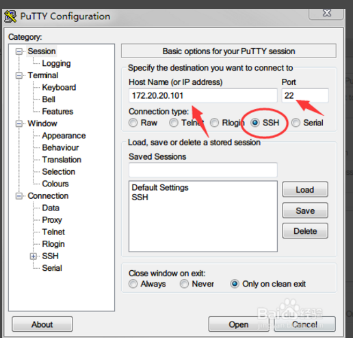

# Windows下的SSH软件--[PuTTY](https://www.chiark.greenend.org.uk/~sgtatham/putty/)

> 原链接：https://blog.csdn.net/l707941510/article/details/80520790

## PuTTY的连接方法

1. Putty是用来远程连接服务器的，支持SSH、Telnet、Serial等协议的连接。其中最常用的是SSH。

1. 输入需要连接的服务器的IP地址，和端口号（ssh默认使用22端口），点击Open按钮即可开始连接。也可以点击“Save”按钮，把输入的地址保存下载，以便下次快速连接。

    

1. Open后，会有一个提示，需要生成一个Key，点击“是”。

    

1. Putty即可连接到你的远程服务器（一般Linux）。输入用户名和密码，即可远程登录。

    

1. 这时，你在Putty里的操作就和在服务器本身上操作一样了，甚至比在服务器上操作还要方便。

    

## Putty的一些简单配置

1. 保存一个session（会话）

    这样做的目的是不需要每次都输入IP直接点击这个保存的会话，打开即可连接。

    如图：

    

1. 改变字体大小和样式

    

    推荐使用Consolas，个人觉得看得很舒服。

    

1. 改变文字颜色

    

1. 保存配置，这点最重要，否则每次都配置一遍，要麻烦死

    

1. 如果下次打开想查看配置的话，需要点击保存的session，然后点击Load。

    最终效果如图：

    

