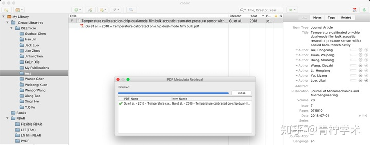

# zotero

## 导入文献

-   网页识别
-   抓取 PDF 元数据
-   手动输入通过标示符增加：Add by identifier (DOI, ISBN, PMID)
-   文件导入（比如从 Endnote 导入）

### PDF元数据抓取

拖动一PDF文件到Zotero的某个分组中，右击该PDF文件，选择“retrieve metadata for PDF”，如下。

如果抓取成功（注意，Zotero只能抓取英文文献的PDF文件，中文文献可以通过其他方式导入），结果如下所示。

### 网页抓取

要想做到网页抓取，需要首先安装Zotero Connector浏览器插件。下面以安装好插件的Chrome浏览器示范Zotero对不同数据库的网页抓取能力。

1. Google scholar

    

    由于Zotero支持对谷歌学术搜索结果的识别，因此当我们在谷歌学术搜索文献后，插件形状会变成文件夹的图标，点击该图标，即可选择导入哪些文献到Zotero中，默认导入到当前被选中的分组中。

    

1. 中国知网

    很多人可能需要保存中文文献的需要，幸运的是Zotero能够识别中国知网。如下图所示，其他操作类似。

    

1. 豆瓣

    

1. Wikipedia

    维基百科大家用的非常多，Zotero也能够识别维基百科的搜索条目，如下图所示。

    

除了上面提及一些，Zotero还能识别更多其他数据库和网站，如常用的Web of Science，Youtube等等
