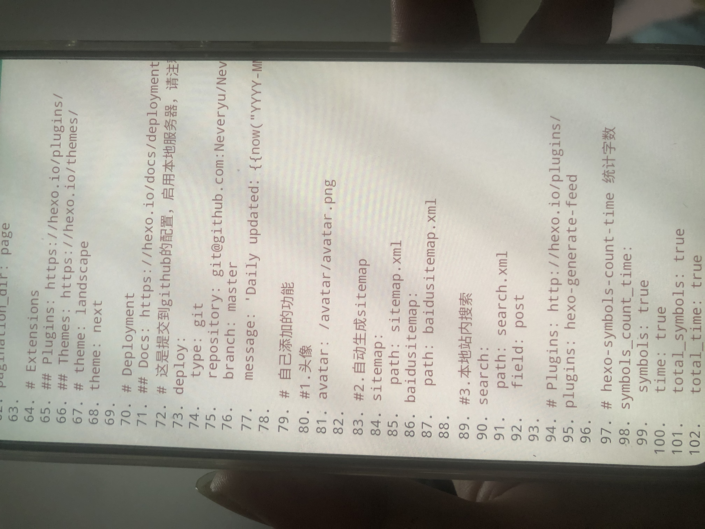

# Hexo

## 需要整理的

[将Hexo升级到v5](https://zhuanlan.zhihu.com/p/174015035)

### 此作者其他文章

[将Hexo升级到v4](https://zhuanlan.zhihu.com/p/157511323)

关键词：Beyond Compare

## 需要做的

- 由于用户名更新，需要重新修改资料，包括评论系统

### 站点地图(包含百度站点和普通站点两个，我现在只弄了一个)

```yml
# hexo sitemap
sitemap:
  path: sitemap.xml

baidusitemap:
  path: baidusitemap.xml
```



### 百度收录、bing收录、google收录

> 注意，由于有三线部署，所以要把它们的域名全部加入

### custom-icon

bilibili的个人侧边栏图标

### github-action三线部署，并且博客源码移动到私有仓库

[参考点这里](github-deploy.md)

### 公益404，添加腾讯公益

[参考点这里](https://theme-next.js.org/docs/theme-settings/custom-pages.html?highlight=404#Custom-404-Page)
