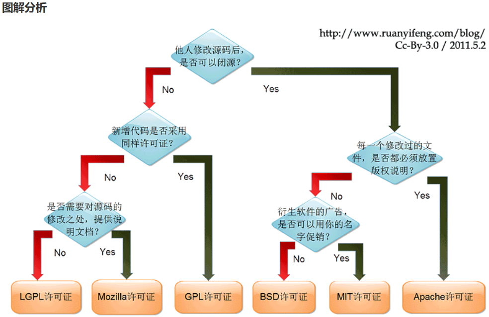
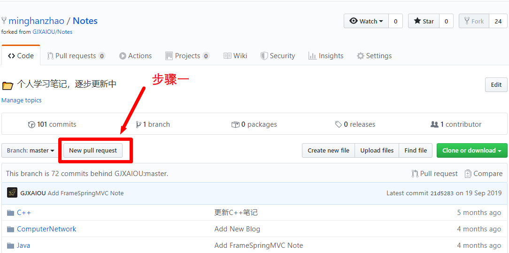
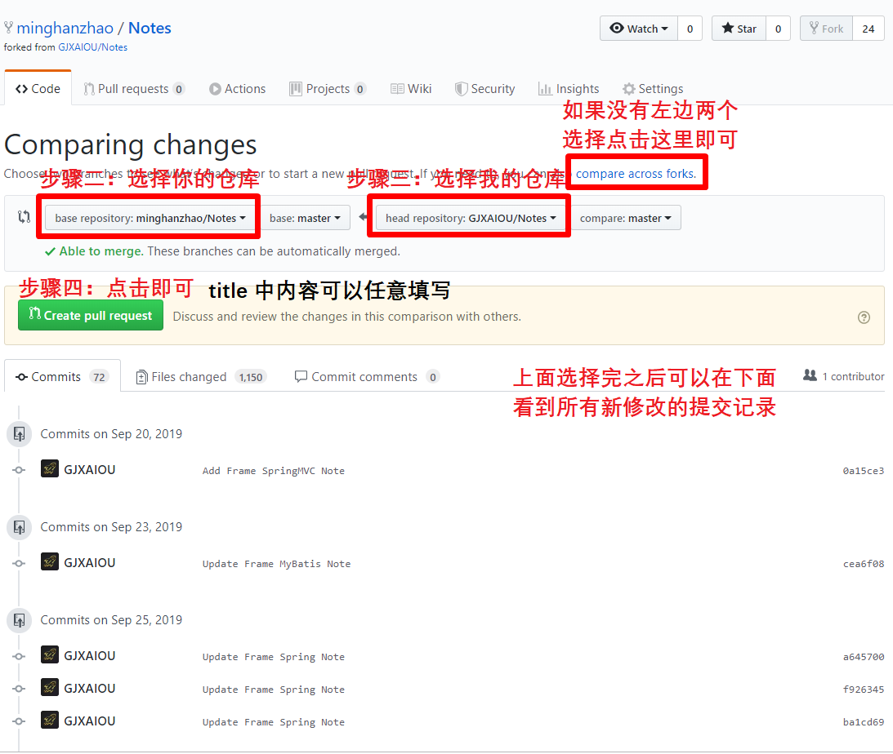
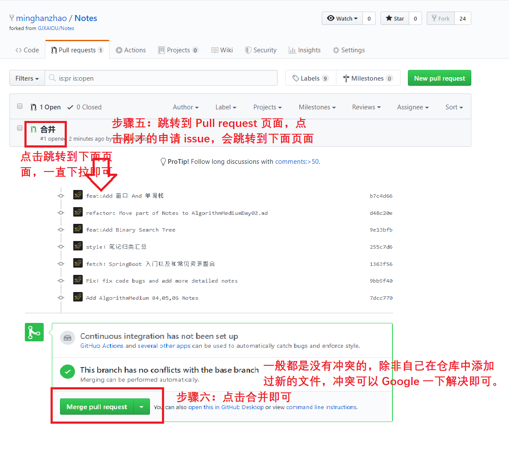

# git远程操作

## 开源协议

参考github关于开源协议的网站：https://choosealicense.com/

<details>
<summary>常见协议图解分析</summary>


</details>

## 设置全局用户名和邮箱

```bash
git config --global user.name "ysl2"
git config --global user.enail "songli.yu@outlook.com"
```

linux下面不要加sudo。见 https://docs.github.com/en/free-pro-team@latest/github/authenticating-to-github/error-permission-denied-publickey

补充：用户名和邮箱最好和github的注册用户名和邮箱保持一致。 具体是否完全要求必须一致，这个我也不太清楚。 为了避免以后麻烦。还是保持一致吧

## ssh免密登录

```bash
// ssh创建密钥的时候，用的邮箱必须是自己注册的邮箱才行

ssh-keygen -t rsa -C "随机字符串"
```

**把`~/.ssh/id_rsa.pub`的内容（即公钥）复制到github**

然后测试一下连通性

```bash
ssh -T git@github.com

```

## 设置github加速

采用chrome的`github加速`插件，按照[原作者仓库的README文件](https://github.com/fhefh2015/Fast-GitHub)进行配置

注意：在下载了那个插件并按照原作者要求配置好`~/.ssh/config`文件之后，就可以按照网页上给出的加速下载链接进行克隆。不要再使用github原先的ssh地址了。

## Fork 之后保证笔记更新

因为笔记一直**处于更新和修改过程中**，所以大家可以采用以下方式保证 Fork 到自己仓库的笔记能够保持最新。

- 合并步骤一

    

- 合并步骤二、三、四

    

- 合并步骤五、六

    

## pull request

1. 注意先在自己仓库中添加一个上游URL，目的是以后可以及时从上游URL拉取更新到本地

    ```bash
    # 注意这个原仓库指的是你从谁那fork的，谁就是原仓库
    git remote add upstream '原仓库的http克隆地址'
    ```

2. 在本地克隆的仓库先新建一个分支，在自己这个新建的分支做修改

3. 提交并推送到自己的github仓库，然后在github自己fork的仓库会提示可以pull request，然后根据提示在网页上操作即可

## 禁用push

1. 当前仓库的所有分支都禁用push

    ```text
    # 先创建一个远程链接
    git remote add origin git@github.com:abc/abc.git
    # 然后单独把push的链接改为no_push
    git remote set-url --push origin no_push
    ```

2. 当前仓库的某个分支禁用push（这个不管用）

    ```text
    # 我自己试了一下，并不管用
    git config branch.<branch-name>.remote no_push
    ```

## 切换到指定远程分支

> 参考：https://blog.csdn.net/astonishqft/article/details/83029490

```bash
# 查看所有分支
git branch -a
# 切换到特定远程分支
git checkout -b windows origin//windows
```

