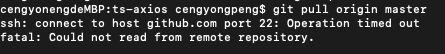
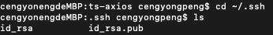
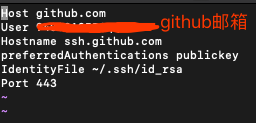
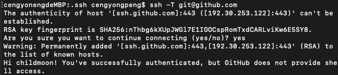

# git报错 port 22

> ssh connect to host github.com port 22: Connection timed out
>
> 原链接：[https://blog.csdn.net/nightwishh/article/details/99647545](https://blog.csdn.net/nightwishh/article/details/99647545)

碰到了git拉代码时报出的一个错误



通过查阅资料尝试了几种方法之后解决了，在这做个记录。

首先需要检查一下SSH是否能够连接成功，输入以下命令

```text
ssh -T git@github.com
```

若还是报这个错`ssh: connect to host github.com port 22: Connection timed out`就可以使用以下解决办法

第一步：打开终端并打开存放ssh的目录

```text
cd ~/.ssh
```

```text
ls
```



查看是否存在这些文件 若不存在，则可能是ssh没配置对，首先需要配置ssh（自行百度）很简单
若存在则在继续在终端输入以下命令新建一个文件

```text
vim config
```

接着输入下面内容：



```text
Host github.com
User 注册github的邮箱
Hostname ssh.github.com
PreferredAuthentications publickey
IdentityFile ~/.ssh/id_rsa
Port 443
```

最后`:wq`退出编辑即可
接着再执行

```text
ssh -T git@github.com
```

出现提示回车yes即可



验证就能顺利通过了

总结自：[https://blog.csdn.net/vosang/article/details/50499300](https://blog.csdn.net/vosang/article/details/50499300)
