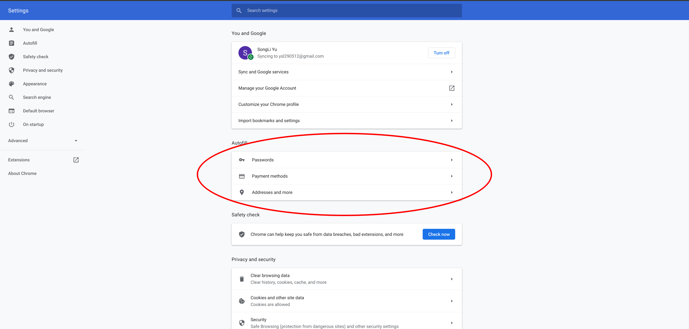

# 密码

Microsoft Authenticator

换新环境时优先在chrome、ios、android登录此管理器，以同步密码

## chrome浏览器

用Microsoft AutoFill插件

注意在chrome的设置里面把下面三个的所有能点的选项全关掉（除了第一个里面有个选项是由Microsoft Authenticator控制的，其他的全关）

## ios

用Microsoft Authenticator app

在`设置 -> 密码`中，取消密钥链，改用此app来管理

每次填密码的时候，点键盘上方的钥匙，直接填到Microsoft Authenticator里面

## 参考

[从别的地方导入密码到Microsoft Authenticator](https://docs.microsoft.com/zh-cn/azure/active-directory/user-help/user-help-authenticator-app-import-passwords)
