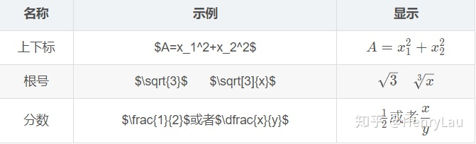
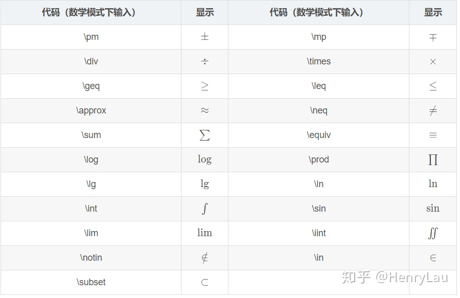
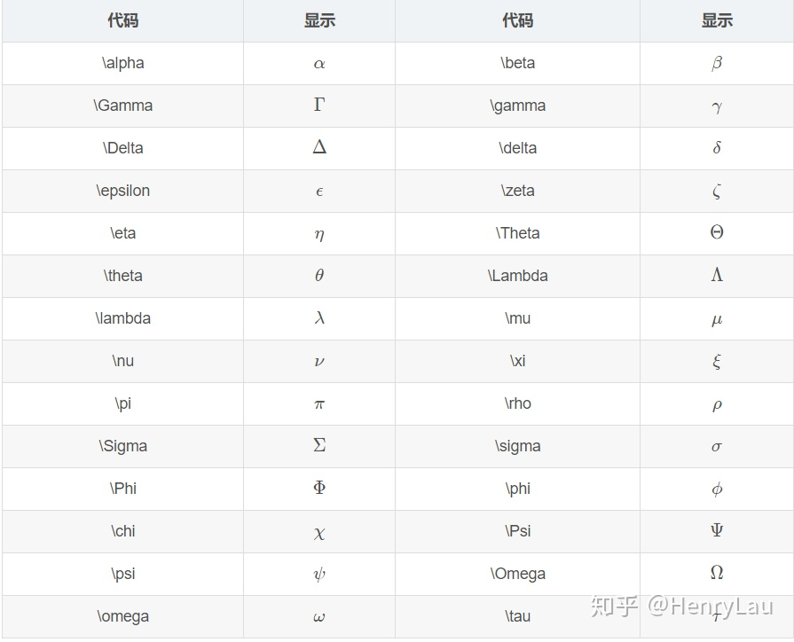

# 在 markdown 中使用 latex

知乎搜：`markdown 数学公式`

[https://www.zhihu.com/search?type=content&q=markdown%20%E6%95%B0%E5%AD%A6%E5%85%AC%E5%BC%8F](https://www.zhihu.com/search?type=content&q=markdown%20%E6%95%B0%E5%AD%A6%E5%85%AC%E5%BC%8F)

在 Markdown 语言中{}中的内容表示一个整体
数学模式内空格为分隔符，无法显示为空格，一般采用`\quad`实现空格。

## 起止符

行内公式（不会换行）使用`$`作为起止符

块级公式（单独一行）使用`$$`作为起止符

## 角标

上标使用`^`表示，上标长度大于一时，使用`{}`包围

下标使用`_`表示，下标长度大于一时，使用`{}`包围

上下标可以同时使用，相互嵌套

## 符号

对数使用`\log_{2} n`表示

根式使用`\sqrt[指数]{表达式}`表示

分式使用`\frac{分子}{分母}`表示

求和使用`\sum_{下限}^{上限}`表示

负无穷使用`-\infty`表示，正无穷使用`+\infty`表示

积分使用`\int_{下限}^{上限}`表示

## 矩阵

矩阵使用`\begin{matrix}`和`\end{matrix}`作为起止符，使用`&`表示空格，使用`\\`表示换行

$$
\begin{matrix}
   1 & 0 & 0 \\
   0 & 1 & 0 \\
   0 & 0 & 1
\end{matrix}
$$

使用`\left`符号 和`\right`符号 作为起止符，包围矩阵，可以为矩阵添加括号

$$
\left[
\begin{matrix}
   1 & 0 & 0 \\
   0 & 1 & 0 \\
   0 & 0 & 1
\end{matrix}
\right]
$$

小括号

$$
\left(
 \begin{matrix}
   1 & 2 & 3 \\
   4 & 5 & 6 \\
   7 & 8 & 9
  \end{matrix}
  \right) \tag{4}
$$

需要注意的是，如果想使用`{}`括号，需要在其前面添加反斜杠

$$
\left\{
\begin{matrix}
   1 & 0 & 0 \\
   0 & 1 & 0 \\
   0 & 0 & 1
\end{matrix}
\right\}
$$

行列式

$$
 \left|\begin{matrix}
    1 & 2 & 3 \\
    4 & 5 & 6 \\
    7 & 8 & 9
   \end{matrix} \right|
$$

## 公式号

我们可能需要给块级公式末尾添加公式号，只需要使用`\tag{编号}\`即可

$$
\left\{
\begin{matrix}
   1 & 0 & 0 \\
   0 & 1 & 0 \\
   0 & 0 & 1
\end{matrix}
\right\} \tag{1}
$$

包含希腊字母与省略号行省略号`\cdots`，列省略号`\vdots`，斜向省略号（左上至右下）`\ddots`

$$
\left\{
 \begin{matrix}
 1      & 2        & \cdots & 5        \\
 6      & 7        & \cdots & 10       \\
 \vdots & \vdots   & \ddots & \vdots   \\
 \alpha & \alpha+1 & \cdots & \alpha+4
 \end{matrix}
 \right\}
$$

## 表格

简易表格

$$
\begin{array}{|c|c|c|}
	\hline 2&9&4\\
	\hline 7&5&3\\
	\hline 6&1&8\\
	\hline
\end{array}
$$

开头结尾： `\begin{array}` ， `\end{array} `定义式：例：${|c|c|c|}$，其中 c l r 分别代表居中、左对齐及右对齐。

分割线：① 竖直分割线：在定义式中插入 `|`， （`||`表示两条竖直分割线）。 ② 水平分割线：在下一行输入前插入 `\hline`，以下图真值表为例。其他：每行元素间均须要插入 `&` ，每行元素以 `\\` 结尾。

真值表

$$
\begin{array}{cc|c}
	       A&B&F\\
	\hline 0&0&0\\
	       0&1&1\\
	       1&0&1\\
	       1&1&1\\
\end{array}
$$

多行等式对齐

$$
\begin{aligned}
a &= b + c \\
  &= d + e + f
\end{aligned}
$$

方程组、条件表达式方程组

$$
\begin{cases}
3x + 5y +  z \\
7x - 2y + 4z \\
-6x + 3y + 2z
\end{cases}
$$

同理，条件表达式

$$
f(n) =
\begin{cases}
n/2,  & \text{if }n\text{ is even} \\
3n+1, & \text{if }n\text{ is odd}
\end{cases}
$$

## 间隔 (大小空格、紧贴)

紧贴 + 无空格 + 小空格 + 中空格 + 大空格 + 真空格 + 双真空格

$$
a\!b + ab + a\,b + a\;b + a\ b + a\quad b + a\qquad b
$$

紧贴`\!`

无空格 小空格`\,`

中空格`\;` 大空格`\`

真空格`\quad` 双真空格`\qquad`

