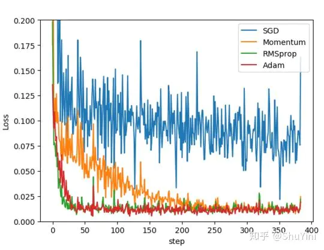

> 原文章：https://www.jianshu.com/p/39dac1e24709
>
> pytorch官方文档：https://pytorch.org/docs/stable/optim.html?highlight=optim#module-torch.optim

# 优化器

## SGD(随机梯度下降)

优点：使用mini-batch的时候，可以收敛得很快

缺点：

- 在随机选择梯度的同时会引入噪声，使得权值更新的方向不一定正确
- 不能解决局部最优问题

推荐程度：不推荐

## 使用动量(Momentum)的SGD

```text
更新的时候在一定程度上保留之前更新的方向，用法为在torch.optim.SGD的momentum参数不为零
```

优点：加快收敛速度，有一定摆脱局部最优的能力，一定程度上缓解了没有动量的时候的问题

缺点：仍然继承了一部分SGD的缺点

推荐程度：可以一试

## 使用牛顿冲量法(Nesterov Accelerated Gradient, NAG)的SGD

```text
可以理解为往标准动量中添加了一个校正因子

理解策略：在Momentum中小球会盲目地跟从下坡的梯度，容易发生错误。
所以需要一个更聪明的小球，能提前知道它要去哪里，还要知道走到坡底的时候速度慢下来而不是又冲上另一个坡
```

优点：梯度下降方向更加准确

缺点：对收敛率的作用却不是很大

推荐程度：不如不试

## ASGD(平均随机梯度下降, Averaged Stochastic Gradient Descent)

```text
ASGD就是用空间换时间的一种SGD。

原文献：http://riejohnson.com/rie/stograd_nips.pdf
```

推荐程度：很少见

## AdaGrad(自适应学习率的梯度下降)

```text
独立地适应所有模型参数的学习率，梯度越大，学习率越小；梯度越小，学习率越大

Adagrad适用于数据稀疏或者分布不平衡的数据集

论文：http://www.jmlr.org/papers/volume12/duchi11a/duchi11a.pdf
```

推荐程度：不推荐

## AdaDelta

```text
是Adagard的改进版，对学习率进行自适应约束，但是进行了计算上的简化，加速效果不错，训练速度快

论文：https://arxiv.org/pdf/1212.5701.pdf

在论文中提到AdaDelta有两个改进方法：

- Accumulate Over Window
- Correct Units with Hessian Approximation
```

优点：避免在训练后期，学习率过小；初期和中期，加速效果不错，训练速度快

缺点：还是需要自己手动指定初始学习率，初始梯度很大的话，会导致整个训练过程的学习率一直很小，在模型训练的后期，模型会反复地在局部最小值附近抖动，从而导致学习时间变长

推荐程度：可以试一试更好的

## Rprop(弹性反向传播)

```text
1、首先为各权重变化赋一个初始值，设定权重变化加速因子与减速因子。

2、在网络前馈迭代中当连续误差梯度符号不变时，采用加速策略，加快训练速度；当连续误差梯度符号变化时，采用减速策略，以期稳定收敛。

3、网络结合当前误差梯度符号与变化步长实现BP，同时，为了避免网络学习发生振荡或下溢，算法要求设定权重变化的上下限。
```

缺点：优化方法适用于full-batch，不适用于mini-batch，因此基本上没什么用

推荐程度：不推荐！不能用在mini-batch，想不到在什么时候能用

## RMSProp(均方根传递, Root Mean Square Prop)

```text
RProp的改进版，也是Adagard的改进版

思想：梯度震动较大的项，在下降时，减小其下降速度；对于震动幅度小的项，在下降时，加速其下降速度

RMSprop采用均方根作为分母，可缓解Adagrad学习率下降较快的问题

论文：https://arxiv.org/pdf/1308.0850v5.pdf  http://www.cs.toronto.edu/~tijmen/csc321/slides/lecture_slides_lec6.pdf

对于RNN有很好的效果
```

优点：可缓解Adagrad学习率下降较快的问题，并且引入均方根，可以减少摆动，适合处理非平稳目标，对于RNN效果很好

缺点：依然依赖于全局学习率

推荐程度：推荐！RMSProp算法在经验上已经被证明是一种有效且实用的深度神经网络优化算法。目前它是深度学习从业者经常采用的优化方法之一

## Adam(AMSGrad)

```text
将Momentum算法和RMSProp算法结合起来使用的一种算法，既用动量来累积梯度，又使得收敛速度更快同时使得波动的幅度更小，并进行了偏差修正

论文：https://arxiv.org/pdf/1412.6980.pdf
```

优点：

- 对目标函数没有平稳要求，即loss function可以随着时间变化
- 参数的更新不受梯度的伸缩变换影响
- 更新步长和梯度大小无关，只和alpha、beta_1、beta_2有关系。并且由它们决定步长的理论上限
- 更新的步长能够被限制在大致的范围内（初始学习率）
- 能较好的处理噪音样本，能天然地实现步长退火过程（自动调整学习率）
- 很适合应用于大规模的数据及参数的场景、不稳定目标函数、梯度稀疏或梯度存在很大噪声的问题

## Adamax

```text
Adam的改进版，对Adam增加了一个学习率上限的概念，是Adam的一种基于无穷范数的变种

论文：https://arxiv.org/pdf/1412.6980.pdf
```

优点：对习率的上限提供了一个更简单的范围

推荐程度：非常推荐！其实也就是Adam的一个变种，差不了多少

## Nadam

Adam的改进版，类似于带有Nesterov动量项的Adam，Nadam对学习率有了更强的约束，同时对梯度的更新也有更直接的影响。一般而言，在想使用带动量的RMSprop，或者Adam的地方，大多可以使用Nadam取得更好的效果。

这里先挖个坑，因为根据pytorch稳定版的文档好像还没封装Nadam函数，可是隔壁tensorflow已经有了，希望可以快点出来吧

## SparseAdam

```text
针对稀疏张量的一种“阉割版”Adam优化方法
```

优点：相当于Adam的稀疏张量专用版本

推荐程度：推荐，在处理稀疏张量的时候尤其推荐

## AdamW

```text
Adam的进化版，是目前训练神经网络最快的方式

论文：https://arxiv.org/pdf/1711.05101.pdf
```

优点：比Adam收敛得更快

缺点：只有fastai使用，缺乏广泛的框架，而且也具有很大的争议性

推荐程度：观望！希望之后能成为主流

## L-BFGS (Limited Broyden–Fletcher–Goldfarb–Shanno)

```text
是一种在牛顿法基础上提出的一种求解函数根的算法，简单来说，L-BFGS和梯度下降、SGD干的同样的事情，但大多数情况下收敛速度更快

L-BFGS是对BFGS的改进，特点就是节省内存

是解无约束非线性规划问题最常用的方法

警告：

- 这个optimizer不支持为每个参数单独设置选项以及不支持参数组（只能有一个）
- 目前所有的参数不得不都在同一设备上。在将来这会得到改进

注意：

这是一个内存高度密集的optimizer（它要求额外的param_bytes * (history_size + 1)个字节）。内存不符合要求，尝试减小history size，或者使用不同的算法。
```

优点：收敛速度快、内存开销少，是解无约束非线性规划问题最常用的方法

缺点：使用条件严苛

推荐程度：酌情选择，根据自己的需要考虑是否真的需要使用这个算法

## 算法对比图示




