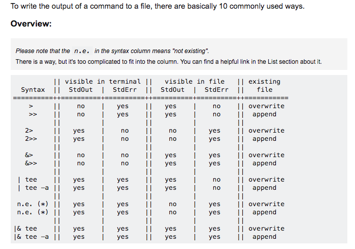

# shell

## bash

1. bash introduction and official documentation

    - https://zh.wikipedia.org/wiki/Bash
    - https://www.gnu.org/software/bash/manual/

1. test expression and arithmetic expression

    - https://en.wikipedia.org/wiki/Test_(Unix)
    - [bash-man-page](http://www.linuxcommand.org/lc3_man_pages/bash1.html)中的`Compound Commands`部分
    - 终端输入 `man test`，会显示所有比较运算符

    ```bash
    #!/bin/bash

    INT=2
    FILE=foo.bar

    # []提供基本测试。属于POSIX语法
    # 在[]中使用小括号，则小括号需要转义（其他特殊含义字符也是需要转义）
    # 在[[]]和(())中，小括号不需要转义
    if [ $INT -gt 1 ]; then
        echo "1: INT >= 1"
    fi
    # (()) 提供算术测试。注意：在这种情况下，变量不需要加$展开。
    if ((INT >= 1)); then
        echo "2: INT >= 1"
    fi

    # [[]] 提供正则匹配和通配符匹配，属于bash语法。
    if [[ $INT =~ ^-?[0-9]+$ ]]; then
        echo "3: catched"
    fi
    if [[ $FILE == foo.* ]]; then
        echo "4: file match."
    fi

    # $(()) 提供算术运算
    if [[ $((INT % 2)) -eq 0 ]]; then
        echo "5: INT is even."
    fi

    # (( $(()) )) 算术运算结合算术测试
    if (($((INT % 2)) == 0)); then
        echo "6: INT is even."
    fi

    # "$FILE"
    # 引号并不是必需的，但这是为了防范空参数。
    # 如果 $FILE 的参数展开 是一个空值，就会导致一个错误（操作符将会被解释为非空的字符串而不是操作符）。用引号把参数引起来就 确保其总是一个字符串，即使字符串为空。

    ```

1. redirect to

    - https://stackoverflow.com/questions/818255/in-the-shell-what-does-21-mean/818284#818284
    - https://catonmat.net/bash-one-liners-explained-part-three
    - https://blog.csdn.net/yuki5233/article/details/85091314
    - 

1. tab & space

    shell语法对tab和space敏感，不要用4个space代替tab

1. 文本三件套：grep，sed，awk

