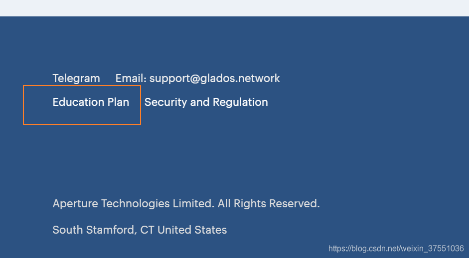
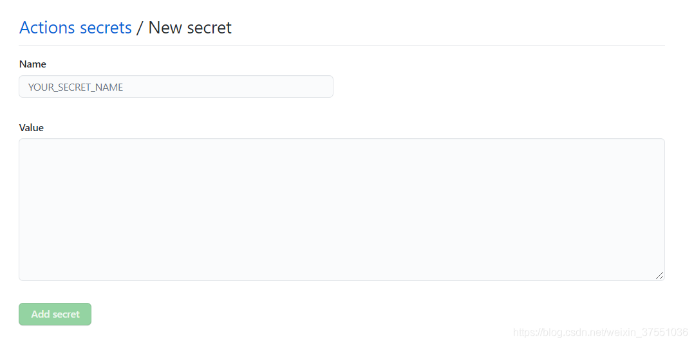
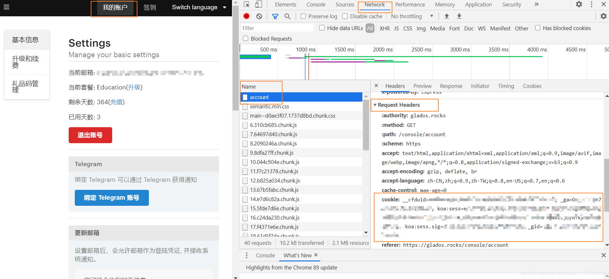
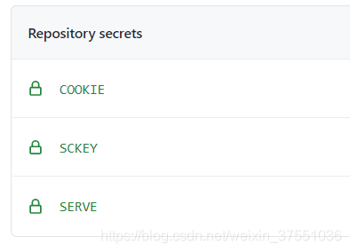
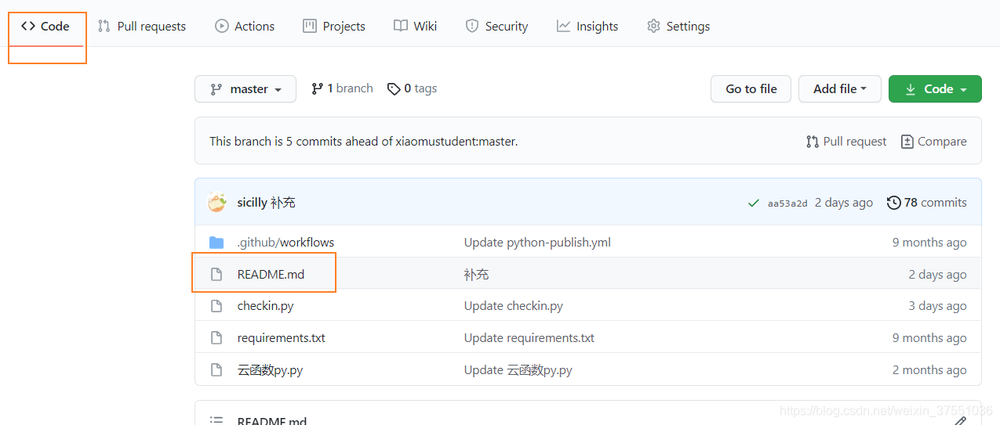
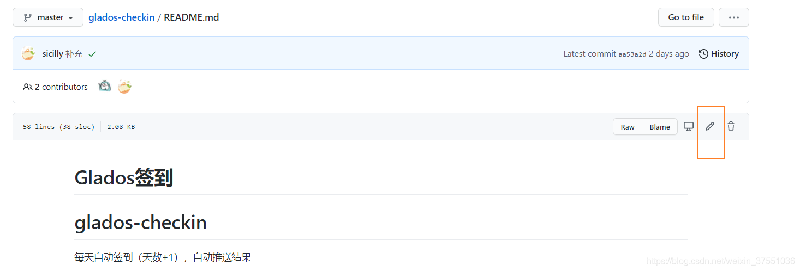
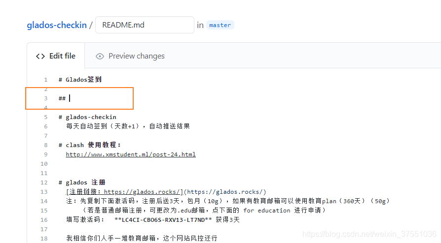
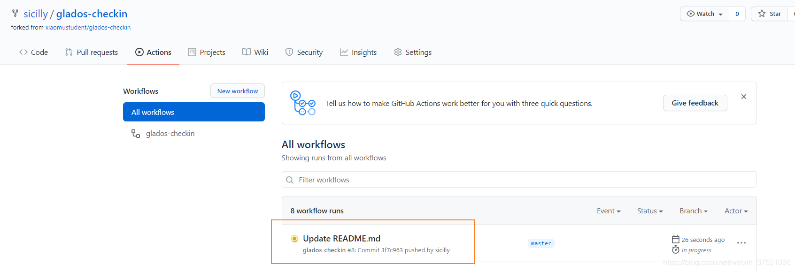

# GLaDOS 自动签到

> 本文原链接：https://blog.csdn.net/weixin_37551036/article/details/115415358
>
> YuSoLi: 我用的自动签到脚本和原作者使用的不是同一个。原作者的自动签到脚本有时会导致签到失败，因此不建议用原作者的那个。在此文章中，我已经把自动签到脚本的链接替换为我自己使用的那一个。因此只参考我这篇就行。
>
> 请低调使用 :-)

## 简介

首次输入邀请码注册免费获得 3 天，绑定教育邮箱获得 360 天，每天签到获得 1 天。本文教大家如何通过脚本自动签到，并自动推送结果到微信上。每步都配了截图，小白也能做。

## 注册 GLaDOS

注册地址：

在 https://github.com/glados-network/GLaDOS 实时更新

如果你有教育邮箱，可以拉到页面底部申请教育计划免费获得 360 天时长

## Fork 项目到自己的仓库

> YuSoLi: 这个自动签到项目说每天上午9:30签到，但是我实测是上午10:30

1. 打开 https://github.com/DullSword/GLaDOS-CheckIn

2. 在页面右上角点击 fork

## 配置账户信息

1. 添加 action cecrets

    如图所示点击 settings-secrets-new repository secret

    

2. 添加自己账户的信息

    这里需要分别添加三次：

    |  Name  |              Value              |
    | :----: | :-----------------------------: |
    | SERVE  |               yes               |
    | COOKIE | 你自己的 cookie（下一步会说明） |
    | SCKEY  | 你自己的 sckey（下一步会说明）  |

    接下来会详细介绍如何获取 COOKIE 和 SCKEY

    

3. 获取 COOKIE

    登录 glados，按键盘上的 `F12` 打开开发者工具

    进入我的账户，刷新页面

    如图所示找到 cookie，把 cookie： 后面的几行都复制下来，填入上一步对应的 value 中

    

4. 获取 SCKEY

    这是在 server 酱中获取的，用于绑定微信，给你推送签到后的结果

    > YuSoLi: 由于微信在2021年4月的调整，下面这种公众号推送的方式已经被微信禁用了。目前可用的是企业微信推送的方式。
    >
    > 但是下文提到的`Server酱`如果使用企业微信，必须用`Server酱 Turbo版`。而此版本是收费的
    >
    > `虾推啥`官网：http://www.xtuis.cn/
    >
    > `虾推啥`同样提供了企业微信推送，并且是免费的。推荐这个。官网有教程，与server酱差不多。使用的时候需要改一下自动签到脚本中文件`checkin.js`链接的api地址。这个地址在`虾推啥`的官网里可以找到，或者直接参考[我的设置](https://github.com/ysl2/GLaDOS-CheckIn)
    >

    server 酱地址：http://sc.ftqq.com/3.version

    - 用 github 账号登入

        

    - 扫码绑定微信

        

    - 复制 SCKEY

        

    三个 secret 添加好后，就应该是这个样子：

    

## 开启 Action

选择 enable workflow

## 提交

> YuSoLi：
>
> 这部分不要参考下文的“改`README.md`”，改了也没效果。只需要star一下你自己fork的仓库，就会开始action了
>

此时已经开启了 action，代码中写的是每天凌晨 0 点左右或者每次提交代码时会触发签到行为。为了验证是否成功，我们随便修改一下代码并提交：
点这个 readme.md（避免修改了不该修改的代码）

点击这个笔进行编辑

随便写点什么，修改这个文件是不会影响到代码的

提交更改

## 验证结果

点开 action，发现正在 update，当图标变成绿色 √ 的时候就执行完毕了

打开微信看是否收到通知：

自此就成功了，每天凌晨 12 点多都会自动签到的，不过 cookie 过段时间会失效，到时登录 github 手动更改一下 cookie 值就行。

## 感想

1. 白嫖真香
2. 第一次使用 github 的 action，还挺好用
3. 关于 server 酱：由于微信升级的原因到时可能会失效，具体可以看一下他的文档如何使用企业微信推送通知，这里不赘述了
