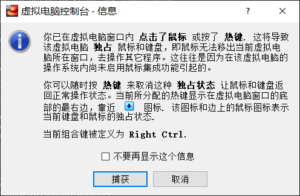
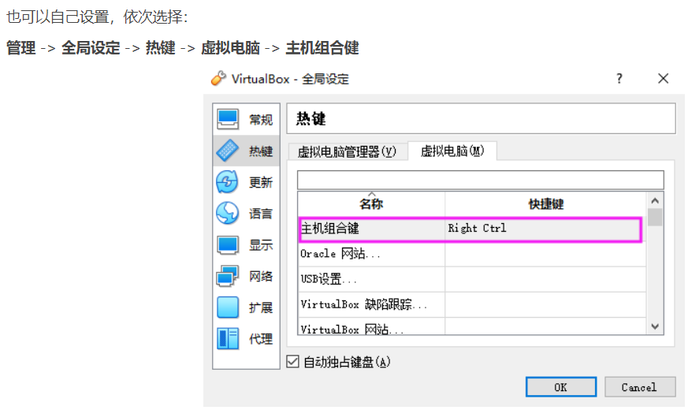
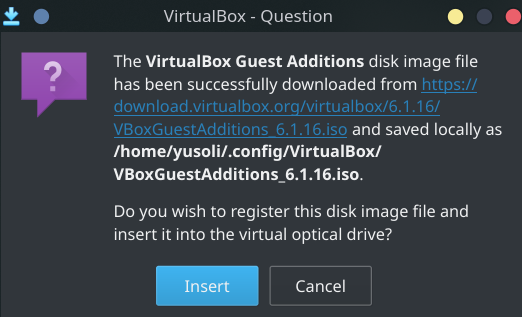
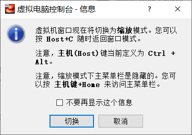
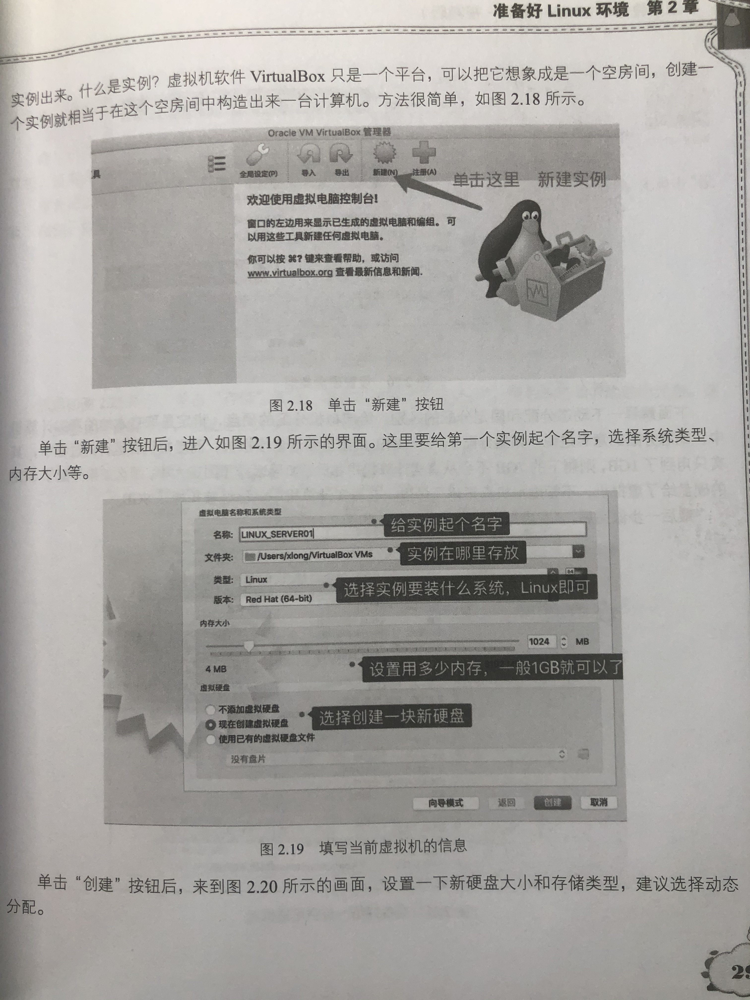
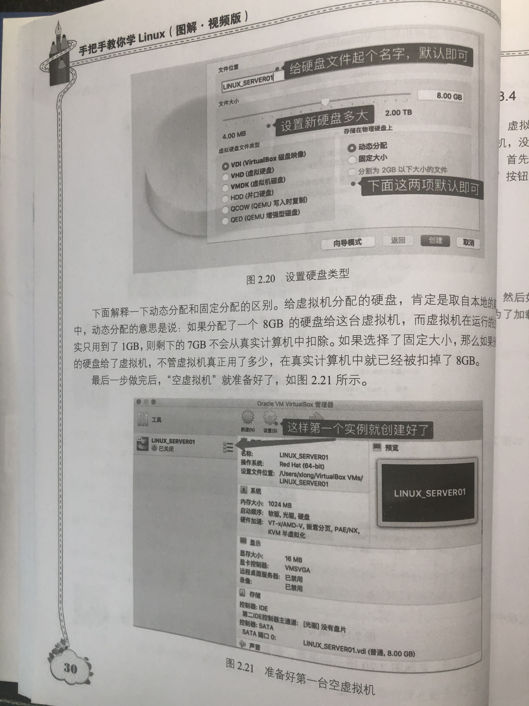
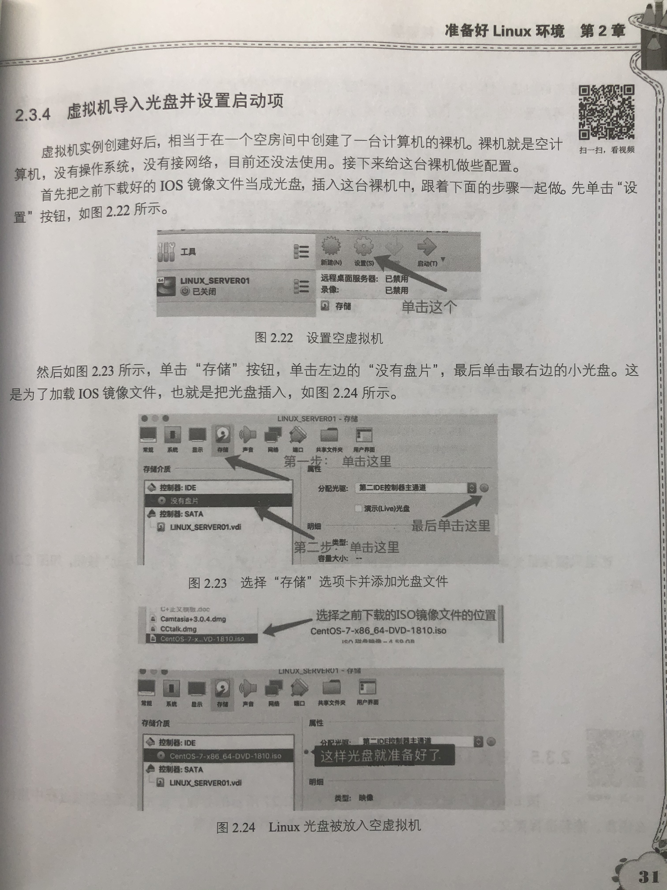
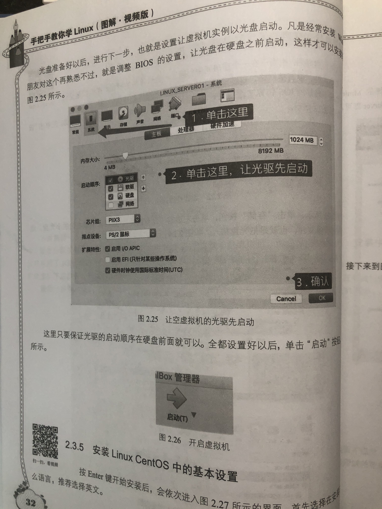
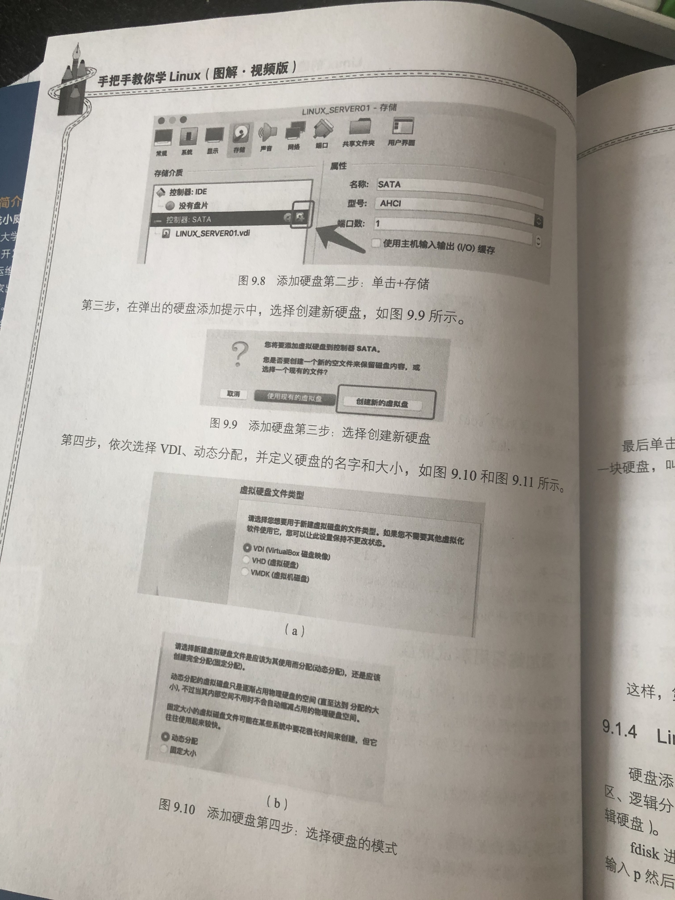
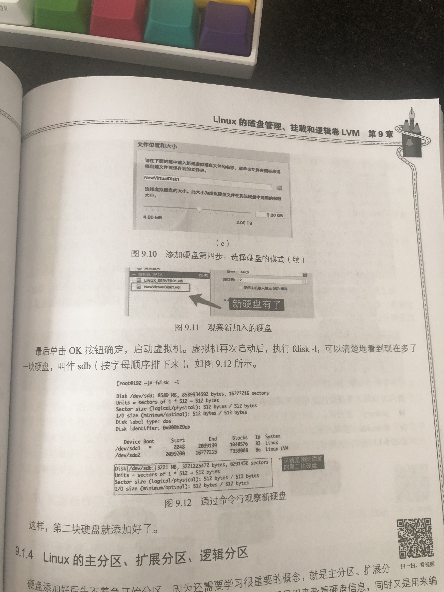

# VirtualBox安装Linux

[VirtualBox（官网下载）](https://www.virtualbox.org/wiki/Downloads)

[centos（清华源）](https://mirrors.tuna.tsinghua.edu.cn/centos/8/isos/x86_64/?C=M&O=D)

[中科大源](http://mirrors.ustc.edu.cn/)

## 主机组合键





另外，把snapshot的快捷键取消，因为这个快捷键与打开终端的快捷键冲突

更新：把主机组合键改为`ctrl + shift + alt`

## 增强功能



如果安装增强程序失败，就手动安装：

> 参考：https://superuser.com/a/1407054

```bash
sudo mkdir /media/cdrom
sudo mount /dev/cdrom /media/cdrom
```

然后执行：

```bash
sudo sh VBoxLinuxAdditions.run
```

可以把上述过程写成一个开机自启服务，或者直接修改fstab进行挂载。

需要注意的是，最后的`sh VBoxLinuxAdditions.run`不要写在服务里，只需要写挂载的那部分就行了

## 视图

### 缩放模式



### 全屏模式


### 自动调整显示尺寸（需要安装增强功能）

https://blog.csdn.net/u012631731/article/details/79548621

## 安装步骤









## 添加练习用测试硬盘（可选）

选中一个虚拟机 -> 设置 -> 存储





## 设置桥接网络


