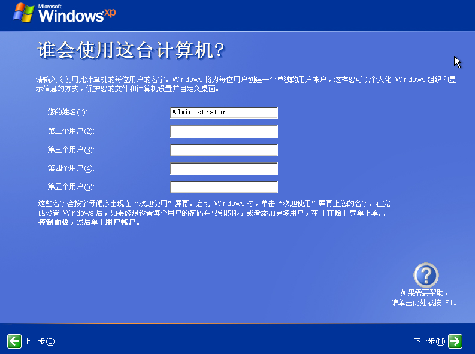
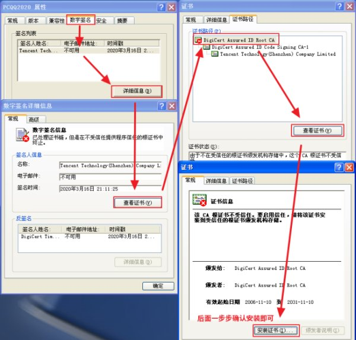

# 虚拟机安装Windows

## XP

### 激活

激活密钥：http://www.bjjyhx.cn/news/4873-cn.html

### 增强程序安装

1. 需要等很长时间，并且中途会出现三次提示有风险，需要点“仍然安装”

2. 关于用户权限问题

    > 原链接：https://blog.csdn.net/qq_35373144/article/details/90769748

    确认xp权限
    xp默认的自然是Administrator用户，应该不会存在权限问题
    为了确认，在右键“运行方式”中勾掉保护我的计算机和数据不受未授权程序的活动影响，结果还是装不上
    忽然想起我安装了腾讯管家，那可能是它惹的祸，卸了，结果问题解决。
    腾讯管家有一个安装程序权限提醒控制的功能，安装增强功能的时候并没有提示出来，不知道为什么，特此记录一下这个问题。

### [设置共享文件夹]

> 原链接：https://blog.csdn.net/Q1302182594/article/details/8720545?utm_medium=distribute.pc_relevant.none-task-blog-2%7Edefault%7EBlogCommendFromMachineLearnPai2%7Edefault-2.control&dist_request_id=&depth_1-utm_source=distribute.pc_relevant.none-task-blog-2%7Edefault%7EBlogCommendFromMachineLearnPai2%7Edefault-2.control
>
> 注意：此方法已经过时，不需要进行下面的步骤。只要安装增强程序即可

1. 关闭虚拟机的电源，然后在VirtualBox选中选择“设置”，然选中“共享文件夹”，点击图中红色圈住的按钮，添加一个需要共享的文件夹。
2. 我设置共享的文件夹是/root下的“公共的”这个文件夹，记得把“自动挂载”勾选上。如下图所示。记得点击“确认”保存设置。
3. 启动虚拟机，在Window XP 桌面上，右击“网上邻居”，然后点击“映射网络驱动器”。如下图所示。
4. 点击“浏览”，选中刚才设为共享的文件夹。如下图所示，我刚才设为公享的文件夹是”公共的“，因此选中它。
5. 点击”完成“，这时就完成了共享文件夹的设置。进入”我的电脑“，你将会看到以下图标。通过他，你就可以访问你在ubuntu中设为共享的文件夹了。

### 常用软件

> 参考：https://www.zhihu.com/question/387966274/answer/1412525677

1. 360极速浏览器

    官网下载即可。建议从宿主机下载，通过共享文件夹传输给虚拟机

2. 搜狗输入法

    直接百度搜，官网下载

3. 微信

    官网下载

4. qq

    官网下载

    [解决qq安装包不让安装的问题（证书过期）](https://zhidao.baidu.com/question/1607247632718368947.html)

    手工安装根证书的具体方法如下：

    右键QQ安装程序点属性，点数字签名-详细信息，点查看证书，在证书路径中点击上方的根证书（DigiCert Root CA)，点击查看证书，点击安装证书，然后一步步确认安装证书即可（XP默认即可将证书安装到“受信任的根证书颁发机构”中）。

    

## 显卡直通

参考：https://www.bwsl.wang/arch/119.html
