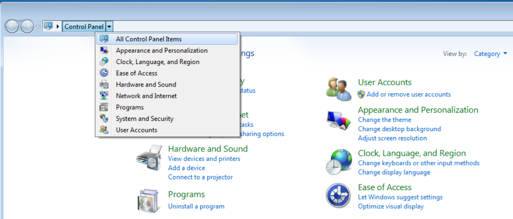
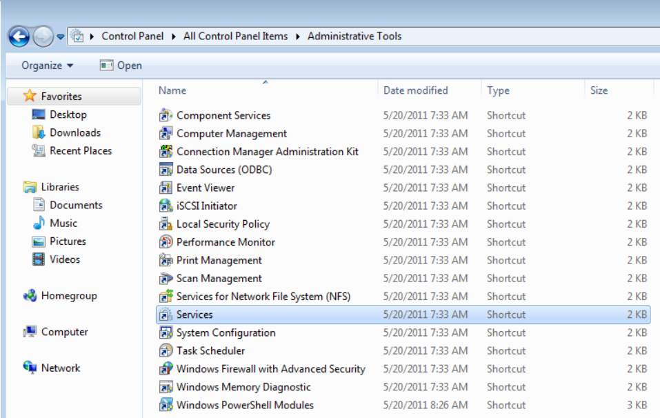
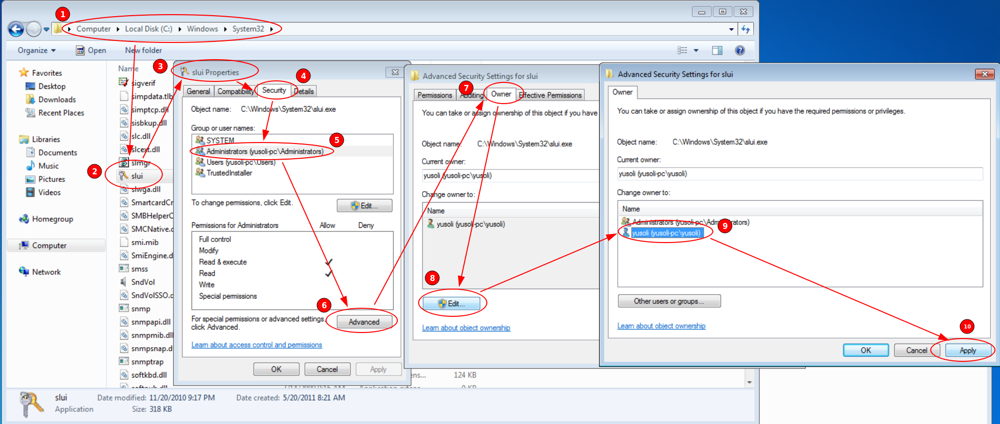
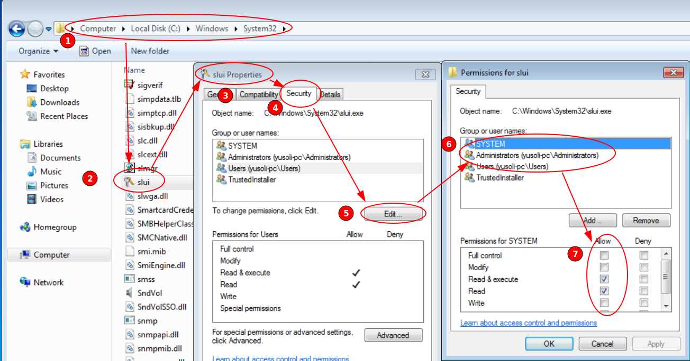
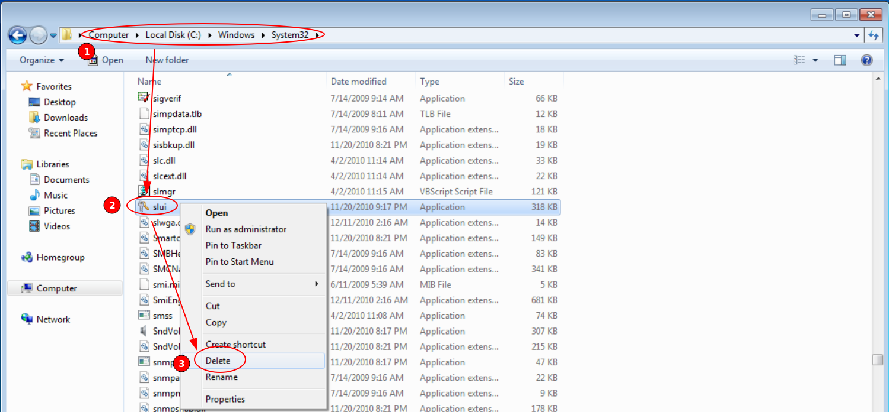
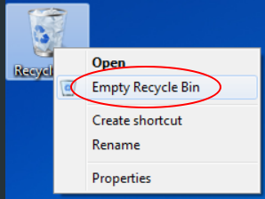

# Windows


## Windows 7 Sp1 Pack

下载地址：https://www.catalog.update.microsoft.com/Search.aspx?q=KB976932

## 解决“windows系统评估工具已经停止工作”

1. 按`WIN+R`进入运行，输入`regedit`打开注册表

1. 进入注册表编辑器后，分别找到（定位）`HKEY_CURRENT_USER”和“HKEY_LOCAL_MACHINE`两个选项。

1. 点击左侧的小箭头展开注册表选项，分别找到

    ```text
    HKEY_CURRENT_USER\Software\Microsoft\Office\14.0\Word
    HKEY_LOCAL_MACHINE\SOFTWARE\Microsoft\Office\Word\Addins
    ```

1. 然后分别在找到的两个选项上点击右键---删除就好。

## Windows Thin PC

1. 关闭`软件保护`

    

    

    在services中找到`Software Protection`，关闭此服务。

2. 更改激活文件的权限

    

    

    注意：在第二张图的第6步，需要把前三个用户的权限全都设置为`Full control`

3. 删除激活文件

    

    
## 其他东西

关键词：NINJUTSU OS

