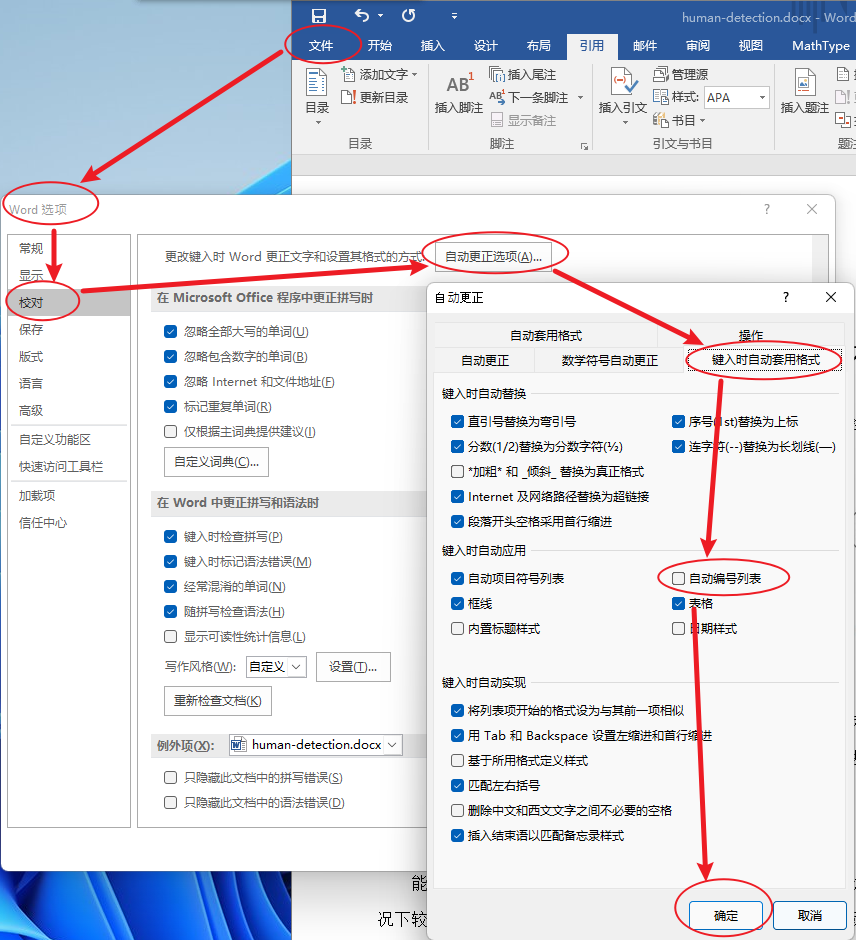

# windows常用软件

[vscode](../../ide/vscode-settings/vscode-global.md)

[chrome](chrome.md)

[firefox国际版](http://ftp.mozilla.org/pub/firefox/releases/)

[轻聊版qq](http://link.zhihu.com/?target=http%3A//dldir1.qq.com/qqfile/qq/QQ7.9Light/14314/QQ7.9Light.exe)

## MathType

1. 打开Word后，提示“宏已被禁用”

    文件——选项——信任中心——信任中心设置——宏设置——启动所有宏，再点确定即可

## Word

1. 关闭自动标号(需要重启)

    > 注意：是 自动项目和符号列表 这一项，图里圈错了。

    

2. 关闭鼠标自动选择

    

