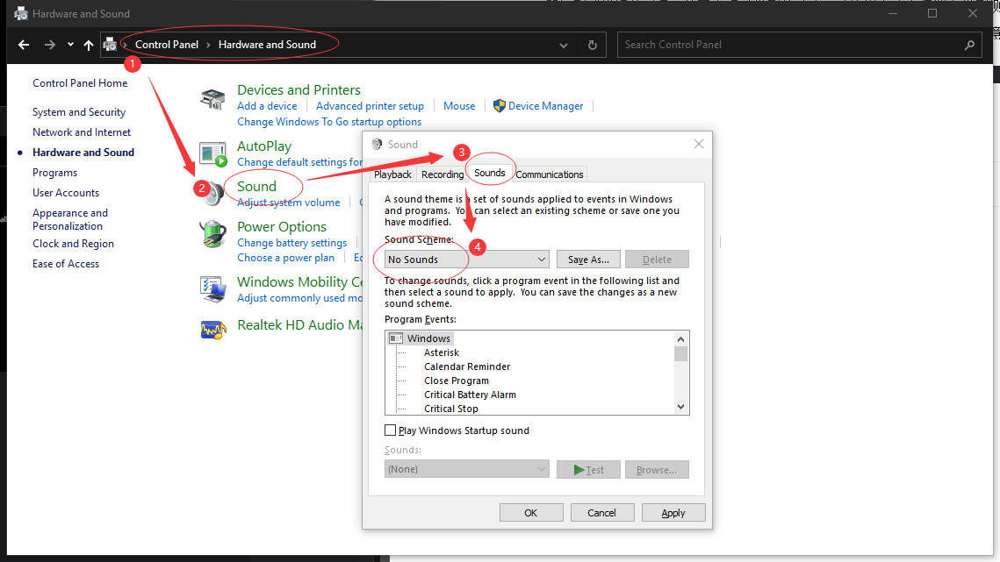

# System

## 改键盘响应速度

打开控制面板，搜索 键盘，点击“键盘”，进入键盘属性设置。也可以在运行中输入 control keyboard 直接打开。


## 关闭系统提示音效

控制面板 -> 声音 -> 把方案改成“无声”



## wslg

先按照wslg的github仓库提示，切换到预览版。

然后安装驱动（AMD）：https://www.amd.com/en/support/kb/release-notes/rn-rad-win-wsl-support

## windows 上的 `ssh-copy-id` 命令替代品

```powershell
type $env:USERPROFILE\.ssh\id_rsa.pub | ssh yusoli@192.168.3.79 "cat >> .ssh/authorized_keys"
```

## 删除在Linux系统下的保护文件

```dos
chkdsk /f 盘符:
```

## 关闭 Win + L 锁屏快捷键

https://www.maketecheasier.com/disable-lock-screen-shortcut-key-windows/

